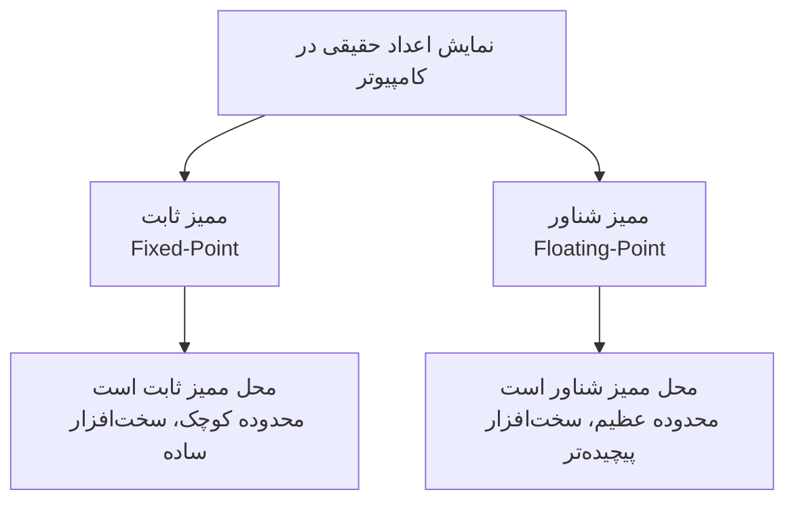
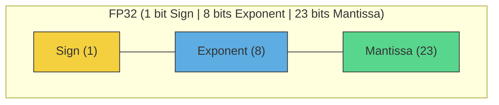
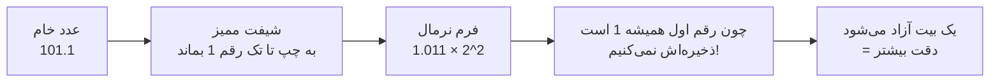
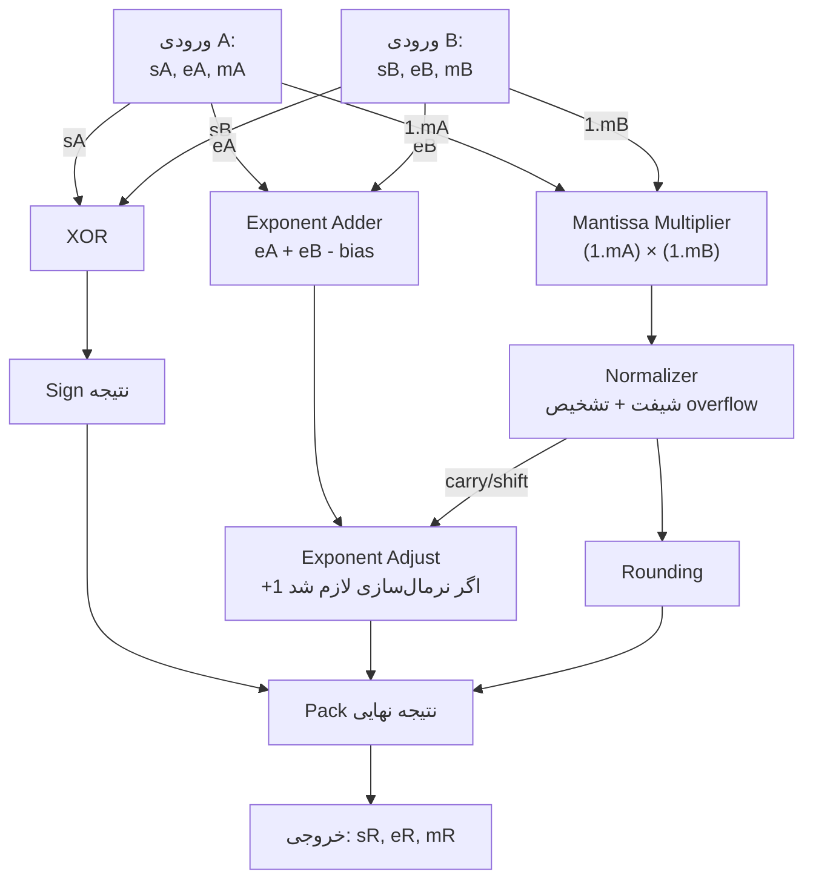
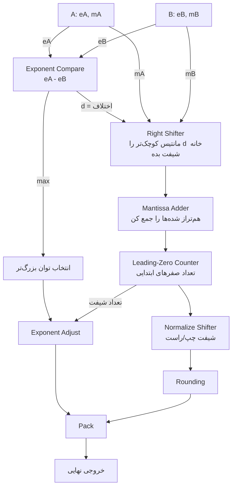
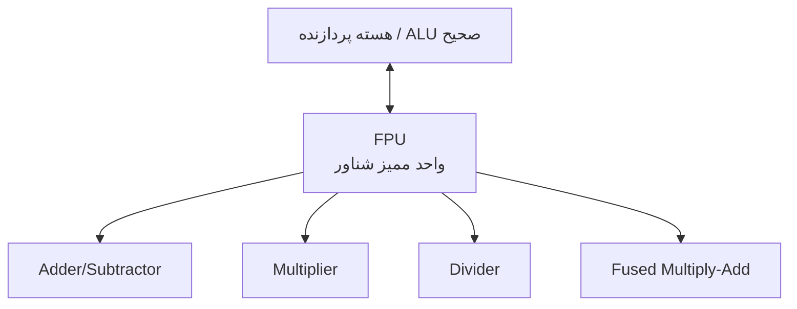
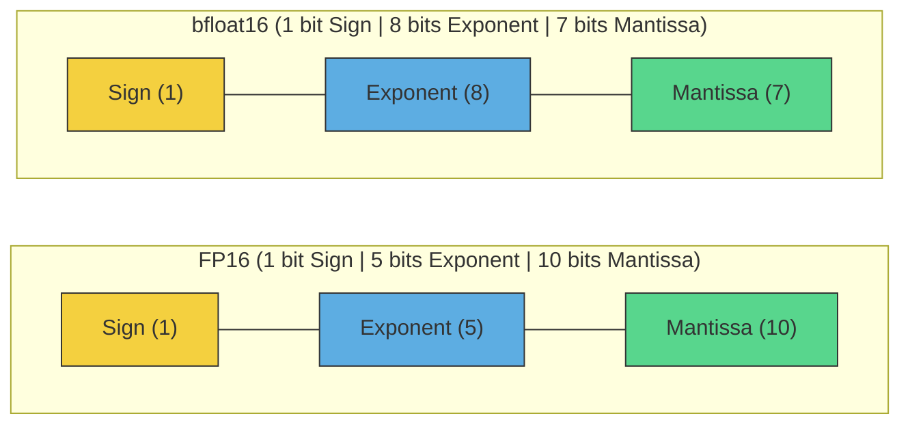
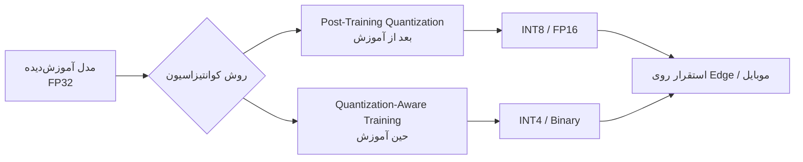

# سیستم اعداد ممیز شناور (FLP)

## فهرست مطالب

- [سیستم اعداد ممیز شناور (FLP)](#سیستم-اعداد-ممیز-شناور-flp)
  - [فهرست مطالب](#فهرست-مطالب)
  - [مقدمه](#مقدمه)
  - [ساختار استاندارد IEEE 754](#ساختار-استاندارد-ieee-754)
  - [مقادیر خاص و اعداد غیرنرمال (Denormal)](#مقادیر-خاص-و-اعداد-غیرنرمال-denormal)
  - [عملیات ضرب ممیز شناور (سخت‌افزار)](#عملیات-ضرب-ممیز-شناور-سختافزار)
  - [عملیات جمع ممیز شناور (سخت‌افزار)](#عملیات-جمع-ممیز-شناور-سختافزار)
  - [معماری سخت‌افزاری FPU](#معماری-سختافزاری-fpu)
  - [فرمت‌های جایگزین برای معماری‌های DNN](#فرمتهای-جایگزین-برای-معماریهای-dnn)
  - [لایه نرم‌افزاری: کوانتیزاسیون (Quantization)](#لایه-نرمافزاری-کوانتیزاسیون-quantization)

---

## مقدمه

کامپیوتر در پایین‌ترین لایه چیزی جز $0$ و $1$ نمی‌فهمد. سؤال بنیادی این است:

> چطور عددی مثل $3.14$ یا $0.0000125$ یا $1{,}250{,}000{,}000$ را فقط با بیت‌ها ذخیره کنیم؟

دو رویکرد اصلی وجود دارد:

ایده اصلی ممیز شناور همان «نماد علمی» است. همان‌طور که در مبنای $10$ می‌نویسیم:

$$1250 = 1.25 \times 10^{3}$$

کامپیوتر هم دقیقاً همین کار را می‌کند، فقط با **مبنای ۲**:

$$5.5_{(10)} = 101.1_{(2)} = 1.011 \times 2^{2}$$

هر عدد ممیز شناور از سه جزء تشکیل می‌شود:

---

## ساختار استاندارد IEEE 754

| بخش | نماد | کارکرد |
| :--- | :--- | :--- |
| علامت (Sign) | $s$ | مثبت یا منفی بودن عدد |
| توان (Exponent) | $e$ | بزرگی عدد / محل ممیز |
| مانتیس (Mantissa) | $m$ | ارقام دقیق عدد |

فرمول کلی برای محاسبه یک عدد نرمال ممیز شناور استاندارد:

$$n = (-1)^{s} \times 2^{\,e - \text{bias}} \times \left(1 + \frac{m}{2^{ms}}\right)$$

بیایید تک‌تک اجزا را باز کنیم:

### بخش علامت: 
$$(-1)^s$$
- اگر $s = 0$ : عدد مثبت است.
- اگر $s = 1$ : عدد منفی است.

### بخش توان: 
محل ممیز را تعیین می‌کند. از آنجا که توان واقعی می‌تواند منفی باشد (برای اعداد بسیار کوچک)، برای جلوگیری از ذخیره‌سازی بیت علامتِ مجزا برای توان، از یک مقدار انحراف به نام **$\text{bias}$** استفاده می‌شود تا همواره توان به صورت یک عدد بدون علامت (unsigned) ذخیره شود.

$$\text{bias} = 2^{\,es-1} - 1$$

که در آن $es$ تعداد بیت‌های بخش توان است. برای مثال در استاندارد $FP32$ با $es = 8$:

$$\text{bias} = 2^{7} - 1 = 127$$

پس اگر توان واقعی یک عدد $+3$ باشد، در حافظه مقدار $3 + 127 = 130$ ذخیره می‌شود. اگر توان واقعی $-5$ باشد، مقدار $-5 + 127 = 122$ ذخیره می‌گردد. به این ترتیب، عملیات مقایسه بزرگی دو عدد اعشاری برای پردازنده بسیار ساده‌تر و سریع‌تر می‌شود.

### بخش مانتیس: 
$$\left(1 + \dfrac{m}{2^{ms}}\right)$$

جمله $1+$ در این فرمول همان **بیت پنهان (Hidden Bit)** است. $ms$ نشان‌دهنده تعداد بیت‌های بخش مانتیس است.

ما عدد را در فرآیندی به نام **نرمال‌سازی (Normalization)** مجبور می‌کنیم به فرمی درآید که همواره اولین رقم سمت چپ ممیز غیرصفر باشد. در مبنای $10$:

$$450 \;\xrightarrow{\text{نرمال‌سازی}}\; 4.5 \times 10^2$$

اما در مبنای $2$، از آنجا که تنها دو رقم $0$ و $1$ وجود دارند، اولین رقم غیرصفر سمت چپ ممیز **قطعاً و همواره $1$ خواهد بود**:

$$101.1_{(2)} \;\xrightarrow{\text{شیفت ممیز}}\; 1.011 \times 2^{2}$$

چون طبق قرارداد این رقم همیشه $1$ است، نیازی به هدر دادن حافظه برای ذخیره آن نیست. سخت‌افزار هنگام بازخوانی عدد، این $1$ پنهان را به طور خودکار به ابتدای مانتیس اضافه می‌کند. این ترفند هوشمندانه **یک بیت دقت رایگان بیشتر** به ما می‌دهد.

---

### فرمت‌های رایج، محدوده و دقت عددی

تعداد بیت‌های اختصاص یافته به توان، «محدوده دینامیکی» و تعداد بیت‌های مانتیس، «دقت اعشاری» را مشخص می‌کنند.

| فرمت | کل بیت | Sign | Exponent | Mantissa | Bias | دقت تقریبی (رقم اعشار) | محدوده عددی (تقریبی) |
| :--- | :---: | :---: | :---: | :---: | :---: | :---: | :--- |
| **FP32** | $32$ | $1$ | $8$ | $23$ | $127$ | $\approx 7$ | $1.4 \times 10^{-45}$ تا $3.4 \times 10^{38}$ |
| **FP16** | $16$ | $1$ | $5$ | $10$ | $15$ | $\approx 3.3$ | $6.1 \times 10^{-5}$ تا $6.5 \times 10^{4}$ |
| **bfloat16** | $16$ | $1$ | $8$ | $7$ | $127$ | $\approx 2.1$ | $1.2 \times 10^{-38}$ تا $3.4 \times 10^{38}$ |

---

## مقادیر خاص و اعداد غیرنرمال (Denormal)

در استاندارد $IEEE\ 754$، حالت‌های خاصی برای نمایش مقادیری چون بی‌نهایت، خطاها یا اعداد بسیار کوچک در نظر گرفته شده است. این مقادیر با بررسی الگوهای بیتی بخش توان و مانتیس شناسایی می‌شوند:

### ۱. صفرهای علامت‌دار ($\pm 0$)
وقتی تمام بیت‌های توان و تمام بیت‌های مانتیس برابر با $0$ باشند، عدد صفر را نشان می‌دهد. با توجه به بیت علامت $s$، ما دو صفر متفاوت داریم: $+0$ و $-0$.
* **شرط:** $\text{Exponent} = 0$ و $\text{Mantissa} = 0$

### ۲. اعداد غیرنرمال یا زیرنرمال (Denormal / Subnormal)
وقتی یک عدد به قدری کوچک می‌شود که توان آن حتی با کمترین مقدار ممکن نیز قابل نمایش نیست، از حالت نرمال خارج می‌شود. در این حالت، بیت‌های بخش توان همگی صفر هستند اما مانتیس مخالف صفر است. 
در اعداد غیرنرمال، **بیت پنهان به جای $1$ برابر با $0$ فرض می‌شود** تا از وقوع خطای زیرسرریز ناگهانی (Sudden Underflow) جلوگیری کرده و امکان زیرسرریز تدریجی (Gradual Underflow) فراهم شود.
* **شرط:** $\text{Exponent} = 0$ و $\text{Mantissa} \neq 0$
* **فرمول محاسبه:** 

$$n = (-1)^{s} \times 2^{\,1 - \text{bias}} \times \left(0 + \frac{m}{2^{ms}}\right)$$

### ۳. بی‌نهایت ($\pm \infty$)
برای نشان دادن سرریز محاسباتی (Overflow)، مانند تقسیم یک عدد غیرصفر بر صفر.
* **شرط:** تمام بیت‌های توان $1$ ($\text{Exponent} = 255$ در $FP32$) و $\text{Mantissa} = 0$

### ۴. تعریف‌نشده (NaN - Not a Number)
برای خروجی عملیات‌های نامعتبر ریاضی مانند $\frac{0}{0}$ یا $\infty - \infty$.
* **شرط:** تمام بیت‌های توان $1$ ($\text{Exponent} = 255$ در $FP32$) و $\text{Mantissa} \neq 0$

---

## عملیات ضرب ممیز شناور (سخت‌افزار)

1. جمع کردن توان‌های دو عملوند و کسر کردن مقدار $\text{bias}$ برای حفظ ساختار انحراف.
2. ضرب کردن مانتیس‌ها (با در نظر گرفتن بیت پنهان $1$).
3. نرمال‌سازی مانتیس حاصل (در صورت نیاز، شیفت به چپ یا راست).
4. تنظیم توان حاصل بر اساس تعداد شیفت‌های مرحله قبل.
5. تعیین علامت نهایی از طریق عملیات $XOR$ روی بیت‌های علامت عملوندها.

$$A \times B = (-1)^{s_A \oplus s_B} \times 2^{(e_A + e_B - \text{bias})} \times (M_A \times M_B)$$

### دیتاپث RTL ضرب‌کننده ممیز شناور

---

## عملیات جمع ممیز شناور (سخت‌افزار)

جمع ممیز شناور به مراتب پیچیده‌تر از ضرب است، زیرا بدون هم‌توان کردن (Alignment) عملوندها، امکان جمع مستقیم مانتیس‌ها وجود ندارد.

1. محاسبه اختلاف توان‌ها و مقایسه بزرگی آن‌ها.
2. شیفت دادن مانتیس عددی که توان کوچک‌تری دارد به سمت راست به اندازه اختلاف توان‌ها تا توان هر دو عدد یکسان شود.
3. جمع یا تفریق مانتیس‌های هم‌تراز شده بر اساس علامت‌ها.
4. نرمال‌سازی مانتیس حاصل (با استفاده از واحد شمارشگر صفرهای پیشرو یا Leading-Zero Counter جهت شناسایی تعداد شیفت‌های مورد نیاز).
5. تنظیم توان نهایی و اعمال سیستم گرد کردن (Rounding).

### دیتاپث RTL جمع‌کننده ممیز شناور

---

## معماری سخت‌افزاری FPU

به دلیل پیچیدگی بسیار بالای مدارات جمع و ضرب ممیز شناور، این وظایف به یک واحد سخت‌افزاری اختصاصی متصل به پردازنده مرکزی به نام **FPU (Floating Point Unit)** واگذار می‌شود.

این واحد اگرچه سرعت محاسبات اعشاری را به شدت بالا می‌برد، اما هزینه سنگینی از نظر مساحت سیلیکون، مصرف توان و تأخیر انتشار به تراشه تحمیل می‌کند. به همین دلیل استفاده مستقیم از $FP32$ در لبه شبکه یا سخت‌افزارهای کم‌مصرف (مانند اینترنت اشیاء و لبه شبکه) گزینه‌ مناسبی نیست.

---

## فرمت‌های جایگزین برای معماری‌های DNN

شبکه‌های عصبی عمیق (DNN) به طور شگفت‌انگیزی در برابر خطاهای کوچک عددی و گرد کردن مقاوم هستند. از این رو توسعه‌دهندگان سخت‌افزارهای هوش مصنوعی به سراغ استفاده از فرمت‌های محاسباتی کم‌دقت‌تر اما سریع‌تر رفته‌اند.

### الف) فرمت‌های ممیز شناور کم‌دقت ۱۶ بیتی و ۸ بیتی

دو رقیب اصلی در پردازش‌های ۱۶ بیتی عبارتند از $FP16$ و $bfloat16$. در حالی که $FP16$ دقت اعشاری بهتری دارد، فرمت $bfloat16$ با داشتن توان $8$ بیتی (دقیقاً مشابه $FP32$) تضمین می‌کند که دچار خطای سرریز یا زیرسرریز ناگهانی در حین آموزش مدل‌های بزرگ نمی‌شویم.

### ب) فرمت‌های ممیز ثابت و صحیح (Fixed-Point / Integer)

در سیستم ممیز ثابت، محل ممیز اعشار در سخت‌افزار ثابت فرض می‌شود، لذا ساختار مدار به شدت به یک ALU ساده‌ی عدد صحیح نزدیک شده و مصرف انرژی به شکل نمایی کاهش می‌یابد. نمونه‌های پرکاربرد عبارتند از:
* **INT8:** استاندارد طلایی استنتاج (Inference) در اکثر پردازنده‌های لبه و موبایل.
* **INT4 / Binary / Ternary:** فشرده‌سازی بسیار شدید که در آن وزن‌ها تنها مقادیر محدودی مثل $\{-1, +1\}$ یا $\{-1, 0, +1\}$ را می‌پذیرند.

### ج) مقایسه جامع فرمت‌های عددی در هوش مصنوعی

| فرمت | کل بیت‌ها | محدوده دینامیکی | دقت نسبی | پیچیدگی سخت‌افزاری FPU | کاربرد اصلی |
| :--- | :---: | :---: | :---: | :---: | :--- |
| **FP32** | $32$ | بسیار بزرگ | بسیار بالا | بسیار بالا | محاسبات علمی دقیق / آموزش اولیه |
| **FP16** | $16$ | کوچک | بالا | متوسط | استنتاج و آموزش با مقیاس متوسط |
| **bfloat16** | $16$ | بسیار بزرگ | متوسط | متوسط | آموزش مدل‌های زبانی بزرگ (LLM) |
| **FP8** | $8$ | بسیار کوچک | پایین | بسیار کم | استنتاج پرسرعت و آموزش‌های خاص جدید |
| **INT8** | $8$ | ثابت | متوسط | ناچیز (ساده‌ترین سطح) | استنتاج روی دستگاه‌های Edge و موبایل |
| **INT4** | $4$ | بسیار کوچک | بسیار پایین | نزدیک به صفر | مدل‌های کوانتیزه شده فوق فشرده |

---

## لایه نرم‌افزاری: کوانتیزاسیون (Quantization)

کوانتیزاسیون فرآیند نگاشت پارامترهای پیوسته ممیز شناور ($FP32$) به مقادیر گسسته ممیز ثابت یا صحیح با بیت‌های کمتر (مانند $INT8$) است.

فرمول کلاسیک نگاشت یک مقدار اعشاری $x_{float}$ به مقدار صحیح $x_{int}$ به صورت زیر تعریف می‌شود:

$$x_{int} = \text{round}\!\left(\frac{x_{float}}{\text{scale}}\right) + \text{zero\_point}$$

که در آن پارامتر $\text{scale}$ محدوده مقادیر را مقیاس‌دهی کرده و $\text{zero\_point}$ نقطه صفر اعشاری را به یک مقدار صحیح معادل در بازه هدف نگاشت می‌کند. این تبدیل، سایز مدل‌ها را تا $75\%$ کاهش داده و سرعت اجرای آن‌ها را بدون افت شدید در دقت خروجی، چندین برابر می‌کند.