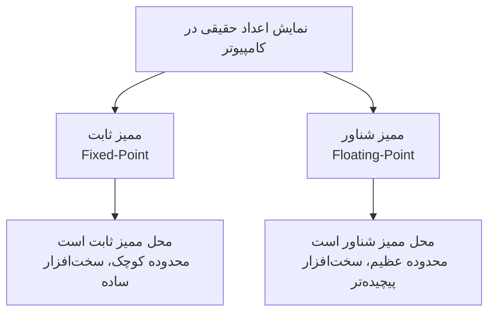
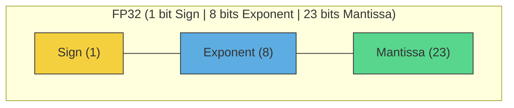
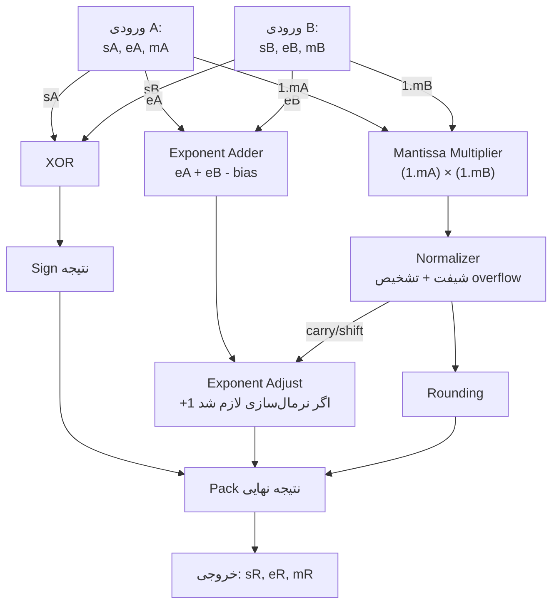
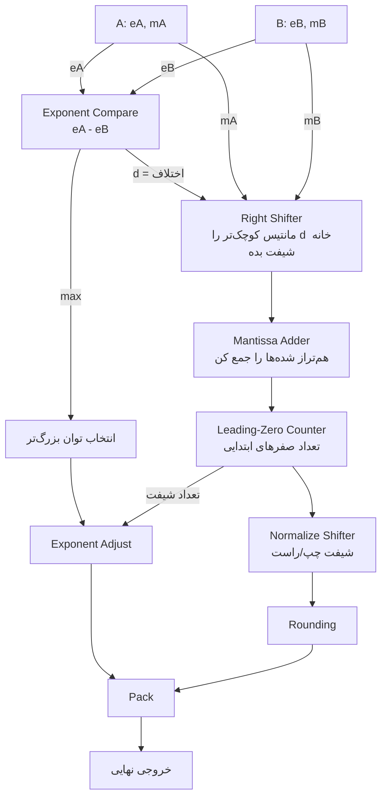
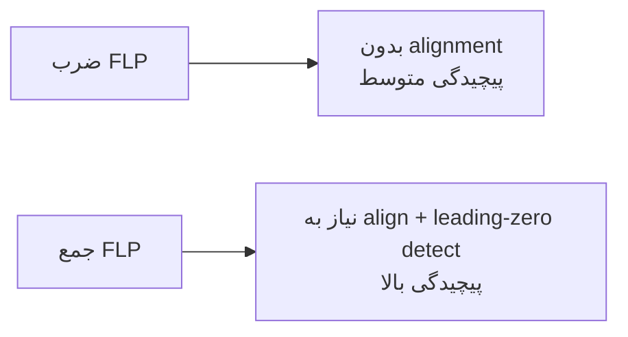
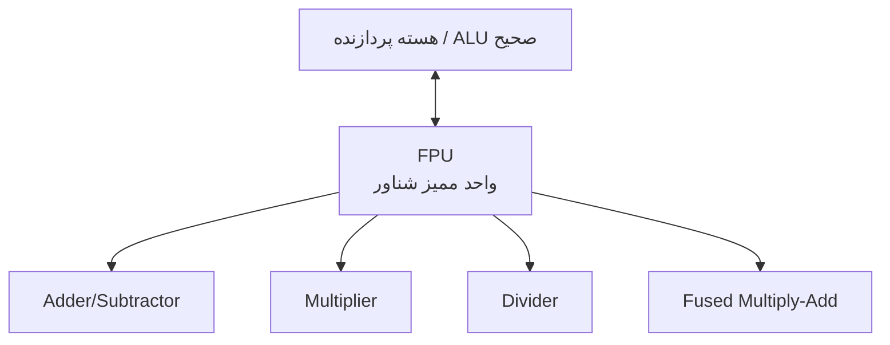
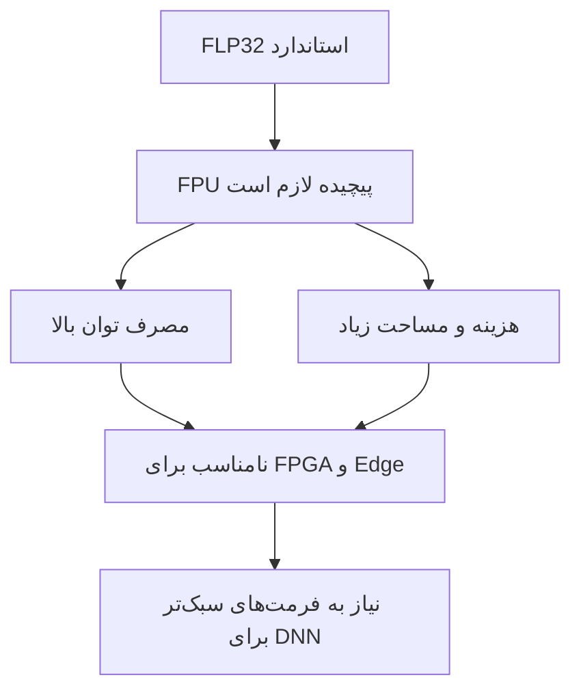
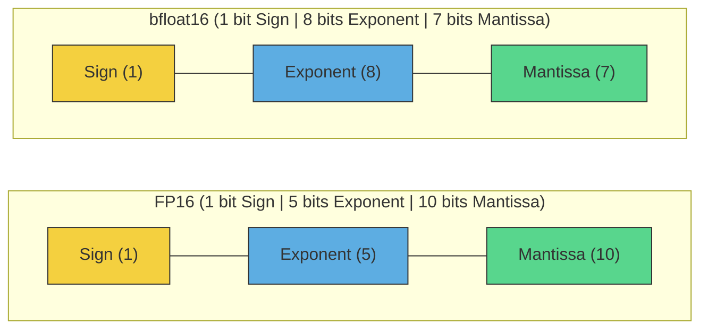
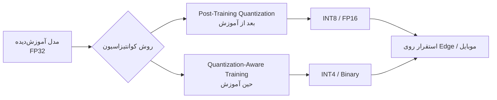

# سیستم اعداد ممیز شناور (FLP)

## فهرست مطالب

- [سیستم اعداد ممیز شناور (FLP)](#سیستم-اعداد-ممیز-شناور-flp)
  - [فهرست مطالب](#فهرست-مطالب)
  - [مقدمه: چرا اصلاً ممیز شناور؟](#مقدمه-چرا-اصلاً-ممیز-شناور)
  - [مبانی نمایش عدد در مبنای ۲](#مبانی-نمایش-عدد-در-مبنای-۲)
  - [ساختار استاندارد IEEE 754](#ساختار-استاندارد-ieee-754)
    - [بخش علامت: $(-1)^s$](#بخش-علامت--1s)
    - [بخش توان: $2^{,e - e\_{max}}$](#بخش-توان-2e---e_max)
    - [بخش مانتیس: $\\left(1 + \\dfrac{m}{2^{ms}}\\right)$](#بخش-مانتیس-left1--dfracm2msright)
    - [فرمت‌های رایج](#فرمتهای-رایج)
  - [نرمال‌سازی و بیت پنهان (مهم‌ترین ترفند)](#نرمالسازی-و-بیت-پنهان-مهمترین-ترفند)
    - [مثال در مبنای ۱۰](#مثال-در-مبنای-۱۰)
    - [مثال در مبنای ۲](#مثال-در-مبنای-۲)
    - [چرا این نبوغ‌آمیز است؟](#چرا-این-نبوغآمیز-است)
  - [مفهوم Bias در توان](#مفهوم-bias-در-توان)
  - [عملیات ضرب ممیز شناور (سخت‌افزار)](#عملیات-ضرب-ممیز-شناور-سختافزار)
    - [دیتاپث RTL ضرب‌کننده ممیز شناور](#دیتاپث-rtl-ضربکننده-ممیز-شناور)
  - [عملیات جمع ممیز شناور (سخت‌افزار)](#عملیات-جمع-ممیز-شناور-سختافزار)
    - [دیتاپث RTL جمع‌کننده ممیز شناور](#دیتاپث-rtl-جمعکننده-ممیز-شناور)
  - [معماری سخت‌افزاری FPU](#معماری-سختافزاری-fpu)
  - [پیچیدگی FLP32 و محدودیت‌های آن](#پیچیدگی-flp32-و-محدودیتهای-آن)
  - [فرمت‌های جایگزین برای معماری‌های DNN](#فرمتهای-جایگزین-برای-معماریهای-dnn)
    - [الف) فرمت‌های ممیز شناور کم‌دقت](#الف-فرمتهای-ممیز-شناور-کمدقت)
    - [ب) فرمت‌های عدد صحیح (Fixed-Point / Integer)](#ب-فرمتهای-عدد-صحیح-fixed-point--integer)
    - [ج) فرمت‌های تخصصی](#ج-فرمتهای-تخصصی)
    - [مقایسه کلی](#مقایسه-کلی)
  - [لایه نرم‌افزاری: کوانتیزاسیون (Quantization)](#لایه-نرمافزاری-کوانتیزاسیون-quantization)

---

## مقدمه: چرا اصلاً ممیز شناور؟

کامپیوتر در پایین‌ترین لایه چیزی جز `0` و `1` نمی‌فهمد. سؤال بنیادی این است:

> چطور عددی مثل $3.14$ یا $0.0000125$ یا $1{,}250{,}000{,}000$ را فقط با بیت‌ها ذخیره کنیم؟

دو رویکرد اصلی وجود دارد:

ایده اصلی ممیز شناور همان «نماد علمی» است. همان‌طور که در مبنای ۱۰ می‌نویسیم:

$$1250 = 1.25 \times 10^{3}$$

کامپیوتر هم دقیقاً همین کار را می‌کند، فقط با **مبنای ۲**:

$$5.5_{(10)} = 101.1_{(2)} = 1.011 \times 2^{2}$$

---

## مبانی نمایش عدد در مبنای ۲

هر عدد ممیز شناور از سه جزء تشکیل می‌شود:

| بخش | نماد | کارکرد |
| :--- | :--- | :--- |
| علامت (Sign) | $s$ | مثبت یا منفی بودن عدد |
| توان (Exponent) | $e$ | بزرگی عدد / محل ممیز |
| مانتیس (Mantissa) | $m$ | ارقام دقیق عدد |

---

## ساختار استاندارد IEEE 754

فرمول کاملی که در اسلایدها آمده (مرجع: اسلاید «FLP addition» و «Multiplication of two FLP numbers») این است:

$$n = (-1)^{s} \times 2^{\,e - e_{max}} \times \left(1 + \frac{m}{2^{ms}}\right)$$

بیایید تک‌تک اجزا را باز کنیم:

### بخش علامت: $(-1)^s$
- اگر $s = 0$ → $(-1)^0 = +1$ (مثبت)
- اگر $s = 1$ → $(-1)^1 = -1$ (منفی)

### بخش توان: $2^{\,e - e_{max}}$
محل ممیز را تعیین می‌کند. $e_{max}$ همان **Bias** است (در بخش ۵ توضیح می‌دهیم).

### بخش مانتیس: $\left(1 + \dfrac{m}{2^{ms}}\right)$
آن «۱+» پشت فرمول، همان **بیت پنهان** است که در بخش بعد توضیح کامل می‌دهیم. $ms$ تعداد بیت‌های مانتیس است.

### فرمت‌های رایج

| فرمت | کل بیت | Sign | Exponent | Mantissa | Bias ($e_{max}$) |
| :--- | :---: | :---: | :---: | :---: | :---: |
| FP32 | 32 | 1 | 8 | 23 | 127 |
| FP16 | 16 | 1 | 5 | 10 | 15 |
| bfloat16 | 16 | 1 | 8 | 7 | 127 |

---

## نرمال‌سازی و بیت پنهان (مهم‌ترین ترفند)

این همان جایی است که اکثر افراد در نگاه اول گیر می‌کنند: **چرا همیشه پشت مانتیس عددِ ۱ نوشته شده؟**

پاسخ کلیدی: این ویژگیِ ذاتیِ عدد نیست؛ **ما عدد را مجبور می‌کنیم با ۱ شروع شود.** به این کار **نرمال‌سازی (Normalization)** می‌گویند.

### مثال در مبنای ۱۰
عدد ۴۵۰ را می‌توان به شکل‌های مختلف نوشت:

$$45 \times 10^1 \quad=\quad 0.45 \times 10^3 \quad=\quad \underbrace{4.5 \times 10^2}_{\text{فرم نرمال}}$$

قرارداد نماد علمی: فقط یک رقم غیرصفر سمت چپ ممیز باشد.

### مثال در مبنای ۲
در باینری فقط دو رقم داریم. پس تنها رقم غیرصفری که می‌تواند پشت ممیز بنشیند، **حتماً ۱ است**:

$$101.1_{(2)} \;\xrightarrow{\text{شیفت ۲ خانه}}\; 1.011 \times 2^{2}$$

### چرا این نبوغ‌آمیز است؟
چون قرارداد کردیم عدد همیشه به شکل $1.xxxx$ باشد، آن `1` همیشه ثابت است و نیازی به ذخیره ندارد. کامپیوتر هنگام خواندن، خودش آن را اضافه می‌کند. نتیجه: **یک بیت رایگان** که صرف دقت بیشتر می‌شود.

> این تفاوت اصلی با مدل‌های ساده‌تر است. در مدل $n = (-1)^s \times 2^e \times m$ (بدون «۱+»)، مانتیس به‌صورت $0.xxxx$ ذخیره می‌شود و بیت پنهان وجود ندارد. ساده‌تر است اما دقت کمتری در همان فضا می‌دهد.

---

## مفهوم Bias در توان

توان می‌تواند منفی باشد (برای اعداد خیلی کوچک مثل $2^{-5}$). اما کامپیوتر نمی‌خواهد یک بیت اضافه برای علامتِ توان هدر دهد.

راه‌حل: یک عدد ثابت ($e_{max}$ یا Bias) از توان واقعی کم می‌کنیم تا همه توان‌ها به شکل **بدون علامت (unsigned)** ذخیره شوند.

$$e_{max} = 2^{\,es-1} - 1$$

برای FP32 با $es = 8$:

$$e_{max} = 2^{7} - 1 = 127$$

پس اگر توان واقعی $+3$ باشد، در حافظه $3 + 127 = 130$ ذخیره می‌شود. اگر توان واقعی $-5$ باشد، $-5 + 127 = 122$ ذخیره می‌شود. به این ترتیب هیچ‌گاه عدد منفی ذخیره نمی‌کنیم و **مقایسه دو عدد اعشاری برای پردازنده بسیار سریع‌تر** می‌شود.

---

## عملیات ضرب ممیز شناور (سخت‌افزار)

مرجع: اسلاید «Multiplication of two FLP numbers». مراحل به این صورت‌اند:

1. جمع کردن توان‌ها (adding their exponents)
2. ضرب کردن مانتیس‌ها (multiplying the mantissas)
3. نرمال‌سازی مانتیس حاصل (normalizing the resultant mantissa)
4. تنظیم توان حاصل (adjusting the exponent)

از نظر ریاضی برای دو عدد $A$ و $B$:

$$A \times B = (-1)^{s_A \oplus s_B} \times 2^{(e_A + e_B - e_{max})} \times (M_A \times M_B)$$

نکته زیبا: علامت حاصل با **XOR** دو علامت به دست می‌آید.

### دیتاپث RTL ضرب‌کننده ممیز شناور

دقت کنید ضرب در ممیز شناور نسبتاً «ساده‌تر» از جمع است، چون لازم نیست توان‌ها را هم‌تراز کنیم.

---

## عملیات جمع ممیز شناور (سخت‌افزار)

مرجع: اسلاید «FLP addition». مراحل:

1. مقایسه توان‌های دو عملوند (comparing the operand exponents)
2. شیفت مانتیس‌ها در صورت تفاوت توان‌ها (shifting their mantissas)
3. جمع مانتیس‌ها (adding the mantissas)
4. نرمال‌سازی حاصل جمع (normalizing the sum)
5. تنظیم توان حاصل (adjusting the sum exponent)

برخلاف ضرب، جمع **پیچیده‌تر** است چون باید ابتدا دو عدد را هم‌تراز (align) کنیم. نمی‌توان $1.5 \times 2^3$ را مستقیم با $1.2 \times 2^1$ جمع کرد؛ اول باید توان‌ها را یکسان کنیم.

### دیتاپث RTL جمع‌کننده ممیز شناور

مقایسه پیچیدگی دو عملیات:

---

## معماری سخت‌افزاری FPU

به دلیل پیچیدگی این عملیات (به‌خصوص جمع با مرحله align و normalize)، معمولاً یک واحد جداگانه به نام **Floating Point Unit (FPU)** برای محاسبات ممیز شناور به کار می‌رود.

این واحد قدرتمند است اما هزینه دارد: مساحت سیلیکون زیاد، مصرف توان بالا، تأخیر بیشتر.

---

## پیچیدگی FLP32 و محدودیت‌های آن

مرجع: اسلاید «Complexity of the FLP32 arithmetic». نکات کلیدی:

- پیچیدگی بالای محاسبات FLP32 معمولاً نیازمند یک FPU جداگانه است.
- مصرف توان بالا و هزینه این واحد، استفاده‌اش را در پردازنده‌های نهفته مانند FPGA محدود می‌کند.
- در نتیجه، FLP32 استاندارد به‌ندرت برای ساخت معماری‌های کارآمد DNN استفاده می‌شود.

علت اصلی این چرخش: شبکه‌های عصبی ذاتاً در برابر نویز و خطای گرد کردن (rounding error) مقاوم‌اند. پس به دقت بالای FP32 نیاز نیست.

---

##  فرمت‌های جایگزین برای معماری‌های DNN

### الف) فرمت‌های ممیز شناور کم‌دقت

**bfloat16 (Brain Floating Point):**
ابداع گوگل برای TPU. توان ۸ بیتی (مثل FP32) نگه می‌دارد تا محدوده عددی حفظ شود، اما مانتیس را به ۷ بیت کاهش می‌دهد.

تفاوت کلیدی: FP16 دقت بیشتر اما محدوده کمتر؛ bfloat16 محدوده بزرگ‌تر اما دقت کمتر. برای آموزش مدل‌های بزرگ، پایداریِ محدوده مهم‌تر از دقت است، پس bfloat16 محبوب‌تر شد.

**FP8:** جدیدترین ترند در GPUهای مدرن. فقط ۸ بیت، برای استنتاج و حتی آموزش با تکنیک‌های خاص.

### ب) فرمت‌های عدد صحیح (Fixed-Point / Integer)

- **INT8:** پرکاربردترین فرمت برای استنتاج روی موبایل و Edge.
- **INT4 / Binary / Ternary:** فشرده‌سازی شدید؛ در Binary Neural Networks وزن‌ها فقط $\{-1, +1\}$ هستند.

### ج) فرمت‌های تخصصی

- **Logarithmic Number System (LNS):** اعداد به‌صورت لگاریتمی ذخیره می‌شوند؛ ضرب تبدیل به جمع می‌شود (ساده و کم‌مصرف برای سخت‌افزار).
- **Posit (Unum):** جایگزین جدید IEEE 754 با توزیع متفاوت بیت‌ها برای دقت بیشتر در محدوده‌های خاص.

### مقایسه کلی

| فرمت | بیت | محدوده | دقت | کاربرد اصلی |
| :--- | :---: | :---: | :---: | :--- |
| FP32 | 32 | بزرگ | بسیار بالا | محاسبات عمومی |
| FP16 | 16 | متوسط | متوسط | آموزش/استنتاج |
| bfloat16 | 16 | بزرگ | پایین‌تر | آموزش LLM |
| FP8 | 8 | کوچک | پایین | استنتاج سریع |
| INT8 | 8 | ثابت | کوانتیزه | Edge/موبایل |

---

## لایه نرم‌افزاری: کوانتیزاسیون (Quantization)

اینجا جنبه نرم‌افزاری ماجرا وارد می‌شود. مدلی که با FP32 آموزش دیده، برای اجرا روی سخت‌افزار سبک به فرمت‌های کم‌بیت تبدیل می‌شود.

نگاشت ساده از FP به INT8:

$$x_{int} = \text{round}\!\left(\frac{x_{float}}{\text{scale}}\right) + \text{zero\_point}$$

مزیت: حجم مدل و مصرف توان به‌شدت کاهش می‌یابد، با افت ناچیز دقت. این دقیقاً همان دلیلی است که اسلاید سوم اشاره می‌کند: FLP32 برای DNN کارآمد نیست.

---
