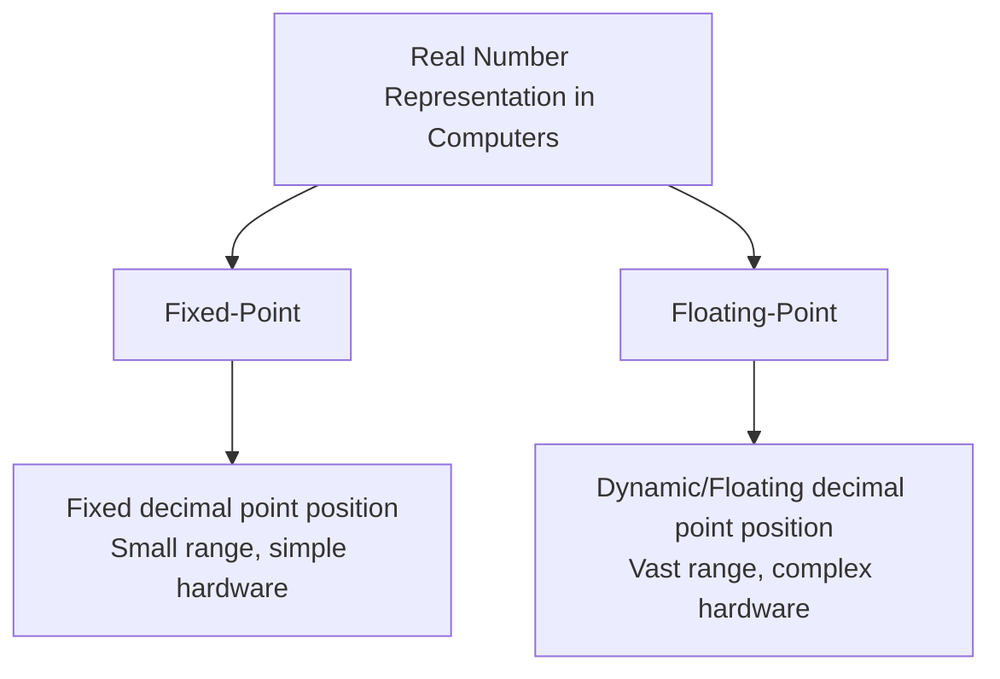
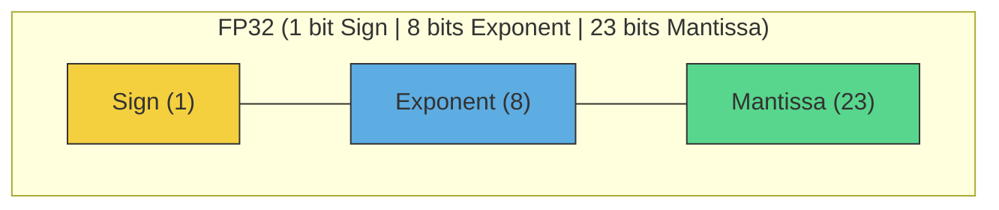
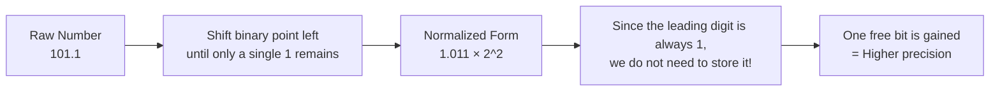
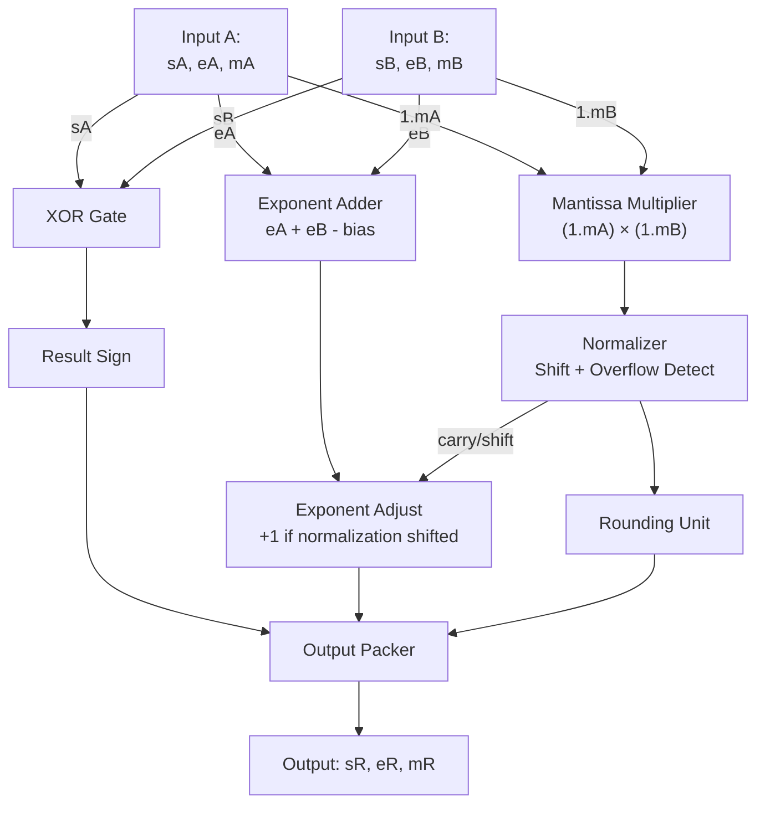
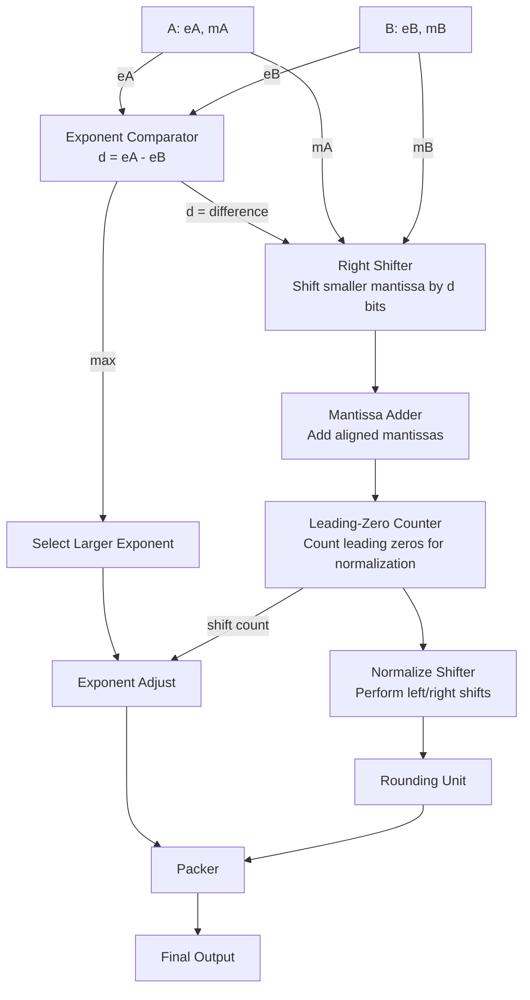
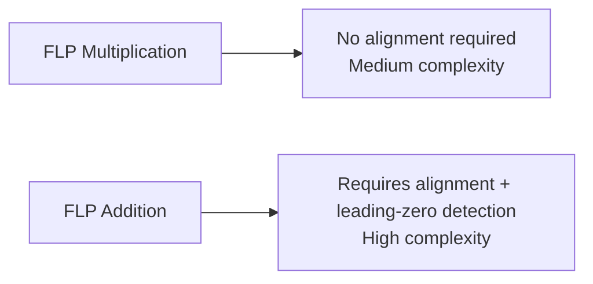
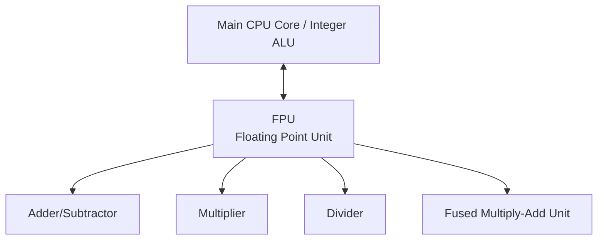
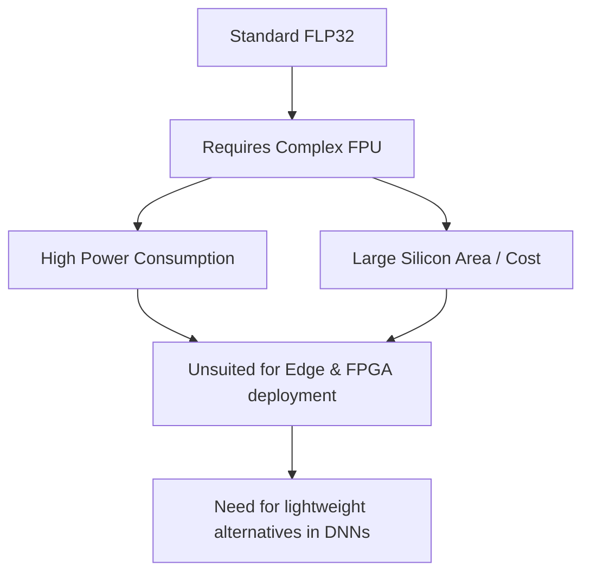
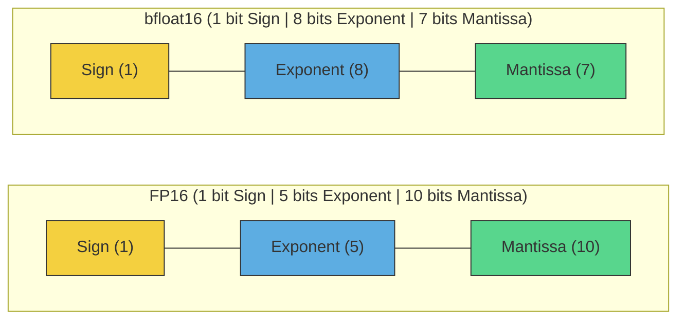
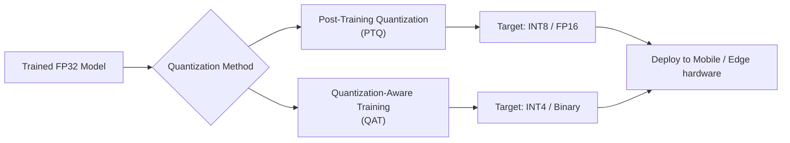

Here is the complete English version of your document, with the hierarchical table of contents and identical Mermaid diagrams and formatting maintained:

---

# Floating-Point Number System (FLP)

## Table of Contents

- [Floating-Point Number System (FLP)](#floating-point-number-system-flp)
  - [Table of Contents](#table-of-contents)
  - [Introduction: Why Floating-Point?](#introduction-why-floating-point)
  - [Fundamentals of Binary Representation](#fundamentals-of-binary-representation)
  - [The IEEE 754 Standard Structure](#the-ieee-754-standard-structure)
    - [Sign Bit: $(-1)^s$](#sign-bit--1s)
    - [Exponent Field: $2^{e - e\_{max}}$](#exponent-field-2e---e_max)
    - [Mantissa Field: $\\left(1 + \\dfrac{m}{2^{ms}}\\right)$](#mantissa-field-left1--dfracm2msright)
    - [Common Formats](#common-formats)
  - [Normalization and the Implicit Bit (The Core Trick)](#normalization-and-the-implicit-bit-the-core-trick)
    - [Decimal Example](#decimal-example)
    - [Binary Example](#binary-example)
    - [Why is this Ingenious?](#why-is-this-ingenious)
  - [The Concept of Bias in Exponents](#the-concept-of-bias-in-exponents)
    - [RTL Datapath for Floating - 1$$](#rtl-datapath-for-floating---1)
  - [Floating-Point Multiplication (Hardware)](#floating-point-multiplication-hardware)
    - [RTL Datapath for Floating-Point Multiplier](#rtl-datapath-for-floating-point-multiplier)
  - [Floating-Point Addition (Hardware)](#floating-point-addition-hardware)
    - [RTL Datapath for Floating-Point Adder](#rtl-datapath-for-floating-point-adder)
  - [FPU Hardware Architecture](#fpu-hardware-architecture)
  - [Complexity of FLP32 and Its Limitations](#complexity-of-flp32-and-its-limitations)
  - [Alternative Formats for DNN Architectures](#alternative-formats-for-dnn-architectures)
    - [A) Low-Precision Floating-Point Formats](#a-low-precision-floating-point-formats)
    - [B) Fixed-Point / Integer Formats](#b-fixed-point--integer-formats)
    - [C) Specialized Formats](#c-specialized-formats)
    - [Overall Comparison](#overall-comparison)
  - [Software Layer: Quantization](#software-layer-quantization)

---

## Introduction: Why Floating-Point?

At the lowest level, computers only process `0`s and `1`s. The fundamental question is:

> How do we represent numbers like $3.14$, $0.0000125$, or $1,250,000,000$ using only bits?

There are two primary approaches:

The core concept behind floating-point numbers is "scientific notation". Just as we write in base 10:

$$1250 = 1.25 \times 10^{3}$$

Computers do exactly the same thing, but in **base 2**:

$$5.5_{(10)} = 101.1_{(2)} = 1.011 \times 2^{2}$$

---

## Fundamentals of Binary Representation

Every floating-point number consists of three distinct components:

| Component | Symbol | Function |
| :--- | :--- | :--- |
| Sign | $s$ | Determines if the number is positive or negative |
| Exponent | $e$ | Represents the magnitude of the number / position of the point |
| Mantissa / Fraction | $m$ | Represents the significant digits of the number |

---

## The IEEE 754 Standard Structure

The complete formula used to represent floating-point numbers (Reference: "FLP addition" and "Multiplication of two FLP numbers" slides) is:

$$n = (-1)^{s} \times 2^{\,e - e_{max}} \times \left(1 + \frac{m}{2^{ms}}\right)$$

Let us break down each component:

### Sign Bit: $(-1)^s$
- If $s = 0$ → $(-1)^0 = +1$ (Positive number)
- If $s = 1$ → $(-1)^1 = -1$ (Negative number)

### Exponent Field: $2^{e - e_{max}}$
Determines where the binary point is shifted. $e_{max}$ acts as the **Bias** (explained in detail in Section 5).

### Mantissa Field: $\left(1 + \dfrac{m}{2^{ms}}\right)$
The "$1+$" prefix in the formula represents the **implicit/hidden bit**. Here, $ms$ is the total number of bits allocated to the mantissa.

### Common Formats

| Format | Total Bits | Sign | Exponent | Mantissa | Bias ($e_{max}$) |
| :--- | :---: | :---: | :---: | :---: | :---: |
| FP32 | 32 | 1 | 8 | 23 | 127 |
| FP16 | 16 | 1 | 5 | 10 | 15 |
| bfloat16 | 16 | 1 | 8 | 7 | 127 |

---

## Normalization and the Implicit Bit (The Core Trick)

This is where most learners get confused: **Why is there always a leading $1$ before the mantissa fraction?**

Key explanation: This is not an inherent trait of the number itself; **we force the number to start with a leading 1.** This process is called **Normalization**.

### Decimal Example
The number $450$ can be represented in various scientific formats:

$$45 \times 10^1 \quad=\quad 0.45 \times 10^3 \quad=\quad \underbrace{4.5 \times 10^2}_{\text{Normalized Form}}$$

The normalization rule for scientific notation states: there must be exactly one non-zero digit to the left of the decimal point.

### Binary Example
In binary, the only possible digits are `0` and `1`. Therefore, the only non-zero digit that can sit to the left of the binary point **is always 1**:

$$101.1_{(2)} \;\xrightarrow{\text{Shift 2 positions left}}\; 1.011 \times 2^{2}$$

### Why is this Ingenious?
By agreeing that the number is always formatted as $1.xxxx$, the leading `1` remains constant and does not need to be stored in memory. The hardware automatically appends it back during computation. This yields **one free extra bit of precision**.

> This is the key difference compared to simpler models. In models without the hidden bit ($n = (-1)^s \times 2^e \times m$), the mantissa is stored as $0.xxxx$. This is simpler to implement but provides lower precision for the same bit-width.

---

## The Concept of Bias in Exponents

Exponents can be negative (for extremely small values like_B} \times 2^{(e_A + e_B - e_{max})} \times (M_A \times M_B)$$

Note: The sign bit of the product is simply calculated using an **XOR** gate.

### RTL Datapath for Floating - 1$$

For FP32 where $es = 8$ (exponent bits):

$$e_{max} = 2^{7} - 1 = 127$$

Thus:
- A real exponent of $+3$ is stored as $3 + 127 = 130$.
- A real exponent of $-5$ is stored as $-5 + 127 = 122$.

This technique eliminates negative exponents in hardware registers, allowing the processor to compare the magnitude of floating-point numbers using fast integer comparators.

---

## Floating-Point Multiplication (Hardware)

Reference: "Multiplication of two FLP numbers" slide. The operations are:

1. Adding their exponents
2. Multiplying the mantissas
3. Normalizing the resultant mantissa
4. Adjusting the exponent

Mathematically, for two numbers $A$ and $B$:

$$A \times B = (-1)^{s_A \oplus s_B} \times 2^{(e_A + e_B - e_{max})} \times (M_A \times M_B)$$

Note: The sign bit of the product is simply calculated using an **XOR** gate.

### RTL Datapath for Floating-Point Multiplier

Floating-point multiplication is relatively "simpler" than addition because it does not require operand alignment.

---

## Floating-Point Addition (Hardware)

Reference: "FLP addition" slide. The steps are:

1. Comparing the operand exponents
2. Shifting their mantissas (alignment)
3. Adding the aligned mantissas
4. Normalizing the sum
5. Adjusting the sum exponent

Addition is **computationally complex** because operands must be aligned to the same exponent before adding. You cannot directly add $1.5 \times 2^3$ to $1.2 \times 2^1$ without first shifting the decimal point of the smaller number.

### RTL Datapath for Floating-Point Adder

A comparison of complexity:

---

## FPU Hardware Architecture

Due to the extreme complexity of these multi-stage operations (especially addition with its alignment and normalization steps), processors delegate these computations to a dedicated co-processor block called the **Floating Point Unit (FPU)**.

While FPUs are highly optimized, they carry a high cost: significant silicon area, high power dissipation, and multiple clock cycles of latency.

---

## Complexity of FLP32 and Its Limitations

Reference: "Complexity of the FLP32 arithmetic" slide. Key limitations include:

- The high hardware overhead of FLP32 operations demands dedicated FPUs.
- Elevated power consumption and design footprint make standard FLP32 modules impractical for resource-constrained embedded systems, such as FPGAs.
- Consequently, standard FLP32 is rarely used for hardware implementations of Deep Neural Network (DNN) engines.

Deep learning models are inherently resilient to low-magnitude rounding errors and noise, which negates the need for the high precision that FP32 provides.

---

## Alternative Formats for DNN Architectures

### A) Low-Precision Floating-Point Formats

**bfloat16 (Brain Floating Point):**
Developed by Google for TPUs. It preserves the same dynamic range as FP32 by allocating 8 bits to the exponent, while reducing the mantissa to 7 bits.

Key trade-off: FP16 provides higher precision with a narrower dynamic range; bfloat16 offers a wide dynamic range with lower precision. For training large models (like LLMs), range stability is more critical than decimal precision to avoid gradient explosion or vanish, making bfloat16 highly popular.

**FP8:** A modern standard utilized in newer GPUs. It uses only 8 bits total, targeting ultra-fast inference and low-power training schemes.

### B) Fixed-Point / Integer Formats

- **INT8:** The gold standard for model deployment and inference on mobile and Edge computing systems.
- **INT4 / Binary / Ternary:** Extreme compression schemes. Binary Neural Networks restrict weights and activations to simple $\{-1, +1\}$ configurations, turning complex math into simple logic gates.

### C) Specialized Formats

- **Logarithmic Number System (LNS):** Numbers are stored in logarithmic form, which simplifies multiplication by turning it into addition (minimizing hardware costs).
- **Posit (Unum):** A dynamic floating-point standard designed to replace IEEE 754 by adjusting exponent/mantissa allocation dynamically to maximize precision around specific ranges.

### Overall Comparison

| Format | Total Bits | Dynamic Range | Precision | Main Application |
| :--- | :---: | :---: | :---: | :--- |
| FP32 | 32 | Very Large | High | General-purpose computing |
| FP16 | 16 | Medium | Medium | Deep learning training / Inference |
| bfloat16 | 16 | Very Large | Low | LLM training |
| FP8 | 8 | Small | Low | Accelerating AI inference |
| INT8 | 8 | Fixed | Quantized | Embedded systems / Mobile Edge |

---

## Software Layer: Quantization

To execute models on low-power hardware, high-precision FP32 parameters are mapped to low-bit formats.

Linear mapping equation from FP32 to INT8:

$$x_{int} = \text{round}\!\left(\frac{x_{float}}{\text{scale}}\right) + \text{zero\_point}$$

Quantization drastically reduces model size and memory bandwidth requirements with negligible loss in accuracy, which explains why standard FLP32 is deprecated for DNN execution.