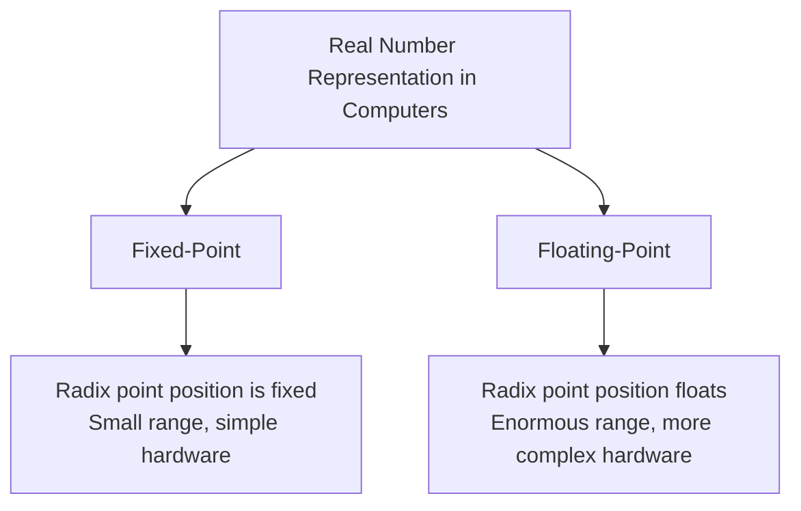
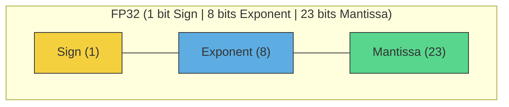
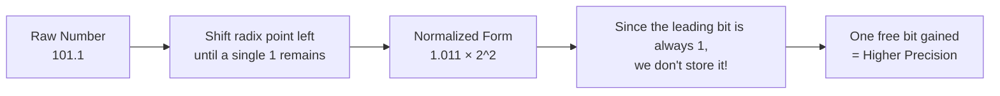
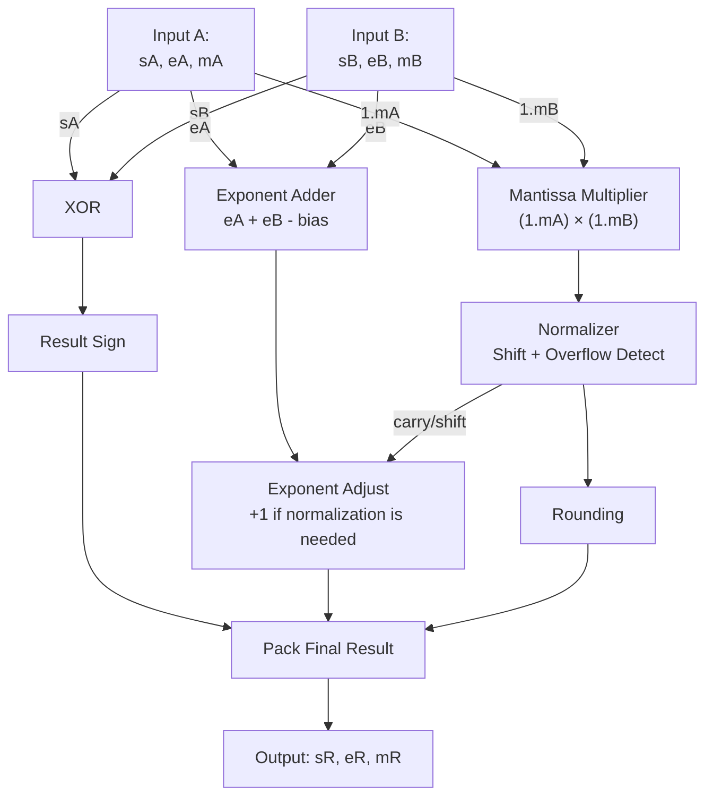
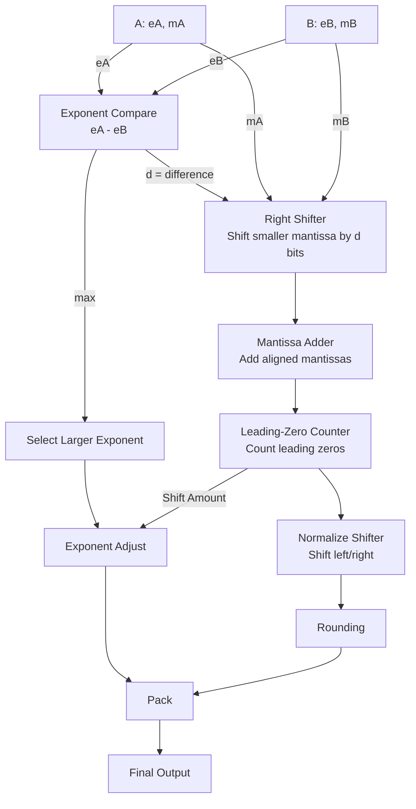
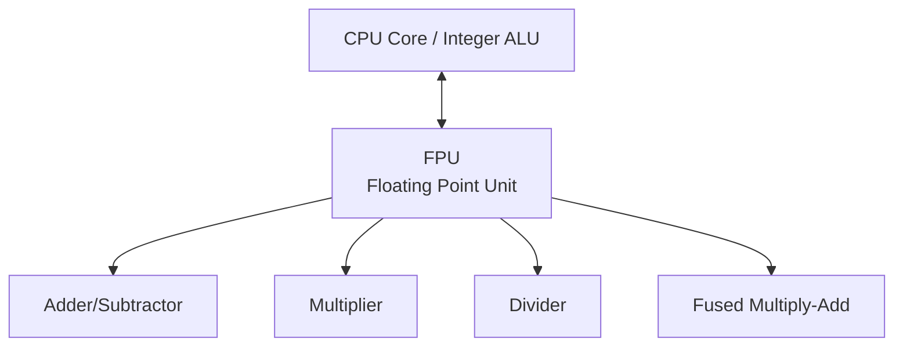
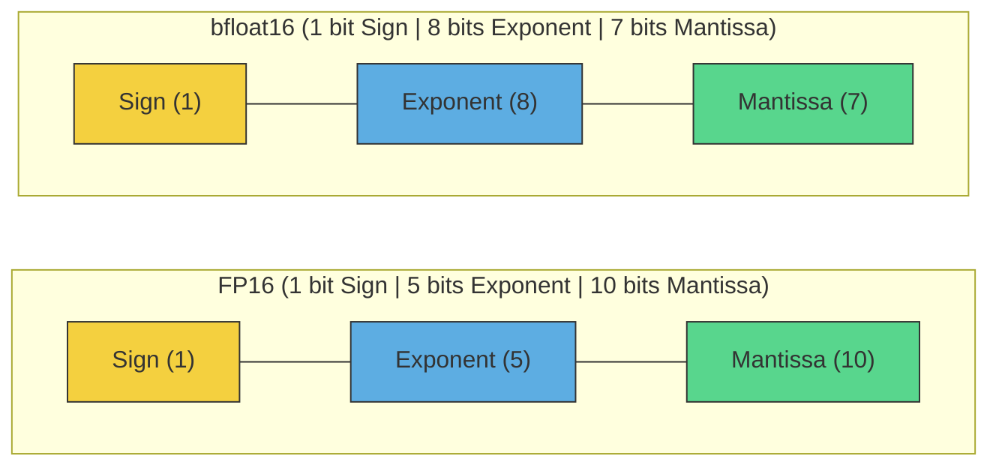
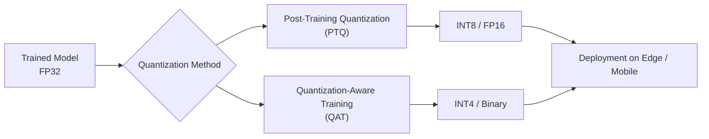

# Floating-Point Representation (FLP) System

## Table of Contents

- [Floating-Point Representation (FLP) System](#floating-point-representation-flp-system)
  - [Table of Contents](#table-of-contents)
  - [Introduction](#introduction)
  - [The IEEE 754 Standard Structure](#the-ieee-754-standard-structure)
  - [Special Values and Denormal Numbers](#special-values-and-denormal-numbers)
  - [Floating-Point Multiplication (Hardware)](#floating-point-multiplication-hardware)
  - [Floating-Point Addition (Hardware)](#floating-point-addition-hardware)
  - [FPU Hardware Architecture](#fpu-hardware-architecture)
  - [Alternative Formats for DNN Architectures](#alternative-formats-for-dnn-architectures)
  - [Software Layer: Quantization](#software-layer-quantization)

---

## Introduction

At the lowest hardware layer, computers process only $0$ and $1$. The fundamental question is:

> How can we store real numbers like $3.14$, $0.0000125$, or $1{,}250{,}000{,}000$ using only binary bits?

There are two primary approaches:

The core concept of floating-point arithmetic is scientific notation. Just as we write in base $10$:

$$1250 = 1.25 \times 10^{3}$$

Computers do the exact same thing, but in **base $2$**:

$$5.5_{(10)} = 101.1_{(2)} = 1.011 \times 2^{2}$$

Every floating-point number consists of three basic components:

---

## The IEEE 754 Standard Structure

| Component | Symbol | Function |
| :--- | :---: | :--- |
| Sign | $s$ | Determines if the number is positive or negative |
| Exponent | $e$ | Determines the scale of the number / radix point position |
| Mantissa (Fraction) | $m$ | Represents the precision bits of the number |

The general formula to calculate a normalized floating-point number is:

$$n = (-1)^{s} \times 2^{\,e - \text{bias}} \times \left(1 + \frac{m}{2^{ms}}\right)$$

Let us examine each component in detail:

### Sign Bit: 
$$(-1)^s$$
- If $s = 0$: the number is positive.
- If $s = 1$: the number is negative.

### Exponent Field: 
Determines the position of the radix point. Since the actual exponent can be negative (for extremely small numbers), a constant offset called **$\text{bias}$** is added. This ensures that the exponent is always stored as an unsigned integer, avoiding the need for an extra sign bit for the exponent itself.

$$\text{bias} = 2^{\,es-1} - 1$$

Where $es$ is the number of bits in the exponent field. For example, in $FP32$ where $es = 8$:

$$\text{bias} = 2^{7} - 1 = 127$$

Thus, if the actual exponent is $+3$, it is stored in memory as $3 + 127 = 130$. If the actual exponent is $-5$, it is stored as $-5 + 127 = 122$. This bias representation makes comparing the magnitudes of two floating-point numbers much faster and simpler for the processor.

### Mantissa (Fraction) Field: 
$$\left(1 + \dfrac{m}{2^{ms}}\right)$$

The "$1+$" term in the formula represents the **hidden bit** (or implicit leading bit). $ms$ denotes the total number of bits allocated to the mantissa field.

During a process called **normalization**, we force the number into a format where there is exactly one non-zero digit to the left of the radix point. In base $10$:

$$450 \;\xrightarrow{\text{Normalization}}\; 4.5 \times 10^2$$

In binary (base $2$), since the only non-zero digit available is $1$, the digit to the left of the radix point **is always $1$**:

$$101.1_{(2)} \;\xrightarrow{\text{Shift Radix Point}}\; 1.011 \times 2^{2}$$

Since the leading bit is implicitly known to be $1$ by convention, we do not waste memory storing it. The hardware automatically inserts this hidden $1$ during computations. This design choice grants **one extra bit of precision for free**.

---

### Common Formats, Range, and Precision

The number of bits assigned to the exponent determines the dynamic range, while the number of bits in the mantissa determines the precision of the fractional representation.

| Format | Total Bits | Sign | Exponent | Mantissa | Bias | Approx. Precision (Decimal) | Approximate Range |
| :--- | :---: | :---: | :---: | :---: | :---: | :---: | :--- |
| **FP32** | $32$ | $1$ | $8$ | $23$ | $127$ | $\approx 7$ digits | $1.4 \times 10^{-45}$ to $3.4 \times 10^{38}$ |
| **FP16** | $16$ | $1$ | $5$ | $10$ | $15$ | $\approx 3.3$ digits | $6.1 \times 10^{-5}$ to $6.5 \times 10^{4}$ |
| **bfloat16** | $16$ | $1$ | $8$ | $7$ | $127$ | $\approx 2.1$ digits | $1.2 \times 10^{-38}$ to $3.4 \times 10^{38}$ |

---

## Special Values and Denormal Numbers

The $IEEE\ 754$ standard defines special bit patterns to represent non-numeric states, infinity, and extremely small numbers:

### 1. Signed Zeros ($\pm 0$)
When all exponent bits and all mantissa bits are $0$, the value represented is zero. Depending on the sign bit $s$, we can have $+0$ or $-0$.
* **Condition:** $\text{Exponent} = 0$ and $\text{Mantissa} = 0$

### 2. Denormalized / Subnormal Numbers
When a number is too small to be represented using the minimum normalized exponent, it becomes denormalized. Here, the exponent bits are all zero, but the mantissa is non-zero. 
For denormal numbers, **the implicit hidden bit is assumed to be $0$ instead of $1$**. This prevents abrupt underflows (Sudden Underflow) and enables a gradual transition to zero (Gradual Underflow).
* **Condition:** $\text{Exponent} = 0$ and $\text{Mantissa} \neq 0$
* **Formula:** 

$$n = (-1)^{s} \times 2^{\,1 - \text{bias}} \times \left(0 + \frac{m}{2^{ms}}\right)$$

### 3. Infinity ($\pm \infty$)
Used to represent values that overflow the maximum representable limit, such as dividing a non-zero number by zero.
* **Condition:** All exponent bits are $1$ ($\text{Exponent} = 255$ in $FP32$) and $\text{Mantissa} = 0$

### 4. Not a Number (NaN)
Represents mathematically undefined or invalid operations, such as $\frac{0}{0}$ or $\infty - \infty$.
* **Condition:** All exponent bits are $1$ ($\text{Exponent} = 255$ in $FP32$) and $\text{Mantissa} \neq 0$

---

## Floating-Point Multiplication (Hardware)

1. Add the exponents of the two operands and subtract the $\text{bias}$ value to maintain the offset representation.
2. Multiply the mantissas (including the implicit leading $1$).
3. Normalize the resulting mantissa (shifting left or right as necessary).
4. Adjust the exponent based on any normalization shifts.
5. Determine the sign of the product using an $XOR$ operation on the sign bits of the input operands.

$$A \times B = (-1)^{s_A \oplus s_B} \times 2^{(e_A + e_B - \text{bias})} \times (M_A \times M_B)$$

### RTL Datapath for Floating-Point Multiplier

---

## Floating-Point Addition (Hardware)

Addition is significantly more complex than multiplication because the operands must be aligned to have the same exponent before their mantissas can be added.

1. Calculate the difference between the two exponents.
2. Shift the mantissa of the smaller number to the right by the difference in exponents so that both numbers share the same exponent (Alignment).
3. Add or subtract the aligned mantissas depending on the sign bits.
4. Normalize the resulting mantissa (using a Leading-Zero Counter to determine the exact number of shifts required).
5. Adjust the exponent and apply the rounding mode.

### RTL Datapath for Floating-Point Adder

---

## FPU Hardware Architecture

Because floating-point arithmetic is hardware-intensive, processors offload these tasks to a dedicated co-processor unit known as the **FPU (Floating Point Unit)**.

While the FPU accelerates floating-point calculations, it comes at a high cost: significant silicon area, high power consumption, and longer propagation delays. This makes native $FP32$ units less suitable for resource-constrained Edge AI or high-efficiency hardware accelerators.

---

## Alternative Formats for DNN Architectures

Deep Neural Networks (DNNs) exhibit high error-tolerance (noise resilience). Consequently, specialized hardware architectures employ reduced-precision numeric formats to optimize throughput and power efficiency.

### A) Low-Precision Floating-Point Formats

In the $16$-bit domain, the two main formats are $FP16$ and $bfloat16$. While $FP16$ provides higher precision, $bfloat16$ keeps an $8$-bit exponent (matching $FP32$), which ensures that model training remains stable by avoiding sudden underflow or overflow.

### B) Fixed-Point and Integer Formats

In fixed-point arithmetic, the radix point's position is static, allowing computations to run on simple, low-power integer ALUs.
* **INT8:** The current standard for model inference on Edge and mobile processors.
* **INT4 / Binary / Ternary:** Extreme quantization where weights are restricted to highly compressed values like $\{-1, +1\}$ or $\{-1, 0, +1\}$.

### C) Comprehensive Comparison of Numeric Formats

| Format | Total Bits | Dynamic Range | Relative Precision | Hardware Complexity (FPU/ALU) | Primary Application |
| :--- | :---: | :---: | :---: | :---: | :--- |
| **FP32** | $32$ | Extremely Large | Very High | Very High | Scientific computing / Primary Training |
| **FP16** | $16$ | Small | High | Moderate | Mid-scale training & inference |
| **bfloat16** | $16$ | Extremely Large | Moderate | Moderate | Large Language Model (LLM) Training |
| **FP8** | $8$ | Very Small | Low | Very Low | Ultra-fast inference & modern FP8 training |
| **INT8** | $8$ | Fixed | Moderate | Extremely Low | Edge AI & mobile model inference |
| **INT4** | $4$ | Extremely Small | Low | Minimal | Ultra-compressed on-device models |

---

## Software Layer: Quantization

Quantization is the process of mapping continuous, high-precision floating-point values ($FP32$) to discrete, lower-precision fixed-point or integer values (like $INT8$).

The standard linear mapping of a float value $x_{float}$ to an integer $x_{int}$ is defined as:

$$x_{int} = \text{round}\!\left(\frac{x_{float}}{\text{scale}}\right) + \text{zero\_point}$$

Where the $\text{scale}$ parameter scales the range of values, and the $\text{zero\_point}$ maps real zero to a representative integer in the target range. This software technique reduces the model size by up to $75\%$ and drastically increases execution speeds with minimal impact on accuracy.