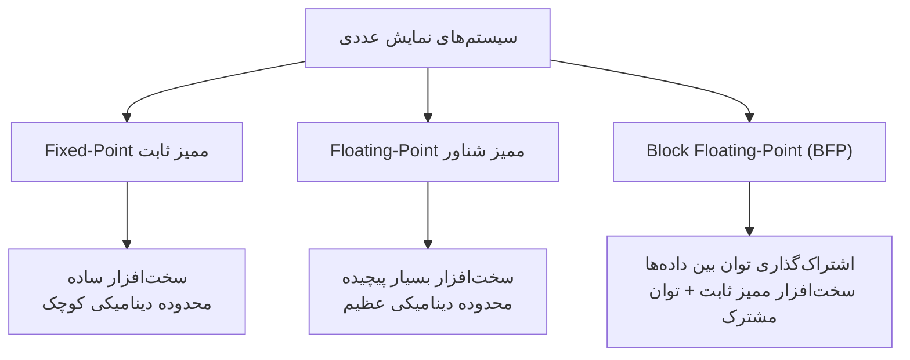
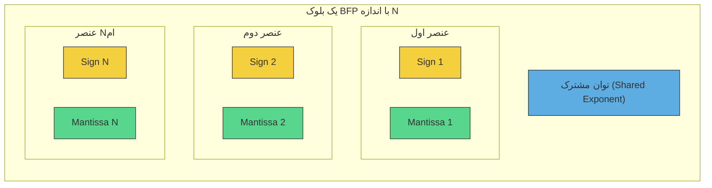
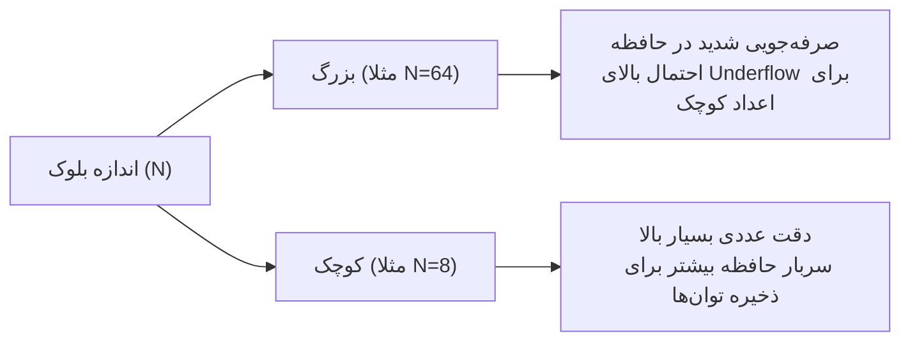
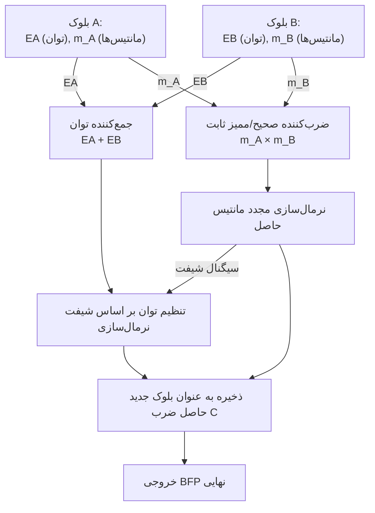
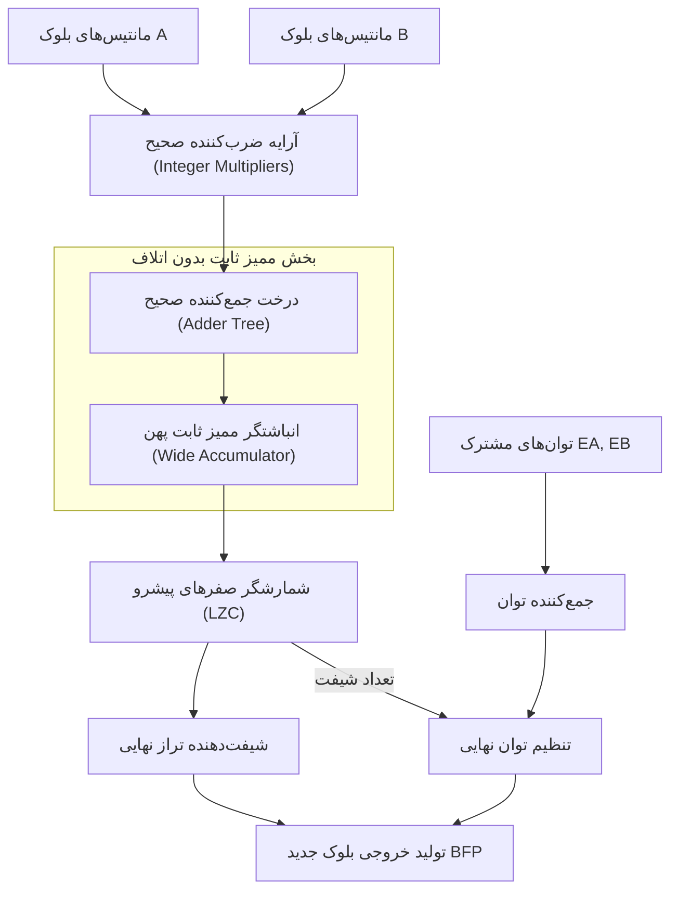

# سیستم اعداد ممیز شناور بلوکی (BFP - Block Floating Point)

## فهرست مطالب

- [سیستم اعداد ممیز شناور بلوکی (BFP - Block Floating Point)](#سیستم-اعداد-ممیز-شناور-بلوکی-bfp---block-floating-point)
  - [فهرست مطالب](#فهرست-مطالب)
  - [مقدمه](#مقدمه)
  - [ساختار و معماری سیستم عددی BFP](#ساختار-و-معماری-سیستم-عددی-bfp)
  - [فرمول ریاضی و ساختار ذخیره‌سازی](#فرمول-ریاضی-و-ساختار-ذخیرهسازی)
  - [اندازه بلوک (Block Size) و مبادلات طراحی](#اندازه-بلوک-block-size-و-مبادلات-طراحی)
  - [عملیات ضرب در سخت‌افزار BFP](#عملیات-ضرب-در-سختافزار-bfp)
  - [عملیات جمع و انباشت (Accumulation) در سخت‌افزار BFP](#عملیات-جمع-و-انباشت-accumulation-در-سختافزار-bfp)
  - [مقایسه جامع: FLP و Fixed-Point و BFP](#مقایسه-جامع-flp-و-fixed-point-و-bfp)
  - [کاربرد BFP در شتاب‌دهنده‌های هوش مصنوعی (DNN Accelerators)](#کاربرد-bfp-در-شتابدهندههای-هوش-مصنوعی-dnn-accelerators)
  - [کوانتیزاسیون و تبدیل نرم‌افزاری به BFP](#کوانتیزاسیون-و-تبدیل-نرمافزاری-به-bfp)

---

## مقدمه

در طراحی سخت‌افزارهای پردازش سیگنال دیجیتال (DSP) و شتاب‌دهنده‌های یادگیری عمیق، طراحان همواره با یک چالش سه‌گانه روبرو هستند: **دقت محاسباتی بالا**، **محدوده دینامیکی وسیع** و **پیچیدگی سخت‌افزاری کم**.

سیستم ممیز ثابت (Fixed-Point) سخت‌افزار بسیار ساده‌ای دارد اما محدوده دینامیکی بسیار محدودی ارائه می‌دهد و به راحتی دچار سرریز (Overflow) یا زیرسرریز (Underflow) می‌شود. در مقابل، ممیز شناور (Floating-Point) محدوده دینامیکی عظیمی دارد اما پیاده‌سازی سخت‌افزاری آن (مخصوصاً بخش تراز کردن توان‌ها در جمع‌کننده) مساحت تراشه و مصرف توان بسیار بالایی را تحمیل می‌کند.

ایده هوشمندانه **ممیز شناور بلوکی (BFP)** به عنوان یک پل ارتباطی میان این دو رویکرد معرفی شده است:



در سیستم BFP، داده‌ها به صورت گروهی یا «بلوکی» دسته‌بندی می‌شوند. تمامی اعداد موجود در یک بلوک، **یک توان مشترک (Shared Exponent)** را به اشتراک می‌گذارند، در حالی که هر عدد مانتیس (Mantissa) و علامت (Sign) اختصاصی خود را دارد. به این ترتیب، محاسبات درونی بلوک مانند محاسبات عدد صحیح ساده و ارزان تمام می‌شود، در حالی که توان مشترک انعطاف‌پذیری پویا را به همراه دارد.

---

## ساختار و معماری سیستم عددی BFP

در یک معماری استاندارد BFP با اندازه بلوک $N$، برای نمایش مجموعه‌ای از اعداد، به جای ذخیره‌سازی توان مجزا برای تک‌تک آن‌ها، کل بلوک تنها با یک توان واحد ذخیره می‌شود.



در این ساختار:
- **توان مشترک ($E_{\text{shared}}$):** بزرگترین توان در میان کل اعضای بلوک است که یک‌بار محاسبه و ذخیره می‌شود.
- **مانتیس‌های انفرادی ($m_i$):** همگی نسبت به توان مشترک شیفت داده شده و تراز می‌شوند. این مانتیس‌ها در عمل مانند اعداد ممیز ثابت (Fixed-Point) رفتار می‌کنند.

---

## فرمول ریاضی و ساختار ذخیره‌سازی

فرض کنید یک بلوک از اعداد حقیقی به صورت $X = \{x_1, x_2, \dots, x_N\}$ داشته باشیم. برای نمایش این بلوک در قالب BFP با مانتیس $B_m$ بیتی و توان مشترک $B_e$ بیتی، مراحل ریاضی زیر طی می‌شود:

۱. ابتدا توان ایده‌آل هر عدد محاسبه می‌شود:

$$e_i = \lfloor \log_2(|x_i|) \rfloor$$

۲. توان مشترک بلوک ($E_{\text{shared}}$) به عنوان بزرگترین توان در بین تمام اعضا انتخاب می‌شود:

$$E_{\text{shared}} = \max_{i=1}^{N} (e_i)$$

۳. مانتیس هر عدد بر اساس تراز شدن با توان مشترک شیفت داده شده و محاسبه می‌شود:

$$m_i = \text{round}\left( \frac{x_i}{2^{E_{\text{shared}}}} \times (2^{B_m - 1} - 1) \right)$$

در نتیجه، هر عدد $x_i$ درون بلوک با فرمول زیر بازسازی می‌شود:

$$x_i = (-1)^{s_i} \times \frac{m_i}{2^{B_m - 1} - 1} \times 2^{E_{\text{shared}}}$$

که در آن $s_i$ بیت علامت عنصر $i$ام است.

---

## اندازه بلوک (Block Size) و مبادلات طراحی

انتخاب اندازه بلوک ($N$) یک پارامتر بحرانی در طراحی سیستم‌های مبتنی بر BFP است:



- **بلوک‌های بزرگ:** بهره‌وری انرژی و فشرده‌سازی حافظه به حداکثر می‌رسد، اما اگر توزیع داده‌ها دارای واریانس بالایی باشد (یک عدد بسیار بزرگ و بقیه بسیار کوچک باشند)، مانتیس اعداد کوچک‌تر به سمت راست شیفت زیادی خورده و عملاً صفر می‌شوند (زیرسرریز یا Truncation Error).
- **بلوک‌های کوچک:** دقت عددی حفظ می‌شود و خطای کوانتیزاسیون کاهش می‌یابد، اما سربار ذخیره کردن توان‌های مشترک بیشتر می‌شود. در کاربردهای یادگیری عمیق، اندازه‌های بلوک $8$، $16$ و $32$ متداول‌ترین انتخاب‌ها هستند.

---

## عملیات ضرب در سخت‌افزار BFP

یکی از بزرگترین مزایای BFP ساده بودن ضرب است. از آنجا که مانتیس‌ها ممیز ثابت هستند، برای ضرب دو بلوک BFP نیازی به هم‌ترازسازی (Alignment) قبل از انجام ضرب نیست.

ضرب دو عنصر $x_i$ از بلوک $A$ و $y_i$ از بلوک $B$ به صورت زیر است:

$$z_i = x_i \times y_i = \left( m_{x,i} \times 2^{E_A} \right) \times \left( m_{y,i} \times 2^{E_B} \right) = \left( m_{x,i} \times m_{y,i} \right) \times 2^{E_A + E_B}$$

پس سخت‌افزار تنها باید:
1. مانتیس‌ها را با استفاده از یک ضرب‌کننده عدد صحیح ساده ضرب کند.
2. توان‌های مشترک دو بلوک را با هم جمع کند.

### دیتاپث RTL ضرب‌کننده BFP



---

## عملیات جمع و انباشت (Accumulation) در سخت‌افزار BFP

عملیات جمع در BFP نسبت به ممیز شناور استاندارد بسیار ارزان‌تر است، زیرا ترازبندی (Alignment) توان‌ها تنها یک بار برای کل بلوک انجام می‌شود، نه برای تک‌تک جفت داده‌ها.

هنگام جمع کردن عناصر داخل یک بلوک (مثلاً در محاسبه ضرب ماتریسی یا کانولوشن):
1. تمامی مانتیس‌های هم‌بلوک از ابتدا دارای توان مشترک هستند، بنابراین مستقیماً و بدون هیچ شیفتی با یکدیگر جمع می‌شوند.
2. برای جلوگیری از سرریز (Overflow) در طول جمع‌های متوالی (Accumulation)، از ثبات‌های انباشتگر با پهنای بیت بیشتر (ممیز ثابت پهن) استفاده می‌شود.
3. در پایان عملیات، نتیجه حاصل مجدداً نرمال‌سازی شده و به فرمت BFP فشرده می‌شود.

### دیتاپث RTL انباشتگر ضرب ضربدری (MAC) در BFP



---

## مقایسه جامع: FLP و Fixed-Point و BFP

| شاخص | ممیز شناور (FLP) | ممیز ثابت (Fixed-Point) | ممیز شناور بلوکی (BFP) |
| :--- | :---: | :---: | :---: |
| **محدوده دینامیکی** | بسیار وسیع | بسیار محدود | وسیع (تغییر پویا بر اساس توان بلوک) |
| **دقت عددی نسبی** | عالی برای تمامی مقادیر | وابسته به مقیاس ثابت داده‌ها | عالی برای داده‌های با توزیع همگن |
| **پیچیدگی محاسبات ضرب** | بالا (نیاز به ALUهای مجزا) | بسیار کم (ضرب‌کننده صحیح) | بسیار کم (ضرب‌کننده صحیح) |
| **پیچیدگی محاسبات جمع** | بسیار بالا (تراز انفرادی توان‌ها) | بسیار کم | کم (تراز کردن گروهی در سطح بلوک) |
| **سربار حافظه** | بالا (ذخیره توان برای تک‌تک داده‌ها) | صفر | بسیار ناچیز (یک توان برای کل بلوک) |

---

## کاربرد BFP در شتاب‌دهنده‌های هوش مصنوعی (DNN Accelerators)

در سال‌های اخیر، سیستم BFP به انتخاب اول طراحان سخت‌افزار هوش مصنوعی و آرایه‌های سیستولیک (Systolic Arrays) تبدیل شده است. نمونه‌های برجسته عبارتند از:

* **فرمت‌های تجاری جدید مایکروسافت و اینتل:** استانداردهایی مانند **MS-FP8** و **Flexpoint** که از ممیز شناور بلوکی برای کاهش عرض پهنای باند حافظه بدون آسیب زدن به همگرایی شبکه‌های عصبی عمیق بهره می‌برند.
* **بهینه‌سازی محاسبات GEMM (ضرب ماتریس‌ها):** در ضرب ماتریس‌های بزرگ، وزن‌ها و اکتیویشن‌ها به بلوک‌های $16$ یا $32$ تایی تقسیم می‌شوند. سخت‌افزار ضرب و جمع را روی هسته‌های ممیز ثابت با فرکانس و بازدهی بالا انجام می‌دهد و در پایان پوسته ممیز شناور بلوک را اعمال می‌کند. این امر توان مصرفی سخت‌افزار را تا $4\times$ بهبود می‌دهد.

---

## کوانتیزاسیون و تبدیل نرم‌افزاری به BFP

برای استفاده از شتاب‌دهنده‌های سخت‌افزاری BFP، مدل‌های آموزش‌دیده در محیط نرم‌افزاری (که معمولاً با فرمت $FP32$ هستند) باید کوانتیزه شوند. الگوریتم تبدیل یک بردار $FP32$ به فرمت BFP در لایه نرم‌افزار به صورت زیر است:

```python
import numpy as np

def float32_to_bfp(tensor, mantissa_bits=8):
    # 1. Find the maximum absolute value within the block
    max_val = np.max(np.abs(tensor))
    if max_val == 0:
        return np.zeros_like(tensor), 0
    
    # 2. Calculate the shared exponent for the block
    shared_exponent = int(np.floor(np.log2(max_val)))
    
    # 3. Align mantissas and quantize to a signed integer format
    scale = 2 ** (mantissa_bits - 1 - shared_exponent)
    quantized_mantissa = np.round(tensor * scale)
    
    # Clipping values outside the range
    max_limit = 2**(mantissa_bits - 1) - 1
    min_limit = -2**(mantissa_bits - 1)
    quantized_mantissa = np.clip(quantized_mantissa, min_limit, max_limit)
    
    return quantized_mantissa.astype(np.int8), shared_exponent

# Sample test
float_block = np.array([0.12, 1.5, -0.85, 0.03], dtype=np.float32)
mantissas, shared_exp = float32_to_bfp(float_block, mantissa_bits=8)

print(f"Quantized mantissas (INT8): {mantissas}")
print(f"Stored shared exponent: {shared_exp}")
```

این متدولوژي به راحتی اجازه می‌دهد پردازش‌های سنگین یادگیری ماشین روی لبه شبکه‌ها (Edge devices) با توان فوق‌العاده پایین و کارایی بی‌نظیر انجام پذیرد.