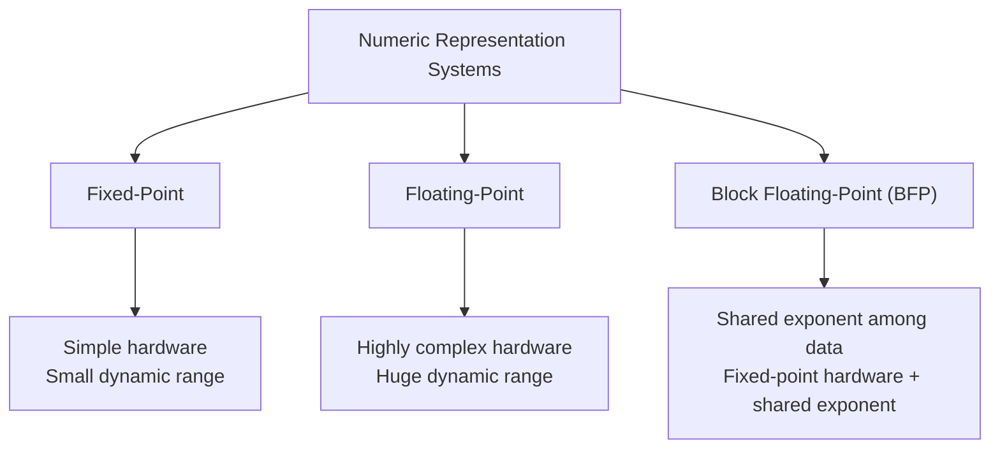
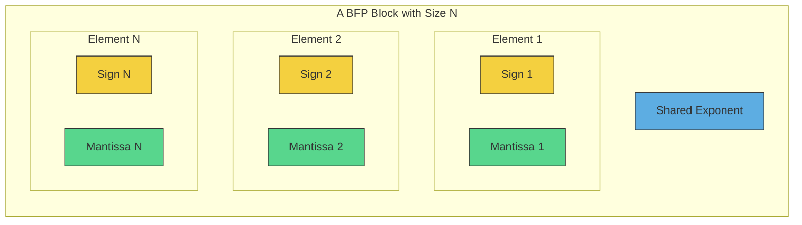
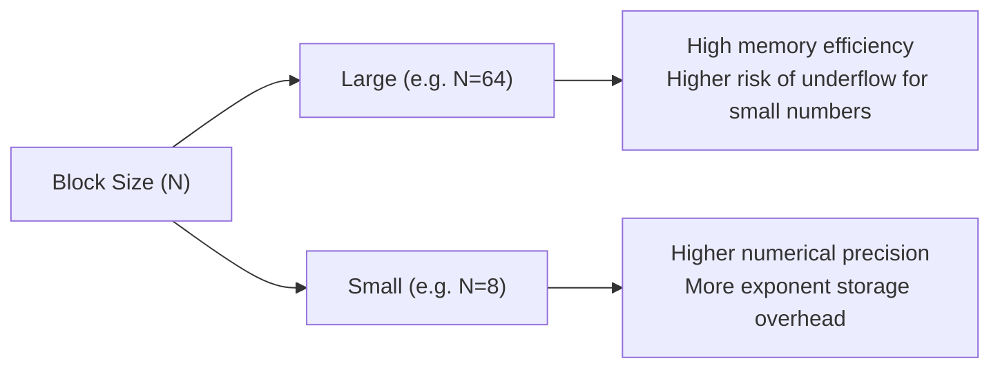
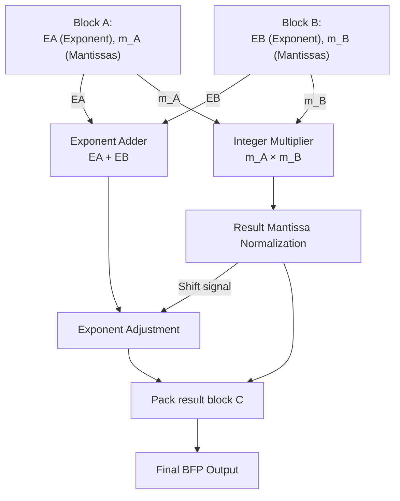
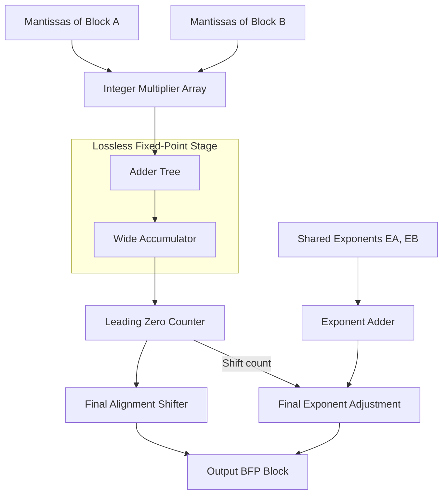

# Block Floating‑Point Number System (BFP)

## Table of Contents

- [Block Floating‑Point Number System (BFP)](#block-floatingpoint-number-system-bfp)
  - [Table of Contents](#table-of-contents)
  - [Introduction](#introduction)
  - [Structure and Architecture of the BFP Number System](#structure-and-architecture-of-the-bfp-number-system)
  - [Mathematical Formulation and Storage Structure](#mathematical-formulation-and-storage-structure)
  - [Block Size and Design Trade‑offs](#block-size-and-design-tradeoffs)
  - [Multiplication Operation in BFP Hardware](#multiplication-operation-in-bfp-hardware)
  - [Addition and Accumulation in BFP Hardware](#addition-and-accumulation-in-bfp-hardware)
  - [Comprehensive Comparison: Floating‑Point vs Fixed‑Point vs BFP](#comprehensive-comparison-floatingpoint-vs-fixedpoint-vs-bfp)
  - [BFP in AI Accelerators (DNN Accelerators)](#bfp-in-ai-accelerators-dnn-accelerators)
  - [Software Quantization and Conversion to BFP](#software-quantization-and-conversion-to-bfp)

---

## Introduction

In the design of **digital signal processing (DSP) hardware** and **deep learning accelerators**, designers constantly face a three‑way trade‑off:

- high computational precision  
- wide dynamic range  
- low hardware complexity  

The **fixed‑point number system** offers extremely simple hardware but provides a very limited dynamic range and easily suffers from **overflow** or **underflow**.

On the other hand, **floating‑point arithmetic** provides a huge dynamic range but requires complex hardware implementation—especially in the **exponent alignment stage during addition**, which significantly increases silicon area and power consumption.

The clever idea of **Block Floating‑Point (BFP)** was introduced as a bridge between these two approaches:



In BFP systems, data values are grouped into **blocks**. All numbers inside a block **share a single exponent**, while each number maintains its own **mantissa** and **sign**.

As a result:

- computations inside the block behave like **simple integer or fixed‑point operations**
- the **shared exponent** provides **dynamic scaling capability**

---

## Structure and Architecture of the BFP Number System

In a standard BFP architecture with block size \(N\), a group of numbers is represented using **one shared exponent instead of storing an exponent for every element**.



In this structure:

- **Shared exponent (\(E_{shared}\))**  
  The largest exponent among all elements in the block. It is computed once and stored for the entire block.

- **Individual mantissas (\(m_i\))**  
  Each value is shifted relative to the shared exponent. In practice, these mantissas behave like **fixed‑point integers**.

---

## Mathematical Formulation and Storage Structure

Suppose we have a block of real numbers:

\[
X = \{x_1, x_2, \dots, x_N\}
\]

To represent this block using BFP with:

- \(B_m\) mantissa bits  
- \(B_e\) exponent bits  

the following steps are performed.

### 1. Compute the ideal exponent for each number

\[
e_i = \lfloor \log_2(|x_i|) \rfloor
\]

### 2. Select the shared block exponent

\[
E_{\text{shared}} = \max_{i=1}^{N} (e_i)
\]

### 3. Compute the aligned mantissas

\[
m_i = \text{round}\left( \frac{x_i}{2^{E_{\text{shared}}}} \times (2^{B_m - 1} - 1) \right)
\]

Each number \(x_i\) can then be reconstructed as:

\[
x_i =
(-1)^{s_i}
\times
\frac{m_i}{2^{B_m - 1} - 1}
\times
2^{E_{\text{shared}}}
\]

where \(s_i\) is the **sign bit** of the \(i\)-th element.

---

## Block Size and Design Trade‑offs

Choosing the **block size \(N\)** is a critical design parameter in BFP systems.



### Large Blocks

Advantages:

- higher compression
- reduced memory overhead

Disadvantages:

- if data distribution has high variance (one large value and many small ones),  
  small numbers may shift too far right and become **zero after quantization**

### Small Blocks

Advantages:

- higher numerical precision
- less quantization error

Disadvantages:

- more overhead for storing block exponents

In deep learning hardware, **block sizes of 8, 16, and 32** are common.

---

## Multiplication Operation in BFP Hardware

One of the biggest advantages of BFP is the **simplicity of multiplication**.

Because mantissas are fixed‑point integers, multiplication does **not require exponent alignment before computation**.

For two elements:

\[
x_i = m_{x,i} \times 2^{E_A}
\]

\[
y_i = m_{y,i} \times 2^{E_B}
\]

their product becomes:

\[
z_i = x_i \times y_i =
(m_{x,i} \times m_{y,i}) \times 2^{E_A + E_B}
\]

Thus, the hardware only needs to:

1. multiply mantissas using an **integer multiplier**
2. add the **two shared exponents**

### RTL Datapath of a BFP Multiplier



---

## Addition and Accumulation in BFP Hardware

Addition in BFP is much cheaper than standard floating‑point addition.

This is because **exponent alignment occurs once per block**, not for every pair of operands.

When accumulating values inside a block (e.g., matrix multiplication or convolution):

1. mantissas already share the same exponent  
2. they can be **added directly without shifting**
3. accumulation uses **wide fixed‑point registers** to prevent overflow
4. the final result is **normalized and compressed back to BFP format**

### RTL Datapath of a BFP MAC (Multiply‑Accumulate)



---

## Comprehensive Comparison: Floating‑Point vs Fixed‑Point vs BFP

| Metric | Floating‑Point | Fixed‑Point | BFP |
|------|------|------|------|
| Dynamic Range | Very large | Very limited | Large (block‑dependent) |
| Numerical Precision | Excellent | Scale‑dependent | Good for homogeneous data |
| Multiplication Complexity | High | Very low | Very low |
| Addition Complexity | Very high | Very low | Low |
| Memory Overhead | High | None | Very small |

---

## BFP in AI Accelerators (DNN Accelerators)

In recent years, BFP has become a preferred representation in **AI hardware accelerators** and **systolic arrays**.

Notable examples include:

- **Microsoft and Intel formats**  
  such as **MS‑FP8** and **Flexpoint**, which leverage block floating‑point to reduce memory bandwidth without harming neural network convergence.

- **GEMM optimization**  
  During large matrix multiplications, weights and activations are divided into blocks (often **16 or 32 elements**).  
  Computation is performed using **high‑throughput fixed‑point cores**, and the floating‑point scaling is applied at the block level.

This approach can improve **energy efficiency by up to 4×**.

---

## Software Quantization and Conversion to BFP

To run models on BFP hardware accelerators, models trained in **FP32** must first be quantized.

A simple algorithm for converting an FP32 vector to BFP format is shown below.

```python
import numpy as np

def float32_to_bfp(tensor, mantissa_bits=8):
    # 1. Find the maximum absolute value within the block
    max_val = np.max(np.abs(tensor))
    if max_val == 0:
        return np.zeros_like(tensor), 0
    
    # 2. Calculate the shared exponent for the block
    shared_exponent = int(np.floor(np.log2(max_val)))
    
    # 3. Align mantissas and quantize to a signed integer format
    scale = 2 ** (mantissa_bits - 1 - shared_exponent)
    quantized_mantissa = np.round(tensor * scale)
    
    # Clipping values outside the range
    max_limit = 2**(mantissa_bits - 1) - 1
    min_limit = -2**(mantissa_bits - 1)
    quantized_mantissa = np.clip(quantized_mantissa, min_limit, max_limit)
    
    return quantized_mantissa.astype(np.int8), shared_exponent

# Sample test
float_block = np.array([0.12, 1.5, -0.85, 0.03], dtype=np.float32)
mantissas, shared_exp = float32_to_bfp(float_block, mantissa_bits=8)

print(f"Quantized mantissas (INT8): {mantissas}")
print(f"Stored shared exponent: {shared_exp}")
```

This methodology enables **energy‑efficient machine learning computation on edge devices**, while maintaining good numerical performance.
