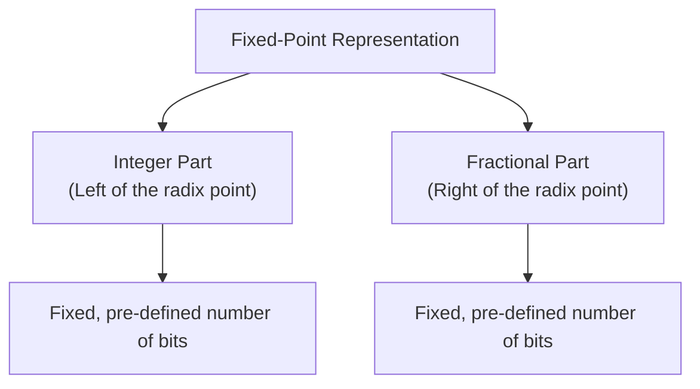
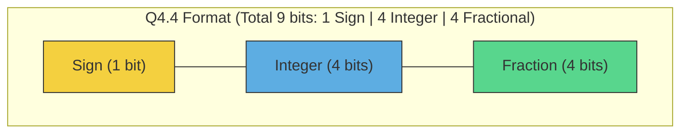
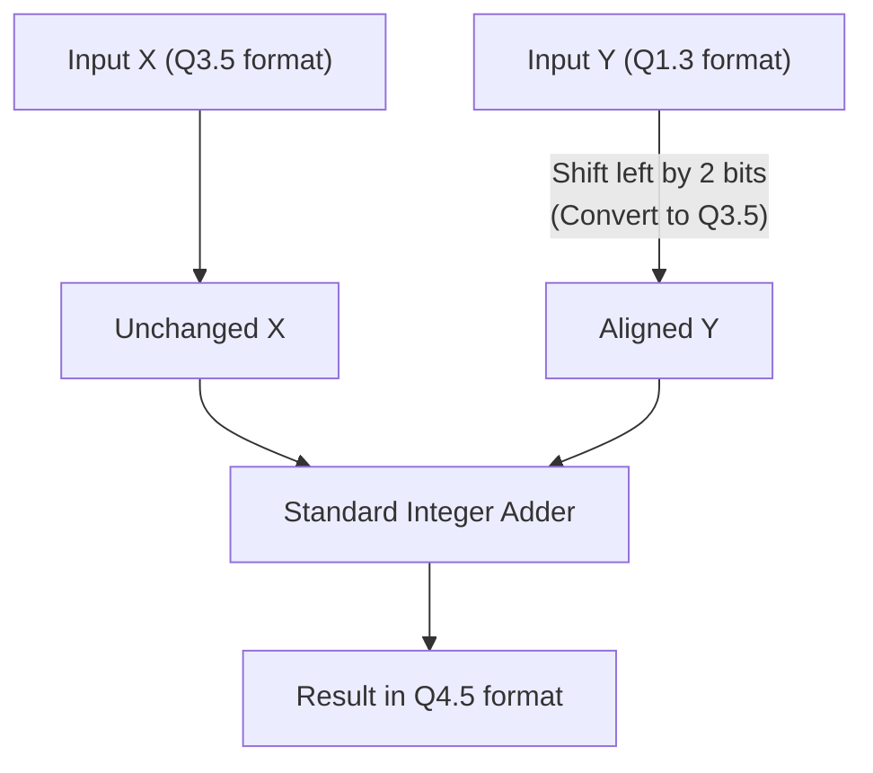
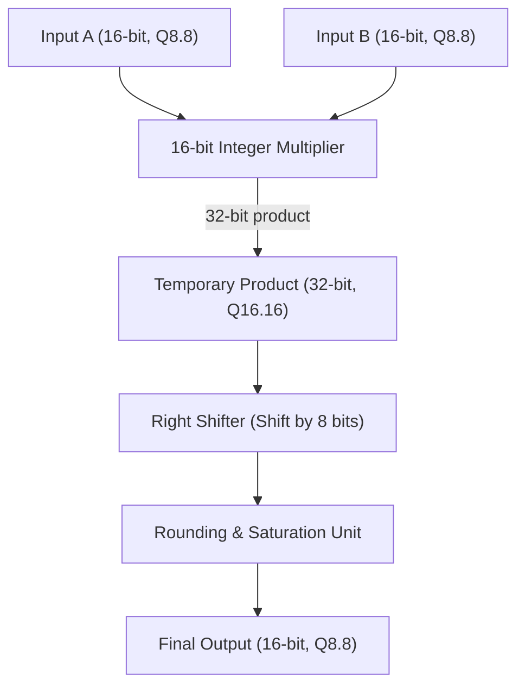
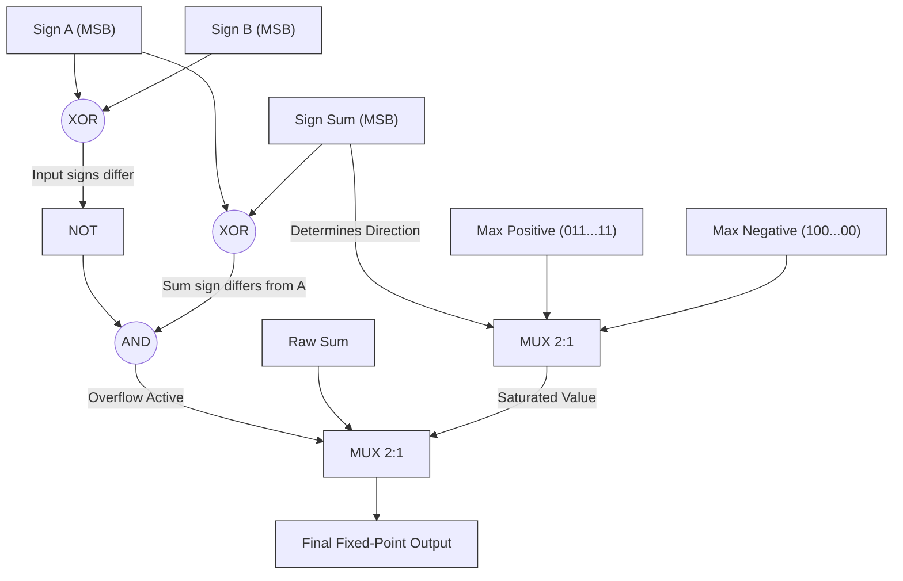
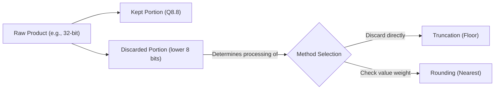

# Fixed-Point (FXP) Number Systems

## Table of Contents
- [Fixed-Point (FXP) Number Systems](#fixed-point-fxp-number-systems)
  - [Table of Contents](#table-of-contents)
  - [Introduction](#introduction)
  - [Mathematical Structure and Representation (Q Format)](#mathematical-structure-and-representation-q-format)
  - [Types of Fixed-Point Formats](#types-of-fixed-point-formats)
  - [Arithmetic Operations in Fixed-Point Hardware](#arithmetic-operations-in-fixed-point-hardware)
  - [Overflow and Rounding Concepts](#overflow-and-rounding-concepts)
  - [Comprehensive Comparison: Fixed-Point (FXP) vs. Floating-Point (FLP)](#comprehensive-comparison-fixed-point-fxp-vs-floating-point-flp)

---

## Introduction

Although Floating-Point (FLP) representation covers an enormous dynamic range, its hardware implementation (such as a Floating-Point Unit - FPU) is highly complex, power-hungry, and occupies a significant silicon area. In embedded systems, Digital Signal Processors (DSPs), Edge AI accelerators, and FPGAs, **Fixed-Point (FXP)** representation is highly preferred.

The core concept of fixed-point arithmetic is simple: **the position of the radix point (binary point) remains fixed throughout all calculations.**



Since the location of the binary point is purely conceptual, the processor's execution unit (ALU) treats these values exactly like **standard integers**. Consequently, fixed-point operations are executed significantly faster and require much simpler hardware.

---

## Mathematical Structure and Representation (Q Format)

To specify the structural layout of a signed fixed-point number, the industry standard **Q format** (or $Q_{m.n}$ format) is used:



In the $Q_{m.n}$ (or $Qm.n$) format:
* **$s$**: The sign bit (1 bit representing signed numbers in two's complement).
* **$m$**: The number of integer bits.
* **$n$**: The number of fractional bits.
* **Total word length ($U$):** Equals $1 + m + n$ (for signed numbers).

### Mathematical Representation

If we have a two's complement binary string representing an integer value $X$, its real-world decimal equivalent ($V$) in $Q_{m.n}$ format is calculated as:

$$V = X \times 2^{-n}$$

For example, consider an 8-bit signed binary number $11010100_{(2)}$ in $Q_{3.4}$ format:
* Equivalent signed integer value in decimal: $-44_{(10)}$
* Since $n=4$, the implicit binary point is located 4 bits from the right ($1101.0100$).
* Real value:

$$V = -44 \times 2^{-4} = \frac{-44}{16} = -2.75$$

### Scaling Factor

In fixed-point programming, any real decimal value is converted into the stored integer representation by multiplying it by a **scaling factor**:

$$\text{Scaling Factor} = 2^{n}$$

$$\text{Stored Integer} = \text{round}(V_{\text{real}} \times 2^{n})$$

---

## Types of Fixed-Point Formats

Depending on the application, the ratio of integer bits to fractional bits varies:

| Format | Total Bits | Sign Bit | Integer Bits ($m$) | Fractional Bits ($n$) | Scaling Factor | Resolution (Precision) | Numeric Range (Interval) |
| :--- | :---: | :---: | :---: | :---: | :---: | :---: | :--- |
| **Q15 (or Q0.15)** | $16$ | $1$ | $0$ | $15$ | $2^{15}$ | $3.05 \times 10^{-5}$ | $-1.0$ to $+0.999969$ |
| **Q8.8** | $16$ | $1$ | $8$ | $8$ | $2^{8}$ | $3.90 \times 10^{-3}$ | $-256.0$ to $+255.996$ |
| **Q1.31** | $32$ | $1$ | $1$ | $31$ | $2^{31}$ | $4.65 \times 10^{-10}$ | $-2.0$ to $+1.999999$ |

> **Note:** The $Q15$ format is highly popular in audio processing and sensor DSPs. It normalizes inputs between $-1$ and $+1$, making it ideal for normalized signals.

---

## Arithmetic Operations in Fixed-Point Hardware

The primary advantage of fixed-point systems is that they execute calculations on **standard integer ALUs**. However, maintaining scale alignment is the responsibility of the hardware
 designer or compiler.

---

### 1. Addition and Subtraction

#### Case A: Identical Formats
If two numbers $X$ and $Y$ have the same format $Q_{m.n}$, their stored integer values in hardware are:
$$X_{stored} = X \times 2^n$$
$$Y_{stored} = Y \times 2^n$$

Since the scales match, we can perform a direct integer addition:
$$Z_{stored} = X_{stored} + Y_{stored} = (X \times 2^n) + (Y \times 2^n) = (X + Y) \times 2^n$$

* **Result:** The sum $Z_{stored}$ is automatically in the same $Q_{m.n}$ format.
* **Hardware Requirement:** A simple $U$-bit integer adder (where $U = 1 + m + n$).

#### Case B: Mixed Formats
If we want to add two numbers with different formats, $X \in Q_{m1.n1}$ and $Y \in Q_{m2.n2}$, we must first align their binary points. Assume that $X$ has higher fractional precision ($n1 > n2$).

1. Calculate the scaling factor difference:
$$d = n1 - n2$$
2. Shift the stored integer $Y_{stored}$ **left** by $d$ bits to match the scale of $X$:
$$Y'_{stored} = Y_{stored} \ll d = Y_{stored} \times 2^{n1 - n2}$$
3. Perform the addition on the aligned integer values:
$$Z_{stored} = X_{stored} + Y'_{stored}$$



* **Final Output Format:** To guarantee zero overflow in the integer part and preserve full precision of the fractional part, the safe destination format is:
$$Q_{\max(m1, m2)+1 . \max(n1, n2)}$$

---

### 2. Multiplication

Unlike addition, fixed-point multiplication does not require initial alignment of the binary points.

#### Case A: Identical Formats
If two numbers $X$ and $Y$ in the same $Q_{m.n}$ format are multiplied:
$$X_{stored} \times Y_{stored} = (X \times 2^n) \times (Y \times 2^n) = (X \times Y) \times 2^{2n}$$

* **Radix Point Position:** The raw product has $2n$ fractional bits.
* **Intermediate Word Length:** The full product is a $2U$-bit number in $Q_{(2m+1).2n}$ format.
* **Rescaling:** To restore the result to the original $Q_{m.n}$ format, we must shift the raw product to the right by $n$ bits:
$$Z_{stored} = (X_{stored} \times Y_{stored}) \gg n$$

#### Case B: Mixed Formats
When multiplying two numbers with different formats, $X \in Q_{m1.n1}$ and $Y \in Q_{m2.n2}$, the exact product is generated in this format:
$$\text{Format of } (X \times Y) = Q_{(m1 + m2 + 1).(n1 + n2)}$$

To scale the final product to a target format $Q_{m3.n3}$, the required shift amount ($S$) is calculated as:
$$S = (n1 + n2) - n3$$
* If $S > 0$: Shift the product to the **right** by $S$ bits (applying rounding or truncation).
* If $S < 0$: Shift the product to the **left** by $|S|$ bits.

$$Z_{stored} = \text{Shift}(X_{stored} \times Y_{stored}, \, S)$$



---

### 3. Division

Division in fixed-point arithmetic is challenging because direct integer division throws away the fractional remainder.

#### Case A: Identical Formats
If we directly divide two numbers in $Q_{m.n}$ format:
$$\frac{X_{stored}}{Y_{stored}} = \frac{X \times 2^n}{Y \times 2^n} = \frac{X}{Y}$$
The scaling factor $2^n$ cancels out, converting the result into a plain integer.

* **Hardware Workaround:** The dividend ($X_{stored}$) must be shifted **left** by $n$ bits prior to the division:
$$X'_{stored} = X_{stored} \ll n = X \times 2^{2n}$$
* Performing the integer division now preserves the scale factor:
$$Z_{stored} = \frac{X'_{stored}}{Y_{stored}} = \frac{X \times 2^{2n}}{Y \times 2^n} = \left(\frac{X}{Y}\right) \times 2^n$$
* **Result:** The quotient is correctly represented in the destination $Q_{m.n}$ format.

#### Case B: Mixed Formats
If we divide $X \in Q_{m1.n1}$ by $Y \in Q_{m2.n2}$ and want the output in a target format $Q_{m3.n3}$:
1. Calculate the initial left shift for the dividend:
$$\text{Shift Left Amount} = n3 + n2 - n1$$
2. Implement in hardware as:
$$X'_{stored} = X_{stored} \ll (n3 + n2 - n1)$$
$$Z_{stored} = \text{Integer\_Divide}(X'_{stored}, \, Y_{stored})$$

---

## Overflow and Rounding Concepts

Due to the finite word length in digital hardware, mathematical operations can result in values requiring more bits than available. This presents two main problems: **overflow at the MSB side** and **loss of precision at the LSB side**.

---

### 1. Overflow Management

An overflow occurs when the output value of an arithmetic operation exceeds the range representable by the target $Q_{m.n}$ format. For a signed $U$-bit number in two's complement ($U = 1 + m + n$), the valid range is:

$$\text{Range} = \left[ -2^m, \, 2^m - 2^{-n} \right]$$

#### A) Wraparound
This is the default behavior of standard integer ALUs and registers. The carry-out bit is discarded, and the remaining bits are stored.
* **Mathematical representation:** The result is calculated modulo the register capacity:
$$Z_{\text{wrap}} = X \pmod{2^U}$$
* **Hardware Drawback:** Wraparound causes sudden sign transitions (e.g., a positive overflow becomes a large negative number). This introduces severe limit-cycle oscillations and instability in recursive DSP algorithms (like IIR filters) and control loops.

#### B) Saturation
In saturation mode, the hardware detects overflow and clamps the value to either the maximum positive limit (Upper Bound) or minimum negative limit (Lower Bound).

$$\text{If } Z > \text{MaxVal} \implies Z_{\text{sat}} = 2^m - 2^{-n}$$
$$\text{If } Z < \text{MinVal} \implies Z_{\text{sat}} = -2^m$$

#### Saturation Logic RTL Datapath
In two's complement arithmetic, an addition overflow occurs if two inputs of the same sign are added together, but the sum ($S$) has a different sign.



---

### 2. Truncation and Rounding Methods

When reducing the word length (e.g., converting a 32-bit $Q16.16$ product back to a 16-bit $Q8.8$ destination), the lower $LSB$ bits must be removed.



#### A) Truncation (Floor)
The extra bits are discarded, which requires no active processing logic.
* **Mathematical Error:** Truncation introduces a persistent **negative bias**. The error ranges between $0$ and $-1 \text{ LSB}$, with a mean error of:
$$\mu_{\text{error}} = -0.5 \text{ LSB}$$

#### B) Round to Nearest / Half-Up
To minimize the bias, a value representing half of the LSB weight ($0.5 \text{ LSB}$) is added to the raw value prior to truncation.

* **Hardware Implementation:** If we need to discard $n$ fractional bits, we add $2^{n-1}$ to the stored integer and shift the result right by $n$ bits:
$$Z_{\text{rounded}} = (Z_{\text{raw}} + 2^{n-1}) \gg n$$

* **Mathematical Error:** The average error drops to nearly zero ($\mu_{\text{error}} \approx 0$). This prevents error accumulation inside feedback loops in DSP filters.

#### Rounding & Scaling RTL Datapath
The following diagram shows how a 32-bit $Q16.16$ product is rounded and scaled down to a 16-bit $Q8.8$ output format:

```mermaid
flowchart TD
    classDef block stroke:#2e86c1,stroke-width:1.5px
    classDef sig stroke:#333,stroke-width:1px

    In["Raw 32-bit Product (Q16.16)"]:::sig --> Split["Splitter"]
    
    Split -->|Upper 16 bits<br/>(Main Integer & Fraction)| ADD["Adder"]
    Split -->|Lower bits to discard<br/>(8 bits)| Bit_Check["Evaluate MSB of discarded bits<br/>(Bit 7 - Round Bit)"]:::block
    
    Bit_Check -->|Value '1' or '0'| ADD
    
    ADD -->|Summed output| Shift["Right Shifter<br/>(Shift by 8 bits)"]:::block
    
    Shift --> Out["Rounded 16-bit Result (Q8.8)"]:::sig
```

---

## Comprehensive Comparison: Fixed-Point (FXP) vs. Floating-Point (FLP)

| Metric | Fixed-Point (FXP) | Floating-Point (FLP) |
| :--- | :--- | :--- |
| **Hardware Complexity** | Extremely simple (standard integer ALU) | Highly complex (dedicated FPU) |
| **Dynamic Range** | Narrow and limited | Exceptionally large |
| **Power Consumption** | Very low (highly suited for battery devices) | High |
| **Latency** | Low (typically executes in 1 clock cycle) | Higher (typically requires multiple clock cycles) |
| **Resolution** | Uniform precision across the entire range | High precision for small values, lower for large values |
| **Software Complexity** | High (programmer manages scaling and overflow) | Very low (handled transparently by the compiler) |
| **Silicon Area (Die Cost)** | Minimal | Large |
| **Primary Applications** | Digital filters, microcontroller DSPs, Edge AI inference (INT8) | Scientific simulation, 3D graphics, neural network training (FP32/BF16) |