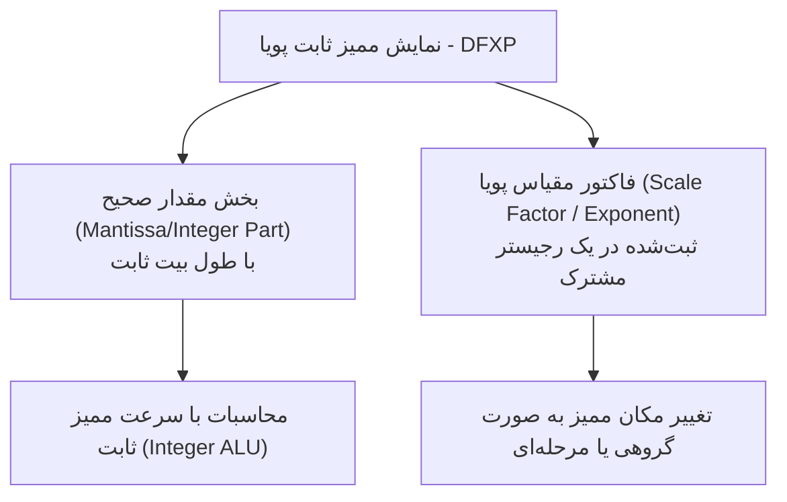
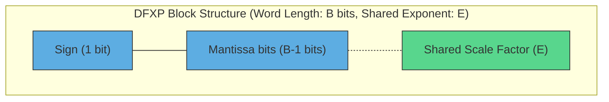
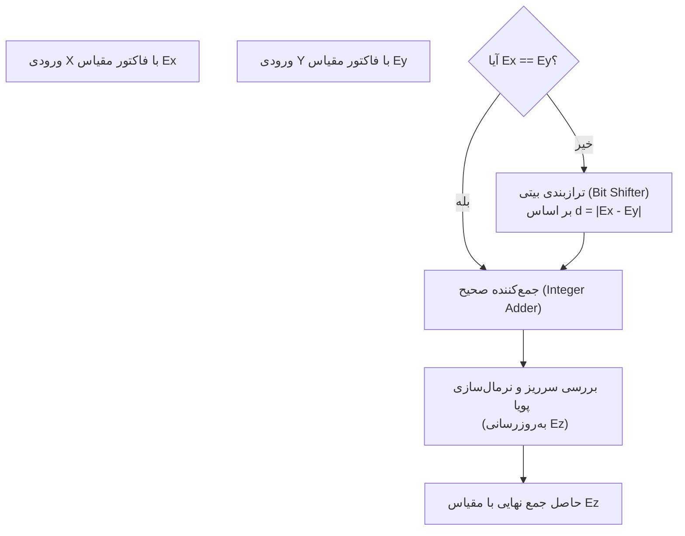
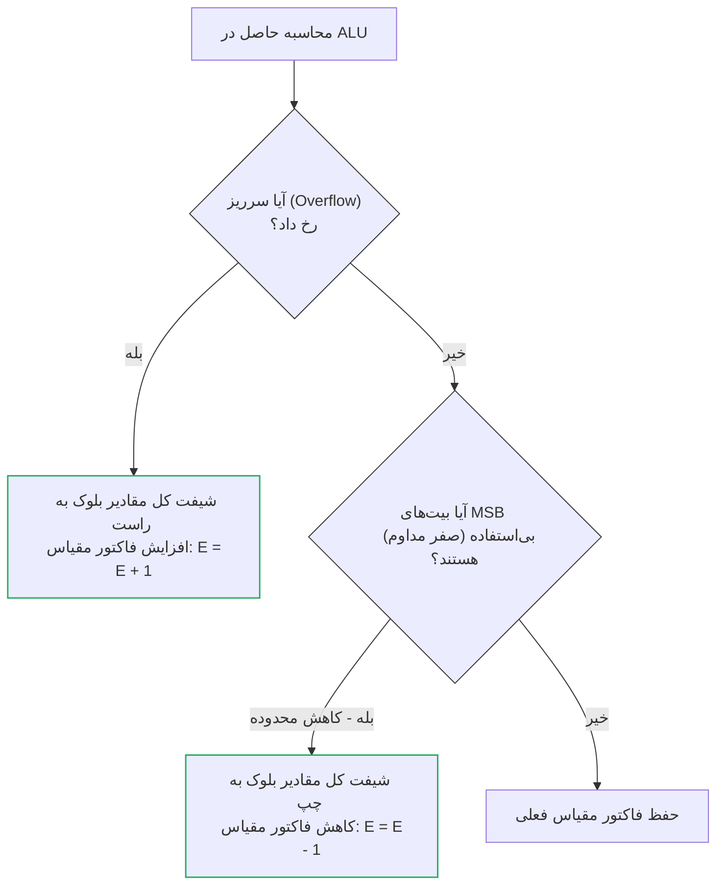
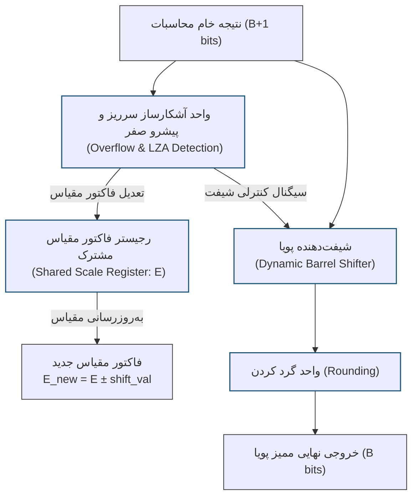

در ادامه، سند تخصصی و جامع سیستم اعداد **ممیز ثابت پویا (Dynamic Fixed-Point - DFXP)** به زبان فارسی، با ساختار، فرمول‌های ریاضی دقیق، نمودارهای Mermaid و تحلیل‌های سخت‌افزاری کاملاً مشابه با الگوی ارائه‌شده طراحی شده است.

---

# سیستم اعداد ممیز ثابت پویا (Dynamic Fixed-Point - DFXP)

## فهرست مطالب
- [سیستم اعداد ممیز ثابت پویا (Dynamic Fixed-Point - DFXP)](#سیستم-اعداد-ممیز-ثابت-پویا-dynamic-fixed-point---dfxp)
  - [فهرست مطالب](#فهرست-مطالب)
  - [مقدمه](#مقدمه)
  - [ساختار و نمایش ریاضی DFXP](#ساختار-و-نمایش-ریاضی-dfxp)
  - [روش‌های تخصیص فاکتور مقیاس پویا](#روشهای-تخصیص-فاکتور-مقیاس-پویا)
  - [عملیات ریاضی در سخت‌افزار DFXP](#عملیات-ریاضی-در-سختافزار-dfxp)
  - [مدیریت سرریز، نرمال‌سازی و تغییر مقیاس پویا](#مدیریت-سرریز-نرمالسازی-و-تغییر-مقیاس-پویا)
  - [مقایسه جامع ممیز ثابت (FXP)، ممیز ثابت پویا (DFXP) و ممیز شناور (FLP)](#مقایسه-جامع-ممیز-ثابت-fxp-ممیز-ثابت-پویا-dfxp-و-ممیز-شناور-flp)

---

## مقدمه

در طراحی سخت‌افزارهای مدرن پردازش سیگنال و شتاب‌دهنده‌های هوش مصنوعی (مانند Edge AI و Deep Learning Inference)، طراحان همواره با یک چالش بزرگ روبرو هستند: سیستم ممیز ثابت (FXP) بسیار کم‌مصرف و سریع است اما به دلیل ثابت بودن ممیز، در برابر تغییرات شدید دامنه سیگنال دچار سرریز یا افت شدید دقت (کم‌ارزشی) می‌شود. از سوی دیگر، ممیز شناور (FLP) محدوده پویای بسیار بزرگی دارد اما سخت‌افزار آن بسیار سنگین و پرمصرف است.

سیستم **ممیز ثابت پویا (Dynamic Fixed-Point - DFXP)** به عنوان یک پل ارتباطی بهینه میان این دو فناوری معرفی شده است. ایده اصلی DFXP ساده اما فوق‌العاده کارآمد است: **موقعیت ممیز (یا همان فاکتور مقیاس) در طول محاسبات ثابت نیست، بلکه در مراحل مختلف الگوریتم یا بخش‌های مختلف داده به طور پویا تغییر می‌کند.**

با اشتراک‌گذاری یک فاکتور مقیاس (Scale Factor) میان گروهی از داده‌ها (مثلاً بردارهای ورودی، وزن‌های یک لایه از شبکه عصبی یا نمونه‌های یک بلوک زمانی سیگنال)، می‌توان بدون نیاز به سخت‌افزار پیچیده ممیز شناور به ازای تک‌تک عناصر، به محدوده پویای بسیار بالایی دست یافت.

---

## ساختار و نمایش ریاضی DFXP

در سیستم DFXP، هر عدد به صورت دو بخش مجزا تعریف می‌شود: یک بخش عدد صحیح متمم دو با طول ثابت (که نقش مانتیس یا مقدار عددی را بازی می‌کند) و یک فاکتور مقیاس پویا که موقعیت ممیز را مشخص می‌کند.

### نمایش ریاضی عدد

فرض کنید مجموعه‌ای از اعداد داریم که در یک بلوک قرار گرفته‌اند. مقدار واقعی اعشاری هر عضو از این مجموعه ($V_i$) به شکل زیر نمایش داده می‌شود:

$$V_i = X_i \times 2^{-E}$$

در این فرمول:
* **$X_i$**: مقدار عدد صحیح ذخیره‌شده عضو $i$-ام در قالب متمم دو با طول بیت مشخص ($B$).
* **$E$**: فاکتور مقیاس پویا (Dynamic Scale Factor) یا توان مشترک بلوک است. این مقدار بسته به بزرگی اعداد داخل بلوک، در طول اجرای برنامه یا زمان کامپایل به‌روزرسانی می‌شود.

به عنوان مثال، فرض کنید یک رجیستر فاکتور مقیاس با مقدار $E = 6$ داریم. اگر مقدار صحیح ذخیره شده $X_i = 120$ باشد، مقدار واقعی معادل آن عبارت است از:

$$V_i = 120 \times 2^{-6} = \frac{120}{64} = 1.875$$

اگر در مرحله بعدی محاسبات، دامنه ورودی‌ها بسیار کوچک شود، سخت‌افزار یا کامپایلر به طور پویا مقدار $E$ را به $E = 12$ تغییر می‌دهد. اکنون همان ظرفیت بیتی قادر است مقادیر بسیار کوچک‌تری را با دقت بالا پوشش دهد.

---

## روش‌های تخصیص فاکتور مقیاس پویا

بسته به معماری سیستم، فاکتور مقیاس پویا به دو روش عمده مدیریت می‌شود:

| روش مدیریت | نحوه عملکرد | مزایا | معایب | کاربرد اصلی |
| :--- | :--- | :--- | :--- | :--- |
| **ممیز بلوکی (Block Floating-Point)** | یک فاکتور مقیاس واحد ($E$) به طور پویا به یک بلوک از داده‌ها (مثلاً یک آرایه یا ماتریس) تخصیص داده می‌شود. | سخت‌افزار بسیار ساده، سرعت محاسبات نزدیک به ممیز ثابت. | در صورت وجود مقدار پرت (Outlier) در بلوک، دقت بقیه عناصر افت می‌کند. | پردازش سیگنال (FFT)، شتاب‌دهنده‌های لایه به لایه CNN |
| **تغییر مقیاس زمانی (Epoch-based Scaling)** | فاکتور مقیاس در طول زمان و بر اساس تحلیل سرریز خروجی‌ها در گام‌های قبلی تنظیم می‌شود. | عدم نیاز به تغییر فرمت در وسط محاسبات بلوکی. | تاخیر در واکنش به تغییرات ناگهانی دامنه سیگنال. | الگوریتم‌های فیلتر تطبیقی (LMS/RLS) |

---

## عملیات ریاضی در سخت‌افزار DFXP

پردازشگرهای DFXP از ALUهای عدد صحیح برای اجرای محاسبات استفاده می‌کنند، اما پیش و پس از محاسبات، یک واحد کنترل مقیاس (Scale Controller) ترازبندی ممیزها را بر اساس فاکتورهای مقیاس پویا مدیریت می‌کند.

### ۱. جمع و تفریق (Addition and Subtraction)

اگر بخواهیم دو عدد $X$ با فاکتور مقیاس $E_x$ و $Y$ با فاکتور مقیاس $E_y$ را جمع کنیم، ابتدا باید فاکتورهای مقیاس آن‌ها را هم‌تراز کنیم.

۱. اختلاف فاکتورهای مقیاس را محاسبه می‌کنیم:
$$d = E_x - E_y$$

۲. مقدار با فاکتور مقیاس کوچک‌تر را به سمت راست شیفت می‌دهیم تا هم‌تراز شود. فرض کنید $E_x > E_y$ (یعنی $X$ دارای ممیز پایین‌تر و دقت بیشتری است):
$$Y'_{stored} = Y_{stored} \gg d$$
$$E_y' = E_x$$

۳. اکنون جمع صحیح انجام می‌شود و فاکتور مقیاس خروجی برابر با فاکتور مقیاس بزرگ‌تر یعنی $E_z = E_x$ خواهد بود:
$$Z_{stored} = X_{stored} + Y'_{stored}$$

---

### ۲. ضرب (Multiplication)

عملیات ضرب در DFXP به دلیل عدم نیاز به ترازبندی اولیه، بسیار ساده‌تر و سریع‌تر انجام می‌شود.

۱. مقادیر صحیح مستقیماً در یکدیگر ضرب می‌شوند:
$$Z_{raw\_stored} = X_{stored} \times Y_{stored}$$

۲. فاکتور مقیاس اولیه حاصل‌ضرب به سادگی از جمع دو فاکتور مقیاس ورودی به دست می‌آید:
$$E_{z\_temp} = E_x + E_y$$

۳. از آنجا که طول کلمه حاصل‌ضرب دو برابر شده است، برای کاهش طول کلمه به اندازه استاندارد، حاصل‌ضرب به چپ یا راست شیفت داده شده و مقدار $E_{z}$ نهایی بر اساس پویایی داده‌ها به‌روزرسانی می‌شود.

$$Z_{stored} = \text{Shift}(Z_{raw\_stored}, \, S)$$
$$E_{z\_final} = E_{z\_temp} - S$$

---

## مدیریت سرریز، نرمال‌سازی و تغییر مقیاس پویا

مهم‌ترین بخش سخت‌افزار DFXP، **واحد نرمال‌سازی و تغییر مقیاس خودکار (Automatic Rescaling Unit)** است. این واحد تضمین می‌کند که اعداد همواره در بهینه‌ترین حالت توزیع بیت قرار داشته باشند تا خطای کوانتیزاسیون به حداقل برسد.

### ۱. آشکارسازی سرریز و اصلاح پویای مقیاس (Dynamic Scale Tuning)

اگر در طول یک سری محاسبات جمع یا ضرب، سرریز رخ دهد یا برعکس، اعداد بسیار کوچک شوند (بیت‌های پرارزش بی‌استفاده بمانند)، واحد کنترل مقیاس به طور خودکار فاکتور مقیاس کل بلوک را تغییر می‌دهد.

---

### ۲. دیتاپث سخت‌افزاری واحد ممیز پویا (DFXP Rescaling & Normalization Datapath)

دیتاپث سخت‌افزاری زیر نشان می‌دهد که چگونه خروجی خام یک جمع‌کننده در سیستم DFXP به صورت پویا با کنترل فاکتور مقیاس ($E$) اصلاح می‌شود تا از سرریز جلوگیری شده یا بهترین دقت اعشاری حفظ گردد:

---

## مقایسه جامع ممیز ثابت (FXP)، ممیز ثابت پویا (DFXP) و ممیز شناور (FLP)

| شاخص مقایسه | ممیز ثابت (FXP) | ممیز ثابت پویا (DFXP) | ممیز شناور (FLP) |
| :--- | :--- | :--- | :--- |
| **سخت‌افزار مورد نیاز** | فوق‌العاده ساده (Integer ALU) | ساده (Integer ALU + Shifter کنترل‌ شده) | بسیار پیچیده (FPU با واحدهای سخت‌افزاری مجزا) |
| **موقعیت ممیز** | کاملاً ثابت در کل زمان اجرا | ثابت برای یک بلوک از داده‌ها، متغیر در طول زمان | متغیر برای تک‌تک داده‌ها به صورت مجزا |
| **محدوده پویا (Dynamic Range)** | بسیار محدود | **متوسط تا بزرگ (تطبیق‌پذیر)** | بی‌نهایت بزرگ |
| **دقت محاسباتی اعشاری** | متوسط و وابسته به دامنه داده | **بسیار بالا به دلیل نرمال‌سازی پویا** | بسیار بالا در تمامی بازه‌ها |
| **مصرف توان سخت‌افزار** | بسیار پایین | **بسیار نزدیک به ممیز ثابت (بهینه)** | بسیار بالا |
| **مساحت تراشه (Silicon Area)** | حداقل ممکن | **بسیار کم (اندکی بیشتر از ممیز ثابت)** | بسیار وسیع و هزینه‌بر |
| **پیچیدگی پیاده‌سازی** | بالا (نیاز به تحلیل استاتیک آفلاین) | **متوسط (مدیریت سخت‌افزار/کامپایلر)** | صفر (پشتیبانی کامل توسط زبان‌های برنامه‌نویسی) |
| **بیشترین کاربرد مدرن** | میکروکنترلرهای ساده و اینترنت اشیا | **شتاب‌دهنده‌های یادگیری عمیق (INT8/INT16 BFP)** | پردازش گرافیکی (GPU) و ابررایانه‌ها |