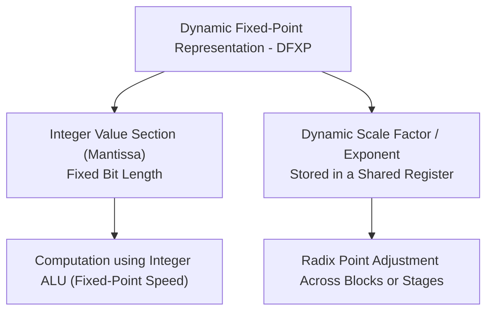
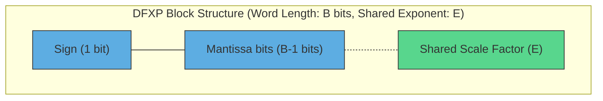
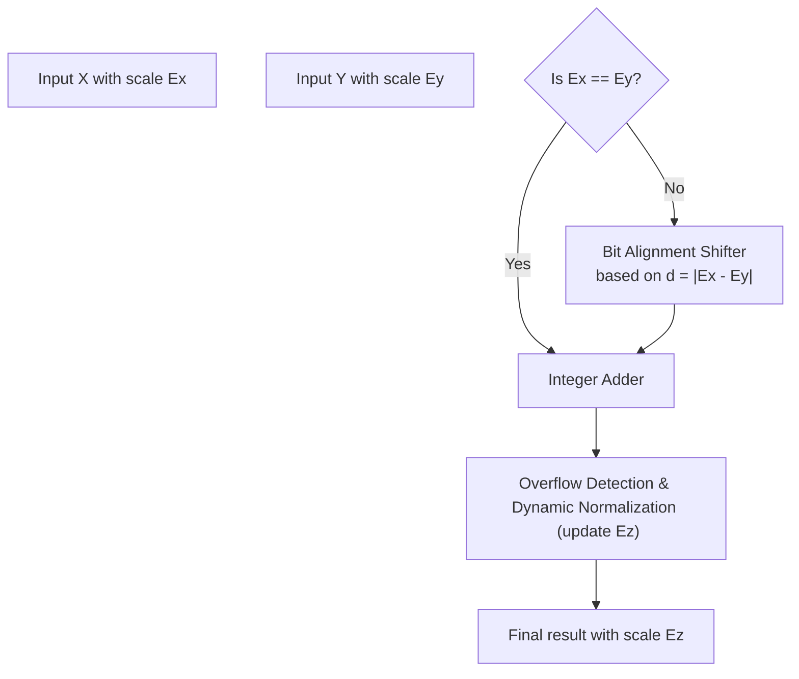
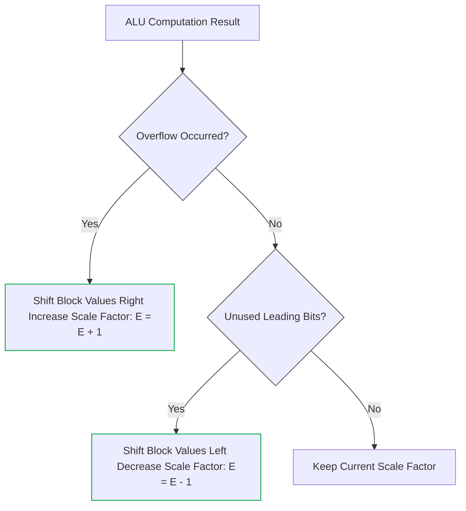
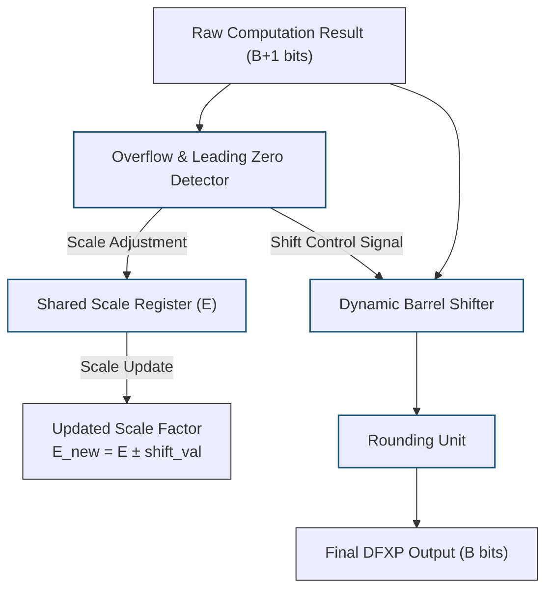

# Dynamic Fixed‑Point Number System (DFXP)

## Table of Contents

- [Dynamic Fixed‑Point Number System (DFXP)](#dynamic-fixedpoint-number-system-dfxp)
  - [Table of Contents](#table-of-contents)
- [Introduction](#introduction)
- [Structure and Mathematical Representation of DFXP](#structure-and-mathematical-representation-of-dfxp)
  - [Mathematical Representation](#mathematical-representation)
- [Dynamic Scale Factor Allocation Methods](#dynamic-scale-factor-allocation-methods)
- [Arithmetic Operations in DFXP Hardware](#arithmetic-operations-in-dfxp-hardware)
- [1. Addition and Subtraction](#1-addition-and-subtraction)
- [2. Multiplication](#2-multiplication)
- [Overflow Management, Normalization, and Dynamic Rescaling](#overflow-management-normalization-and-dynamic-rescaling)
  - [1. Overflow Detection and Dynamic Scale Adjustment](#1-overflow-detection-and-dynamic-scale-adjustment)
  - [2. Hardware Datapath for Dynamic Rescaling and Normalization](#2-hardware-datapath-for-dynamic-rescaling-and-normalization)
- [Comprehensive Comparison: FXP vs DFXP vs FLP](#comprehensive-comparison-fxp-vs-dfxp-vs-flp)

---

# Introduction

In modern hardware design for **digital signal processing (DSP)** and **AI accelerators** (such as Edge AI and deep learning inference engines), designers constantly face a major challenge.

The **fixed‑point (FXP)** representation is extremely fast and energy‑efficient, but because the radix point position is fixed, it suffers from **overflow** or severe **precision loss** when signal amplitude varies significantly.

On the other hand, **floating‑point (FLP)** arithmetic offers an enormous dynamic range, but its hardware implementation is **complex, area‑intensive, and power‑hungry**.

The **Dynamic Fixed‑Point (DFXP)** system is introduced as an efficient compromise between these two technologies. The core idea behind DFXP is simple but highly effective:

**the radix point position (or scaling factor) is not fixed; instead, it changes dynamically during different stages of the computation or across different data segments.**

By sharing a **scale factor** among a group of data elements (for example, input vectors, weights of a neural network layer, or signal samples within a time block), a large dynamic range can be achieved **without requiring floating‑point hardware for every individual element**.

---

# Structure and Mathematical Representation of DFXP

In a DFXP system, each value is represented using two separate components:

1. a fixed‑length **two’s‑complement integer**
2. a **dynamic scaling factor** that determines the radix point position

## Mathematical Representation

Assume we have a set of values stored within the same block.

The real value of each element \(V_i\) is represented as:

\[
V_i = X_i \times 2^{-E}
\]

where:

- \(X_i\)  
  The stored **two’s‑complement integer value** with bit‑width \(B\).

- \(E\)  
  The **dynamic scale factor** (shared exponent) applied to the block.

This scale factor can be updated **during program execution or by the compiler** depending on the magnitude of the data.

### Example

Suppose the scale register holds:

\[
E = 6
\]

and the stored integer value is:

\[
X_i = 120
\]

The corresponding real value becomes:

\[
V_i = 120 \times 2^{-6} = \frac{120}{64} = 1.875
\]

If in the next computation stage the signal magnitude becomes much smaller, the hardware or compiler may update the scale factor to:

\[
E = 12
\]

Now the same bit capacity can represent **much smaller values with higher precision**.

---

# Dynamic Scale Factor Allocation Methods

Depending on system architecture, the dynamic scale factor can be managed in different ways.

| Management Method | Mechanism | Advantages | Disadvantages | Typical Applications |
|---|---|---|---|---|
| **Block Floating‑Point Scaling** | A single scale factor \(E\) is dynamically assigned to a block of data (e.g., vectors or matrices). | Very simple hardware, computation speed close to fixed‑point. | Outliers within a block may reduce precision for other elements. | DSP processing (FFT), CNN accelerators |
| **Epoch‑Based Scaling** | The scale factor is updated over time based on overflow observations from previous iterations. | No need to change numeric format during block computations. | Slow reaction to sudden signal amplitude changes. | Adaptive filters (LMS/RLS) |

---

# Arithmetic Operations in DFXP Hardware

DFXP processors perform arithmetic using **integer ALUs**, while a **scale controller** aligns radix points based on dynamic scaling factors.

---

# 1. Addition and Subtraction

Suppose we want to add two numbers:

- \(X\) with scale factor \(E_x\)
- \(Y\) with scale factor \(E_y\)

### Step 1: Compute scale difference

\[
d = E_x - E_y
\]

### Step 2: Align radix points

The value with the smaller scale factor must be right‑shifted.

Assume:

\[
E_x > E_y
\]

then:

\[
Y'_{stored} = Y_{stored} \gg d
\]

\[
E'_y = E_x
\]

### Step 3: Perform integer addition

\[
Z_{stored} = X_{stored} + Y'_{stored}
\]

with output scale factor:

\[
E_z = E_x
\]

---

# 2. Multiplication

Multiplication in DFXP is simpler since **no alignment is required before the operation**.

### Step 1: Multiply integer values

\[
Z_{raw} = X_{stored} \times Y_{stored}
\]

### Step 2: Combine scale factors

\[
E_{z\_temp} = E_x + E_y
\]

### Step 3: Normalize result

Since the multiplication result doubles the word length, the result must be shifted:

\[
Z_{stored} = \text{Shift}(Z_{raw}, S)
\]

\[
E_{z\_final} = E_{z\_temp} - S
\]

---

# Overflow Management, Normalization, and Dynamic Rescaling

The most critical component of DFXP hardware is the **Automatic Rescaling and Normalization Unit**.

This unit ensures that values remain optimally distributed across available bits, minimizing quantization error.

---

## 1. Overflow Detection and Dynamic Scale Adjustment

If overflow occurs during computation, or if the numbers become too small (unused MSB bits), the scale factor is automatically adjusted.

---

## 2. Hardware Datapath for Dynamic Rescaling and Normalization

The following datapath illustrates how the raw output of an arithmetic unit is dynamically adjusted according to the scale factor.

---

# Comprehensive Comparison: FXP vs DFXP vs FLP

| Comparison Metric | Fixed‑Point (FXP) | Dynamic Fixed‑Point (DFXP) | Floating‑Point (FLP) |
|---|---|---|---|
| Hardware Complexity | Extremely simple (Integer ALU) | Simple (Integer ALU + Controlled Shifter) | Very complex (FPU) |
| Radix Point Position | Fixed during entire execution | Fixed per block but variable over time | Variable per individual number |
| Dynamic Range | Very limited | **Moderate to large (adaptive)** | Extremely large |
| Numerical Precision | Moderate | **High due to dynamic normalization** | Very high |
| Power Consumption | Very low | **Close to fixed‑point efficiency** | High |
| Silicon Area | Minimal | **Slightly larger than FXP** | Large |
| Implementation Complexity | High (requires offline scaling analysis) | **Moderate (hardware/compiler scale management)** | Low (fully supported by languages) |
| Typical Modern Applications | Microcontrollers, IoT | **Deep learning accelerators (INT8/INT16)** | GPUs and HPC systems |

---