# سیستم اعداد ممیز ثابت (Fixed-Point - FXP)

## فهرست مطالب
- [سیستم اعداد ممیز ثابت (Fixed-Point - FXP)](#سیستم-اعداد-ممیز-ثابت-fixed-point---fxp)
  - [فهرست مطالب](#فهرست-مطالب)
  - [مقدمه](#مقدمه)
  - [ساختار و نمایش ریاضی (فرمت Q)](#ساختار-و-نمایش-ریاضی-فرمت-q)
  - [انواع فرمت‌های ممیز ثابت](#انواع-فرمتهای-ممیز-ثابت)
  - [عملیات ریاضی در سخت‌افزار ممیز ثابت](#عملیات-ریاضی-در-سختافزار-ممیز-ثابت)
  - [مفاهیم سرریز (Overflow) و گرد کردن (Rounding)](#مفاهیم-سرریز-overflow-و-گرد-کردن-rounding)
  - [مقایسه جامع ممیز ثابت (FXP) و ممیز شناور (FLP)](#مقایسه-جامع-ممیز-ثابت-fxp-و-ممیز-شناور-flp)

---

## مقدمه

اگرچه سیستم ممیز شناور (FLP) محدوده عددی عظیمی را پوشش می‌دهد، اما پیاده‌سازی سخت‌افزاری آن (مانند واحد FPU) بسیار پیچیده، پرمصرف و بزرگ است. در سیستم‌های تعبیه‌شده (Embedded Systems)، تراشه‌های DSP، پردازنده‌های لبه (Edge AI) و FPGAها، ترجیح داده می‌شود از سیستم **ممیز ثابت (Fixed-Point)** استفاده شود.

ایده اصلی ممیز ثابت بسیار ساده است: **موقعیت ممیز (نقطه باینری) در کل محاسبات ثابت فرض می‌شود.**

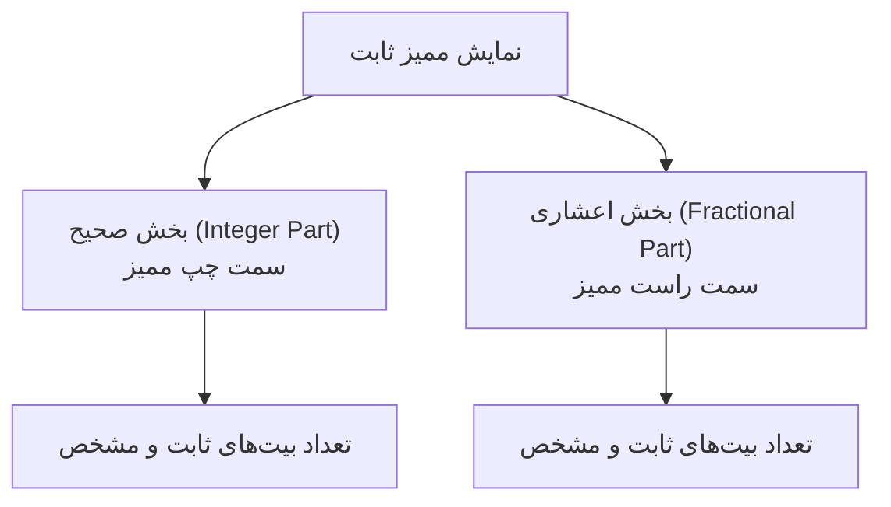

از آنجا که محل ممیز فرضی است، سخت‌افزار پردازنده با این اعداد دقیقاً مانند **اعداد صحیح (Integers)** رفتار می‌کند. در نتیجه، محاسبات ممیز ثابت بسیار سریع‌تر انجام شده و به سخت‌افزار فوق‌العاده ساده‌تری نیاز دارند.

---

## ساختار و نمایش ریاضی (فرمت Q)

برای مشخص کردن ساختار یک عدد ممیز ثابت علامت‌دار، از استاندارد **فرمت Q** (یا فرمت $Q_{m.n}$) استفاده می‌شود:

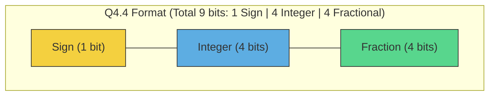

در فرمت $Q_{m.n}$ (یا $Qm.n$):
* **$s$**: بیت علامت (۱ بیت برای اعداد علامت‌دار در متمم دو).
* **$m$**: تعداد بیت‌های بخش صحیح (Integer bits).
* **$n$**: تعداد بیت‌های بخش اعشاری (Fractional bits).
* **کل بیت‌ها ($U$):** برابر است با $1 + m + n$ (برای اعداد علامت‌دار).

### نمایش ریاضی عدد ممیز ثابت

اگر یک رشته بیتی به صورت متمم دو (Two's Complement) با مقدار عدد صحیح $X$ داشته باشیم، ارزش واقعی اعشاری آن ($V$) در فرمت $Q_{m.n}$ به این صورت محاسبه می‌شود:

$$V = X \times 2^{-n}$$

به عنوان مثال، فرض کنید عدد باینری $8$ بیتی علامت‌دار $11010100_{(2)}$ را در فرمت $Q_{3.4}$ داریم:
* مقدار معادل عدد صحیح آن در متمم دو: $-44_{(10)}$
* چون $n=4$ است، ممیز فرضی ۴ رقم از سمت راست فاصله دارد ($1101.0100$).
* مقدار واقعی: 

$$V = -44 \times 2^{-4} = \frac{-44}{16} = -2.75$$

### فاکتور مقیاس (Scaling Factor)

در برنامه‌نویسی ممیز ثابت، هر عدد اعشاری با ضرب در یک **فاکتور مقیاس** به عدد صحیح ذخیره‌شده در حافظه تبدیل می‌شود:

$$\text{Scaling Factor} = 2^{n}$$

$$\text{Stored Integer} = \text{round}(V_{\text{real}} \times 2^{n})$$

---

## انواع فرمت‌های ممیز ثابت

بسته به نوع کاربرد، نسبت بیت‌های صحیح و اعشاری تغییر می‌کند:

| فرمت | کل بیت | بیت علامت | بیت صحیح ($m$) | بیت اعشاری ($n$) | فاکتور مقیاس | رزولوشن (دقت) | محدوده عددی (بازه قابل نمایش) |
| :--- | :---: | :---: | :---: | :---: | :---: | :---: | :--- |
| **Q15 (یا Q0.15)** | $16$ | $1$ | $0$ | $15$ | $2^{15}$ | $3.05 \times 10^{-5}$ | $-1.0$ تا $+0.999969$ |
| **Q8.8** | $16$ | $1$ | $8$ | $8$ | $2^{8}$ | $3.90 \times 10^{-3}$ | $-256.0$ تا $+255.996$ |
| **Q1.31** | $32$ | $1$ | $1$ | $31$ | $2^{31}$ | $4.65 \times 10^{-10}$ | $-2.0$ تا $+1.999999$ |

> **نکته:** فرمت $Q15$ یکی از محبوب‌ترین فرمت‌ها در پردازش سیگنال‌های صوتی و سنسورها است، زیرا محدوده اعداد را بین $-1$ و $+1$ نگه‌می‌دارد که برای مقادیر نرمال‌شده عالی است.

---

## عملیات ریاضی در سخت‌افزار ممیز ثابت

بزرگ‌ترین مزیت ممیز ثابت این است که محاسبات آن روی **ALUهای معمولی عدد صحیح** انجام می‌شود. با این حال، حفظ تراز بیت‌ها بر عهده طراح سخت‌افزار یا کامپایلر است.

### ۱. جمع و تفریق (Addition and Subtraction)

#### حالت اول: فرمت‌های کاملاً یکسان (Same Formats)
اگر دو عدد $X$ و $Y$ هر دو دارای فرمت یکسان $Q_{m.n}$ باشند، مقادیر ذخیره‌شده آنها در سخت‌افزار به صورت صحیح برابر است با:
$$X_{stored} = X \times 2^n$$
$$Y_{stored} = Y \times 2^n$$

در این حالت، هیچ نیازی به تغییر مقیاس (Scaling) یا جابه‌جایی ممیز پیش از انجام عملگر نیست و جمع مستقیم انجام می‌شود:
$$Z_{stored} = X_{stored} + Y_{stored} = (X \times 2^n) + (Y \times 2^n) = (X + Y) \times 2^n$$

* **نتیجه:** حاصل‌جمع $Z_{stored}$ به طور خودکار در همان فرمت $Q_{m.n}$ خواهد بود.
* **سخت‌افزار مورد نیاز:** یک جمع‌کننده صحیح ساده $U$-بیتی (که $U = 1 + m + n$).

#### حالت دوم: فرمت‌های ترکیبی و متفاوت (Mixed Formats)

وقتی در سخت‌افزار (مانند FPGA یا ASIC) با فرمت‌های مختلف ممیز ثابت کار می‌کنیم، معمولاً مقادیر در رجیسترهایی با طول یکسان (مثلاً ۱۶ یا ۹ بیتی) ذخیره می‌شوند. از آنجا که در سخت‌افزار داده‌ها همیشه از سمت راست (**LSB**) تراز و چیده می‌شوند، ممیز فرضی این دو فرمت در موقعیت‌های متفاوتی از رجیستر قرار می‌گیرد. 

برای مثال، اگر دو عدد $X \in Q_{m1.n1}$ و $Y \in Q_{m2.n2}$ را در دو رجیستر هم‌اندازه ذخیره کنیم (با فرض $n1 > n2$):

* در عدد $X$، ممیز فرضی بعد از بیت $n1$ قرار دارد.
* در عدد $Y$، ممیز فرضی بعد از بیت $n2$ قرار دارد و بیت‌های سمت چپ رجیستر با صفر (یا بیت علامت) پر شده‌اند.

##### چالش سخت‌افزاری قبل از هم‌تراز سازی:
اگر بدون تغییر، این دو رجیستر را به یک جمع‌کننده سخت‌افزاری (Integer Adder) بدهیم، بیت‌های با ارزشِ وزنیِ متفاوت با یکدیگر جمع می‌شوند و حاصل‌جمع کاملاً غلط خواهد بود؛ زیرا ممیزهای فرضی آن‌ها روی هم منطبق نیستند.

| رجیستر (۹ بیتی) | $b_8$ | $b_7$ | $b_6$ | $b_5$ | **ممیز فرضی** | $b_4$ | $b_3$ | $b_2$ | $b_1$ | $b_0$ |
| :--- | :---: | :---: | :---: | :---: | :---: | :---: | :---: | :---: | :---: | :---: |
| **رجیستر X ($Q_{3.5}$)** | S | I | I | I | **.** | F | F | F | F | F |
| **رجیستر Y ($Q_{1.3}$)** | S | S | S | S | S | I | **.** | F | F | F |

---

##### مراحل تراز کردن ممیزها در سخت‌افزار:

برای حل این مشکل و انطباق ممیزها، مراحل زیر را طی می‌کنیم:

**۱. محاسبه اختلاف فاکتور مقیاس ($d$):**
ابتدا اختلاف تعداد بیت‌های اعشاری دو فرمت را به دست می‌آوریم:
$$d = n1 - n2$$

**۲. اعمال شیفت به چپ (Shift Left) روی عدد با دقت کمتر:**
برای اینکه ممیز فرضی عدد $Y$ دقیقاً زیر ممیز عدد $X$ قرار بگیرد، رجیستر $Y$ را به اندازه $d$ بیت به سمت چپ شیفت می‌دهیم. با این کار، فضاهای خالی ایجاد شده در سمت راست با صفر پر می‌شوند:
$$Y'_{stored} = Y_{stored} \ll d = Y_{stored} \times 2^{n1 - n2}$$

| رجیستر بعد از شیفت | $b_8$ | $b_7$ | $b_6$ | $b_5$ | $b_4$ | **ممیز فرضی** | $b_3$ | $b_2$ | $b_1$ | $b_0$ |
| :--- | :---: | :---: | :---: | :---: | :---: | :---: | :---: | :---: | :---: | :---: |
| **رجیستر $Y'$ هم‌تراز شده** | S | S | S | I | F | **.** | F | F | **0** | **0** |

**۳. انجام عمل جمع ساده:**
اکنون که ممیز هر دو عدد در یک موقعیت سخت‌افزاری قرار گرفته است، می‌توانیم عمل جمع را بدون خطا روی مقادیر هم‌تراز انجام دهیم:
$$Z_{stored} = X_{stored} + Y'_{stored}$$

---

##### نمودار بلوکی فرآیند هم‌تراز سازی و جمع

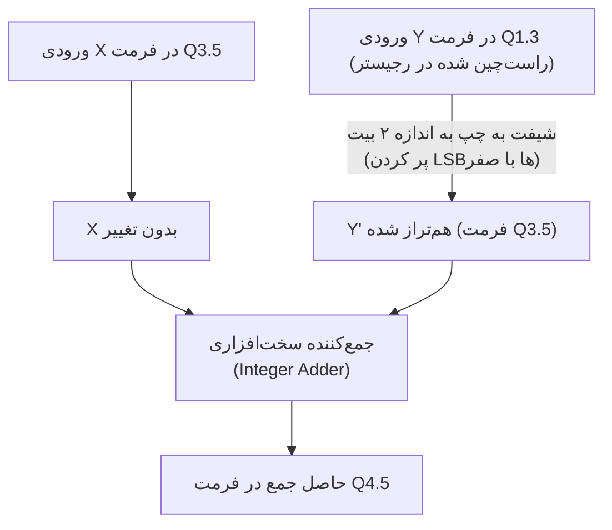

* **فرمت نهایی خروجی:** 
برای جلوگیری از سرریز (Overflow) در بخش صحیح به دلیل عمل جمع و همچنین برای حفظ کامل دقت بخش اعشاری، فرمت خروجی به صورت زیر طراحی می‌شود:
$$Q_{\max(m1, m2)+1 . \max(n1, n2)}$$

* **بخش اعشاری خروجی ($\max(n1, n2)$):** برای از دست نرفته دقت، بزرگترین تعداد بیت اعشار میان دو عدد حفظ می‌شود.
* **بخش صحیح خروجی ($\max(m1, m2)+1$):** بزرگترین تعداد بیت صحیح میان دو ورودی انتخاب شده و یک بیت به آن اضافه می‌شود تا فضای کافی برای رقم نقلی (Carry) حاصل از جمع وجود داشته باشد و از سرریز جلوگیری شود.

---

##### پیاده‌سازی سخت‌افزاری: ثابت (Hardwired) در برابر پویا (Dynamic)

بسته به نوع سیستم و نیاز به پردازش، طراحی این المان سخت‌افزاری برای جمع فرمت‌های ترکیبی به دو روش کلی انجام می‌شود:

###### روش اول: پیاده‌سازی سخت‌افزاری ثابت (Hardwired)
در کاربردهای خاص‌منظوره (مانند فیلترهای دیجیتال FIR در پردازش سیگنال صوتی یا مخابراتی)، فرمت‌های ورودی در زمان طراحی کاملاً مشخص و ثابت هستند. 

* **ویژگی:** میزان شیفت ($d$) یک مقدار ثابت ریاضی است. در سخت‌افزار، شیفت دادن به اندازه یک مقدار ثابت عملاً هیچ هزینه سخت‌افزاری (گیت منطقی یا تأخیر زمان انتشار) ندارد، زیرا صرفاً از طریق جابجایی اتصالات سیم‌ها (Wiring) پیاده‌سازی می‌شود.
* **مثال کاربردی:** جمع سیگنال ورودی یک ADC با فرمت $Q_{1.15}$ و ضرایب ثابت فیلتر با فرمت $Q_{1.7}$. در اینجا ورودی دوم همیشه با شیفتِ سیم‌کشیِ ثابت به میزان ۸ بیت به چپ، به جمع‌کننده متصل می‌شود.

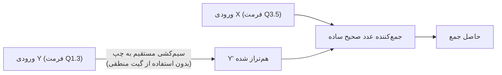

###### روش دوم: پیاده‌سازی سخت‌افزاری پویا (Dynamic / Configurable)
در پردازنده‌های همه‌منظوره، DSPهای عمومی و به ویژه **شتاب‌دهنده‌های هوش مصنوعی (NPU)** که از تکنیک‌های کوانتیزاسیون با دقت‌های متغیر (Mixed-Precision Quantization) استفاده می‌کنند، فرمت اعداد ممکن است لایه به لایه تغییر کند.

* **ویژگی:** سخت‌افزار باید بتواند مقادیر متفاوتی از شیفت را در زمان اجرا اعمال کند. برای این کار، یک بلوک سخت‌افزاری به نام **بشکه شیفت‌دهنده (Barrel Shifter)** که از مالتی‌پلکسرهای موازی ساخته شده، قبل از جمع‌کننده قرار می‌گیرد. مقدار شیفت ($d$) به عنوان یک سیگنال کنترلیِ پویا به این بلوک فرستاده می‌شود.
* **مثال کاربردی:** شتاب‌دهنده‌ای که در یک لایه از شبکه عصبی اعداد $Q_{1.7}$ (دقت ۸ بیتی) را جمع می‌کند و در لایه‌ای دیگر برای افزایش سرعت، محاسبات را با دقت $Q_{1.3}$ (دقت ۴ بیتی) انجام می‌دهد.

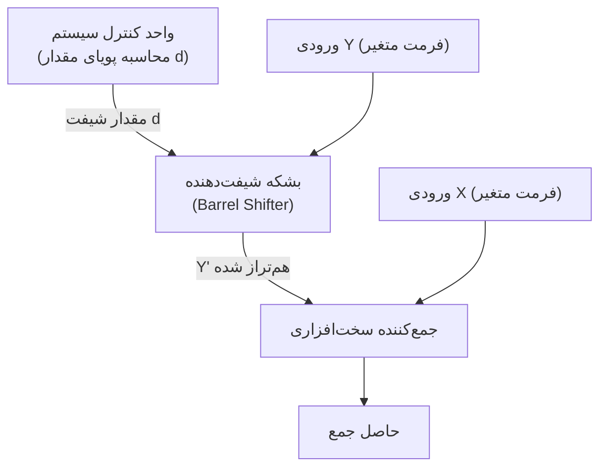

### ۲. ضرب (Multiplication)

در ضرب ممیز ثابت، برخلاف جمع، نیازی به هم‌ترازسازی اولیه ممیزها نیست.

#### حالت اول: فرمت‌های کاملاً یکسان (Same Formats)

اگر دو عدد $X$ و $Y$ در فرمت یکسان $Q_{m.n}$ (با طول کل $U = m + n + 1$ بیت) ضرب شوند:
$$X_{stored} \times Y_{stored} = (X \times 2^n) \times (Y \times 2^n) = (X \times Y) \times 2^{2n}$$

* **موقعیت ممیز:** حاصل‌ضرب به دست آمده دارای $2n$ بیت اعشاری خواهد بود.
* **طول کلمه خروجی:** حاصل‌ضرب دقیق، عددی $2U$ بیتی در فرمت $Q_{(2m+1).2n}$ است.
* **مقیاس‌دهی مجدد (Rescaling):** برای بازگرداندن نتیجه به فرمت اصلی $Q_{m.n}$، باید حاصل‌ضرب را به اندازه $n$ بیت به سمت راست شیفت دهیم:
$$Z_{stored} = (X_{stored} \times Y_{stored}) \gg n$$

---

##### چالش شیفت راست و سرنوشت بخش صحیح ($2m+1$ بیت)

هنگامی که عملیات شیفت راست به اندازه‌ی $n$ بیت را روی حاصل‌ضرب دقیق $2U$ بیتی اعمال می‌کنیم تا آن را دوباره در یک رجیستر تک‌عرضه ($U$ بیتی) با فرمت $Q_{m.n}$ ذخیره کنیم، رجیستر حاصل‌ضرب از دو طرف تحت فشار قرار می‌گیرد:

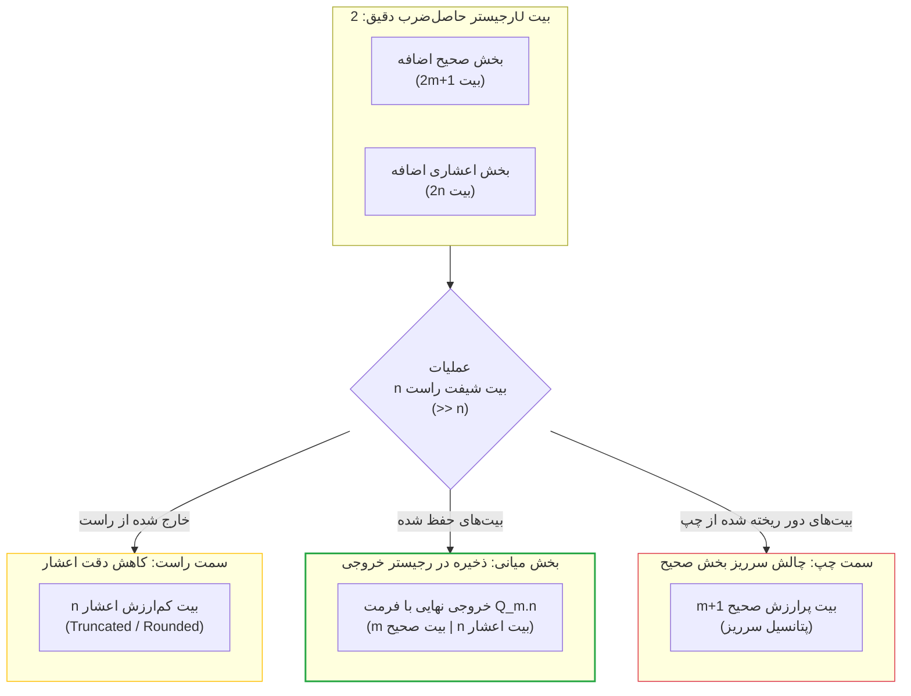

1. **در سمت راست (بخش اعشاری):** $n$ بیت کم‌ارزش اعشاری از لبه‌ی رجیستر خارج و دور ریخته می‌شوند تا اعشار حاصل دوباره $n$ بیتی شود.
2. **در سمت چپ (بخش صحیح):** حاصل‌ضرب پتانسیل رشد تا $2m+1$ بیت را داشته است. اما رجیستر خروجی ما فقط $m$ بیت برای بخش صحیح دارد. با شیفت دادن به راست، ما ناچاریم $m+1$ بیت پرارزش سمت چپ را دور بریزیم که خطر **سرریز (Overflow)** را به همراه دارد.

---

#### پدیده واژگونی (Rollover) و نیاز به مدار اشباع (Saturation)

در محاسبات مکمل دو سخت‌افزاری، اگر بیت‌های پرارزش سمت چپ بدون محافظت دور ریخته شوند، پدیده‌ی **Rollover** رخ می‌دهد که در آن عدد به دلیل سرریز ناگهان تغییر علامت می‌دهد یا مقدار بی‌ربطی به خود می‌گیرد (مثلاً ضرب دو عدد مثبت بزرگ، منفی می‌شود). 

برای جلوگیری از این فاجعه و حفظ پایداری سیستم، از **مدار اشباع** استفاده می‌شود. مدار اشباع بررسی می‌کند که آیا بیت‌های حذفی سمت چپ حاوی اطلاعات ارزشمندی بوده‌اند یا خیر. اگر سرریز رخ داده باشد، خروجی را روی بزرگترین (یا کوچکترین) عدد قابل نمایش قفل می‌کند:

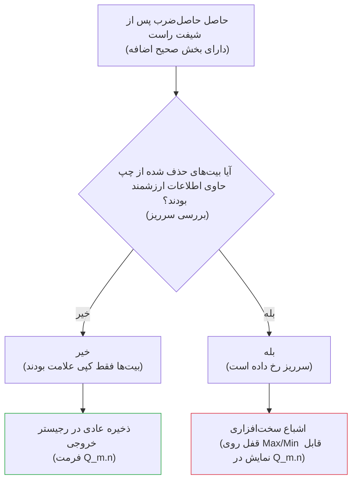

* **آیا این کار محاسبات را مشکل‌دار نمی‌کند؟** 
  بله، دقت ریاضی صدم درصد در لحظه سرریز از دست می‌رود، اما میزان خطا در مقایسه با پدیده‌ی Rollover بسیار ناچیز است (مثلاً خروجی به جای اینکه به خاطر واژگونی ناگهان $-8$ شود، روی $+7$ اشباع می‌شود که نزدیک‌ترین پاسخ ممکن به مقدار واقعی است) و از رفتار غیرپایدار سخت‌افزار جلوگیری می‌کند.
  
#### حالت دوم: فرمت‌های ترکیبی و متفاوت (Mixed Formats)
اگر دو عدد با فرمت‌های متفاوت $X \in Q_{m1.n1}$ و $Y \in Q_{m2.n2}$ را در هم ضرب کنیم، حاصل ضرب بدون هیچ شیفتی در فرمت زیر تولید می‌شود:
$$\text{Format of } (X \times Y) = Q_{(m1 + m2 + 1).(n1 + n2)}$$

برای انتقال حاصل‌ضرب نهایی به یک فرمت مقصد دلخواه مانند $Q_{m3.n3}$، مقدار شیفت لازم ($S$) به شکل زیر محاسبه و اعمال می‌شود:
$$S = (n1 + n2) - n3$$
* اگر $S > 0$: حاصل ضرب را به اندازه $S$ بیت به **راست** شیفت می‌دهیم (به همراه گرد کردن یا برش).
* اگر $S < 0$: حاصل ضرب را به اندازه $|S|$ بیت به **چپ** شیفت می‌دهیم.

$$Z_{stored} = \text{Shift}(X_{stored} \times Y_{stored}, \, S)$$

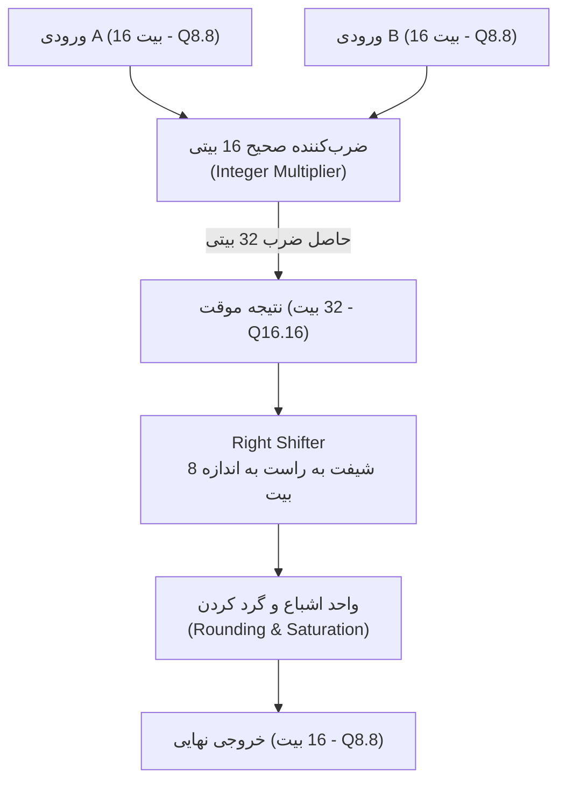

---

### ۳. تقسیم (Division)

تقسیم در ممیز ثابت چالش‌برانگیز است؛ زیرا تقسیم ساده دو عدد صحیح باعث از بین رفتن کامل بخش اعشاری می‌شود.

#### حالت اول: فرمت‌های کاملاً یکسان (Same Formats)
اگر دو عدد در فرمت $Q_{m.n}$ را مستقیماً بر هم تقسیم کنیم:
$$\frac{X_{stored}}{Y_{stored}} = \frac{X \times 2^n}{Y \times 2^n} = \frac{X}{Y}$$
مشاهده می‌شود که فاکتور مقیاس $2^n$ ساده شده و از بین می‌رود و حاصل به یک عدد صحیح معمولی تبدیل می‌شود.

* **راهکار سخت‌افزاری:** مقسوم ($X_{stored}$) باید **پیش از تقسیم** به اندازه $n$ بیت به سمت چپ شیفت داده شود:
$$X'_{stored} = X_{stored} \ll n = X \times 2^{2n}$$
* اکنون عملیات تقسیم صحیح انجام می‌شود تا مقیاس مجدداً موازنه شود:
$$Z_{stored} = \frac{X'_{stored}}{Y_{stored}} = \frac{X \times 2^{2n}}{Y \times 2^n} = \left(\frac{X}{Y}\right) \times 2^n$$
* **نتیجه نهایی:** خروجی دقیقاً در فرمت هدف $Q_{m.n}$ قرار می‌گیرد.

#### حالت دوم: فرمت‌های ترکیبی و متفاوت (Mixed Formats)
اگر بخواهیم $X \in Q_{m1.n1}$ را بر $Y \in Q_{m2.n2}$ تقسیم کنیم و خروجی نهایی را در فرمت مقصد $Q_{m3.n3}$ ذخیره کنیم:

۱. برای حفظ موازنه دقیق فاکتورهای مقیاس در خروجی، مقدار شیفت چپ اولیه مقسوم برابر است با:
$$\text{Shift Left Amount} = n3 + n2 - n1$$
۲. پیاده‌سازی فرمول در سخت‌افزار:
$$X'_{stored} = X_{stored} \ll (n3 + n2 - n1)$$
$$Z_{stored} = \text{Integer\_Divide}(X'_{stored}, \, Y_{stored})$$

#### حالت دوم: فرمت‌های ترکیبی و متفاوت (Mixed Formats)
اگر بخواهیم $X \in Q_{m1.n1}$ را بر $Y \in Q_{m2.n2}$ تقسیم کنیم و خروجی نهایی را در فرمت مقصد دلخواه $Q_{m3.n3}$ ذخیره کنیم:

۱. برای حفظ موازنه دقیق فاکتورهای مقیاس در خروجی، مقدار شیفت چپ اولیه مقسوم برابر است با:
$$\text{Shift Left Amount} = n3 + n2 - n1$$

۲. پیاده‌سازی فرمول در سخت‌افزار:
$$X'_{stored} = X_{stored} \ll (n3 + n2 - n1)$$
$$Z_{stored} = \text{Integer\_Divide}(X'_{stored}, \, Y_{stored})$$

ما سه عدد داریم که مقادیر واقعی آن‌ها $X$، $Y$ و $Z$ است. مقادیر ذخیره‌شده‌ی آن‌ها در رجیسترهای سخت‌افزاری به این صورت تبیین می‌شود:
* **مقسوم (ورودی اول):** $X_{stored} = X \times 2^{n1}$
* **مقسوم‌علیه (ورودی دوم):** $Y_{stored} = Y \times 2^{n2}$
* **خروجی نهایی (هدف):** $Z_{stored} = Z \times 2^{n3}$

هدف نهایی این است که حاصل‌تقسیم به صورت $Z = \frac{X}{Y}$ محاسبه شده و با مقیاس درست یعنی $Z_{stored}$ ذخیره شود. پس ما به دنبال دستیابی به این نتیجه در خروجی هستیم:
$$Z_{stored} = \left(\frac{X}{Y}\right) \times 2^{n3}$$

حال اگر مقسوم‌ ذخیره‌شده ($X_{stored}$) را پیش از تقسیم به اندازه $S$ بیت به چپ شیفت دهیم (یعنی ضرب در $2^S$ کنیم) و سپس تقسیم را انجام دهیم، خواهیم داشت:
$$\frac{X_{stored} \times 2^S}{Y_{stored}} = \frac{X \times 2^{n1} \times 2^S}{Y \times 2^{n2}} = \left(\frac{X}{Y}\right) \times 2^{n1 + S - n2}$$

برای اینکه این حاصل با فرمت هدف یعنی $\left(\frac{X}{Y}\right) \times 2^{n3}$ برابر شود، توان‌های عدد ۲ باید با هم مساوی شوند:
$$n1 + S - n2 = n3$$

با حل این معادله برای $S$ (که همان مقدار شیفت چپ است)، فرمول کلیدی تقسیم به دست می‌آید:
$$S = n3 + n2 - n1$$

فرض کنید می‌خواهیم تقسیم زیر را انجام دهیم:
* **مقسوم ($X$):** عدد $3.5$ در فرمت $Q_{2.2}$ (یعنی $n1 = 2$). 
  مقدار ذخیره‌شده: $X_{stored} = 3.5 \times 2^2 = 14$
* **مقسوم‌علیه ($Y$):** عدد $0.5$ در فرمت $Q_{1.3}$ (یعنی $n2 = 3$). 
  مقدار ذخیره‌شده: $Y_{stored} = 0.5 \times 2^3 = 4$
* **فرمت مقصد نهایی ($Q_{m3.n3}$):** می‌خواهیم خروجی را در فرمت $Q_{3.4}$ ذخیره کنیم (یعنی $n3 = 4$).

**هدف ریاضی:** 
حاصل تقسیم واقعی $\frac{3.5}{0.5} = 7.0$ است. در فرمت مقصد ($Q_{3.4}$)، این عدد باید به صورت زیر ذخیره شود:
$$Z_{stored} = 7.0 \times 2^4 = 112$$

**اعمال فرمول:**
۱. محاسبه مقدار شیفت چپ اولیه مقسوم ($S$):
$$S = n3 + n2 - n1 = 4 + 3 - 2 = 5$$
باید مقسوم را به اندازه $5$ بیت به چپ شیفت دهیم.

۲. شیفت چپ مقسوم:
$$X'_{stored} = X_{stored} \ll 5 = 14 \times 2^5 = 448$$

۳. انجام تقسیم صحیح در سخت‌افزار:
$$Z_{stored} = \frac{448}{4} = 112$$

مشاهده می‌شود که عدد حاصل دقیقاً **۱۱۲** شد که معادل همان عدد **۷.۰** در فرمت مقصد $Q_{3.4}$ است.

---

#### پیاده‌سازی سخت‌افزاری تقسیم Mixed-Format

در سخت‌افزار، این فرآیند طبق فلوچارت زیر جریان می‌یابد:

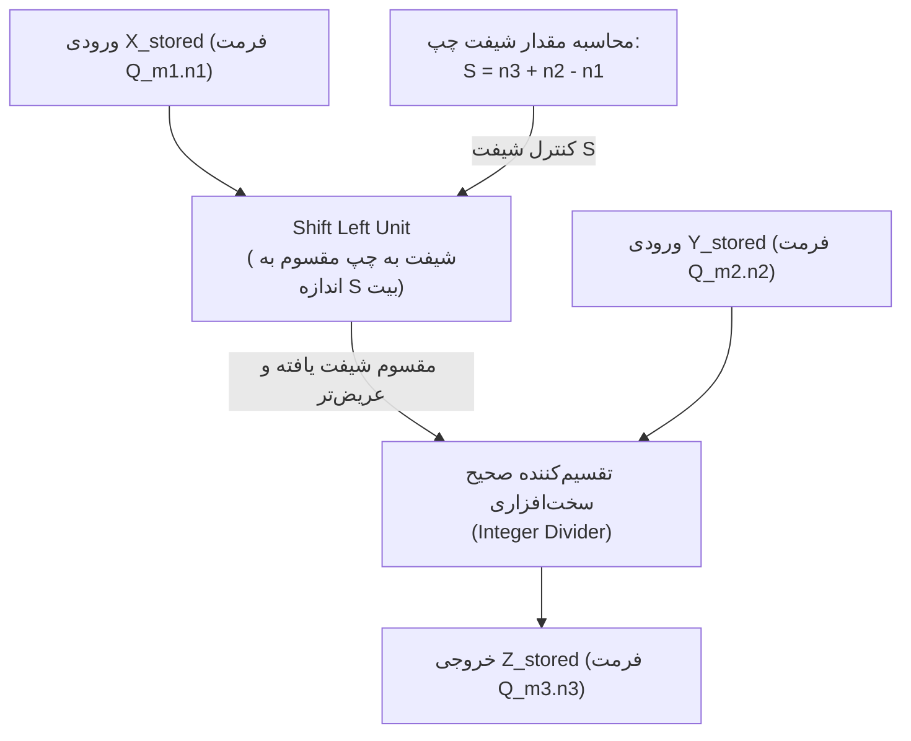

#### یک نکته بسیار مهم طراحی سخت‌افزار (Hardware Warning):
وقتی عدد $X_{stored}$ را پیش از تقسیم به سمت چپ شیفت می‌دهیم ($X'_{stored} = X_{stored} \ll S$)، طول بیت‌های این عدد بزرگتر می‌شود. 
* طراح سخت‌افزار باید رجیستر موقتی که حاصل این شیفت چپ را نگه می‌دارد، به اندازه کافی **عریض‌تر** (Wider) انتخاب کند تا از وقوع سرریز جلوگیری شود.
* اگر این کار انجام نشود، عمل شیفت چپ باعث سرریز (Overflow) و از دست رفتن بیت‌های پرارزش مقسوم پیش از انجام عملیات تقسیم می‌شود.
* به همین دلیل، تقسیم‌کننده سخت‌افزاری (Divider) معمولاً یک بخش با عرض بیت بزرگتر برای ورودی مقسوم (Numerator) در نظر می‌گیرد.

---

## مفاهیم سرریز (Overflow) و گرد کردن (Rounding)

به دلیل محدود بودن طول کلمه (Word Length) در سخت‌افزار ممیز ثابت، پس از انجام محاسباتی نظیر جمع و ضرب، تعداد بیت‌های نتیجه از بیت‌های تخصیص‌یافته فراتر می‌رود. این موضوع ما را با دو چالش مواجه می‌کند: **سرریز در بیت‌های پرارزش (MSB)** و **کاهش دقت در بیت‌های کم‌ارزش (LSB)**.

---

### ۱. مدیریت سرریز (Overflow Management)

سرریز زمانی رخ می‌دهد که نتیجه یک عملیات ریاضی، خارج از بازه قابل نمایش در فرمت $Q_{m.n}$ قرار گیرد. برای یک عدد علامت‌دار $U$-بیتی در متمم دو (که $U = 1 + m + n$)، محدوده عددی مجاز به صورت زیر است:

$$\text{Range} = \left[ -2^m, \, 2^m - 2^{-n} \right]$$

#### الف) سرریز چرخشی (Wraparound)
این رفتار پیش‌فرض ثبات‌ها و ALUهای معمولی عدد صحیح است. در این حالت، بیت سرریز (Carry out) نادیده گرفته شده و بیت‌های باقی‌مانده تفسیر می‌شوند. 
* **ریاضیات عملکرد:** حاصل عملیات به پیمانه (Modulo) ظرفیت ثبات محاسبه می‌شود:
$$Z_{\text{wrap}} = X \pmod{2^U}$$
* **نقص سخت‌افزاری:** بروز این پدیده باعث تغییر ناگهانی علامت عدد از مثبت به منفی (یا بالعکس) می‌شود که در فیلترهای دیجیتال (DSP) یا سیستم‌های کنترل حلقه بسته، منجر به نوسانات شدید و ناپایداری سیستم (Limit Cycles) می‌گردد.

#### ب) اشباع (Saturation)
در این روش، سخت‌افزار مجهز به یک منطق آشکارساز سرریز است. در صورت فراتر رفتن مقدار از محدوده مجاز، خروجی روی کران بالا (Upper Bound) یا کران پایین (Lower Bound) بازه قفل می‌شود.

$$\text{If } Z > \text{MaxVal} \implies Z_{\text{sat}} = 2^m - 2^{-n}$$
$$\text{If } Z < \text{MinVal} \implies Z_{\text{sat}} = -2^m$$

#### دیتاپث سخت‌افزاری واحد اشباع (Saturation Detection RTL)
در نمایش متمم دو، سرریز در جمع دو عدد $A$ و $B$ زمانی رخ می‌دهد که دو عدد هم‌علامت با یکدیگر جمع شوند اما علامت حاصل‌جمع ($S$) با آن‌ها متفاوت باشد.

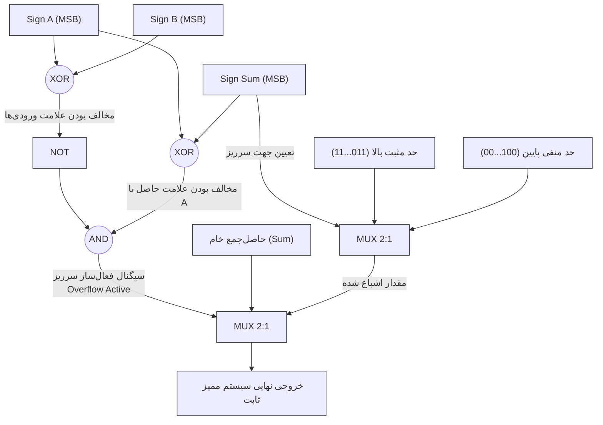

---

### ۲. برش و روش‌های گرد کردن (Truncation & Rounding)

هنگام کاهش طول کلمه (مثلاً پس از ضرب دو عدد $Q8.8$ که حاصل آن $Q16.16$ است و باید مجدداً به $Q8.8$ تبدیل شود)، باید بیت‌های کم‌ارزش اضافی ($LSB$) را حذف کرد.

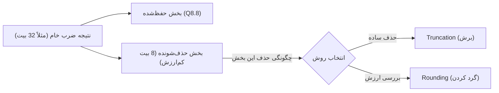

#### الف) برش (Truncation / Floor)
ساده‌ترین روش است که در آن بیت‌های اضافی بدون هیچ پردازشی رها می‌شوند.
* **خطای ریاضی:** این روش همواره دارای یک **بایاس منفی (Negative Bias)** مداوم است که مقدار خطا بین $0$ تا $-1 \text{ LSB}$ تغییر می‌کند. مقدار متوسط خطا (Mean Error) برابر است با:
$$\mu_{\text{error}} = -0.5 \text{ LSB}$$

#### ب) گرد کردن به نزدیک‌ترین (Round to Nearest / Half-Up)
برای کاهش بایاس خطا، به مقدار اصلی قبل از حذف بیت‌ها، مقدار نیم پله ($0.5 \text{ LSB}$) یعنی ارزش اولین بیت حذف‌شونده را اضافه می‌کنیم و سپس عمل برش را انجام می‌دهیم.

* **فرمول سخت‌افزاری:** اگر بخواهیم $n$ بیت اعشار را حذف کنیم، عدد صحیح ذخیره شده را با $2^{n-1}$ جمع کرده و سپس به اندازه $n$ بیت به راست شیفت می‌دهیم:
$$Z_{\text{rounded}} = (Z_{\text{raw}} + 2^{n-1}) \gg n$$

* **خطای ریاضی:** میانگین خطا در این حالت به صفر بسیار نزدیک می‌شود ($\mu_{\text{error}} \approx 0$)، که این امر مانع از تجمع خطا در فیلترهای دیجیتال تکرارشونده (مانند فیلترهای IIR) می‌گردد.

#### دیتاپث سخت‌افزاری واحد گرد کردن و مقیاس‌دهی (Rounding & Scaling Datapath)

سخت‌افزار زیر نشان می‌دهد چگونه یک حاصل‌ضرب ۳۲ بیتی در فرمت $Q16.16$ با دقت بالا گرد شده و به فرمت $Q8.8$ (۱۶ بیتی) تبدیل می‌شود:

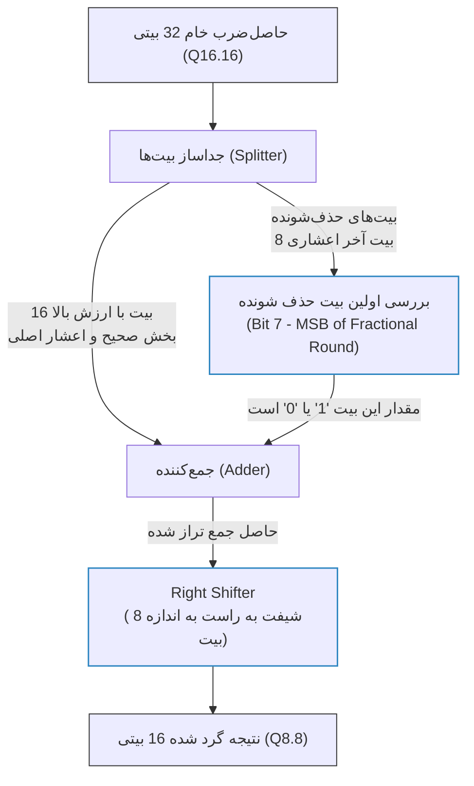
---

## مقایسه جامع ممیز ثابت (FXP) و ممیز شناور (FLP)

| شاخص مقایسه | ممیز ثابت (Fixed-Point) | ممیز شناور (Floating-Point) |
| :--- | :--- | :--- |
| **سخت‌افزار مورد نیاز** | مدارات بسیار ساده (ALU عدد صحیح) | مدارات فوق‌العاده پیچیده (FPU اختصاصی) |
| **محدوده عددی** | بسیار کوچک و محدود | فوق‌العاده عظیم |
| **میزان مصرف توان (Power)** | بسیار پایین (مناسب برای باتری و موبایل) | بالا |
| **سرعت پردازش (Latency)** | بسیار سریع (معمولاً ۱ سیکل کلاک) | کندتر (نیازمند چندین سیکل کلاک) |
| **دقت محاسباتی** | در تمام بازه ثابت و یکنواخت است | برای اعداد کوچک بسیار دقیق، برای اعداد بزرگ کم‌دقت‌تر |
| **پیچیدگی نرم‌افزار** | بالا (برنامه‌نویس باید نگران سرریز و هم‌ترازی باشد) | بسیار کم (برنامه‌نویس درگیر ساختار بیت‌ها نمی‌شود) |
| **مساحت سیلیکون (تراشه)** | بسیار کوچک | بزرگ و هزینه‌بر |
| **کاربرد اصلی** | فیلترهای دیجیتال، پردازش سیگنال (DSP)، میکروکنترلرها، استنتاج هوش مصنوعی (INT8) | شبیه‌سازی‌های علمی، گرافیک ۳ بعدی، آموزش شبکه‌های عصبی (FP32/BF16) |