# Fixed-Point Number System (Fixed-Point - FXP)

## Table of Contents
- [Fixed-Point Number System (Fixed-Point - FXP)](#fixed-point-number-system-fixed-point---fxp)
  - [Table of Contents](#table-of-contents)
  - [Introduction](#introduction)
  - [Structure and Mathematical Representation (Q Format)](#structure-and-mathematical-representation-q-format)
  - [Types of Fixed-Point Formats](#types-of-fixed-point-formats)
  - [Arithmetic Operations in Fixed-Point Hardware](#arithmetic-operations-in-fixed-point-hardware)
  - [Overflow and Rounding Concepts](#overflow-and-rounding-concepts)
  - [Comprehensive Comparison of Fixed-Point (FXP) and Floating-Point (FLP)](#comprehensive-comparison-of-fixed-point-fxp-and-floating-point-flp)

---

## Introduction

Although the floating-point system (FLP) covers an enormous numerical range, its hardware implementation, such as an FPU unit, is highly complex, power-hungry, and large. In embedded systems, DSP chips, Edge AI processors, and FPGAs, the **Fixed-Point** system is often preferred.

The main idea of fixed-point is very simple: **the position of the radix point, or binary point, is assumed to remain fixed throughout all computations.**

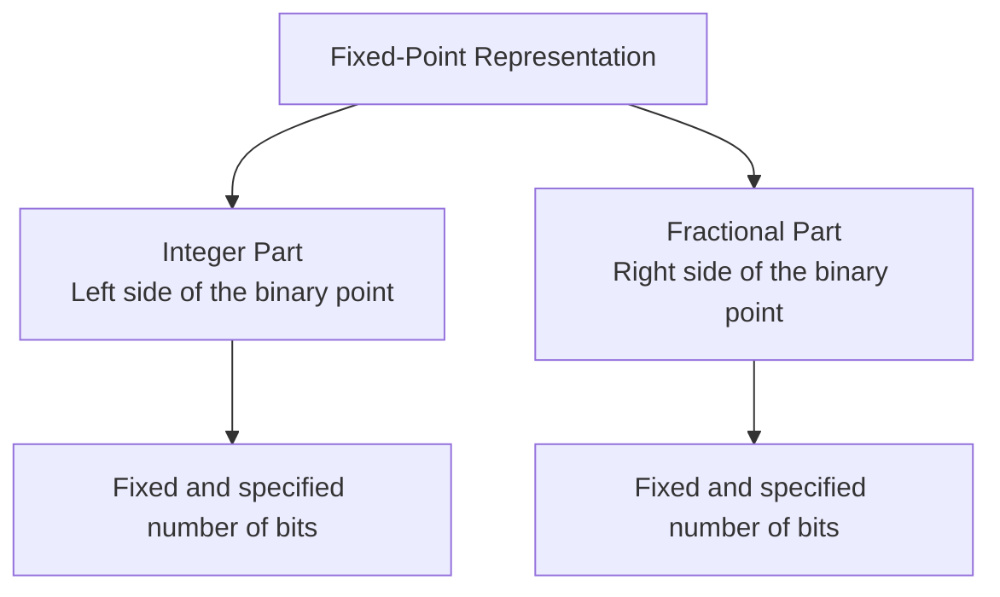

Since the position of the point is implicit, the processor hardware treats these numbers exactly like **integers**. As a result, fixed-point computations are performed much faster and require much simpler hardware.

---

## Structure and Mathematical Representation (Q Format)

To specify the structure of a signed fixed-point number, the **Q format** standard, or $Q_{m.n}$ format, is used:

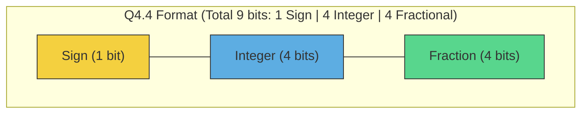

In the $Q_{m.n}$ format, or $Qm.n$:
* **$s$**: the sign bit, 1 bit for signed numbers in two's complement.
* **$m$**: the number of integer bits.
* **$n$**: the number of fractional bits.
* **Total bits ($U$):** equal to $1 + m + n$ for signed numbers.

### Mathematical Representation of a Fixed-Point Number

If we have a bit string represented in two's complement with integer value $X$, its actual decimal value $V$ in the $Q_{m.n}$ format is computed as follows:

$$V = X \times 2^{-n}$$

For example, suppose we have the signed 8-bit binary number $11010100_{(2)}$ in the $Q_{3.4}$ format:
* Its equivalent integer value in two's complement: $-44_{(10)}$
* Since $n=4$, the implicit binary point is 4 digits away from the right side: $1101.0100$.
* The actual value is:

$$V = -44 \times 2^{-4} = \frac{-44}{16} = -2.75$$

### Scaling Factor

In fixed-point programming, each decimal number is converted into an integer stored in memory by multiplying it by a **scaling factor**:

$$\text{Scaling Factor} = 2^{n}$$

$$\text{Stored Integer} = \text{round}(V_{\text{real}} \times 2^{n})$$

---

## Types of Fixed-Point Formats

Depending on the application, the ratio between integer bits and fractional bits changes:

| Format | Total Bits | Sign Bit | Integer Bits ($m$) | Fractional Bits ($n$) | Scaling Factor | Resolution (Precision) | Numeric Range (Representable Interval) |
| :--- | :---: | :---: | :---: | :---: | :---: | :---: | :--- |
| **Q15, or Q0.15** | $16$ | $1$ | $0$ | $15$ | $2^{15}$ | $3.05 \times 10^{-5}$ | $-1.0$ to $+0.999969$ |
| **Q8.8** | $16$ | $1$ | $8$ | $8$ | $2^{8}$ | $3.90 \times 10^{-3}$ | $-256.0$ to $+255.996$ |
| **Q1.31** | $32$ | $1$ | $1$ | $31$ | $2^{31}$ | $4.65 \times 10^{-10}$ | $-2.0$ to $+1.999999$ |

> **Note:** The $Q15$ format is one of the most popular formats in audio signal processing and sensor processing, because it keeps numbers in the range between $-1$ and $+1$, which is excellent for normalized values.

---

## Arithmetic Operations in Fixed-Point Hardware

The greatest advantage of fixed-point arithmetic is that its computations are performed on ordinary **integer ALUs**. However, maintaining bit alignment is the responsibility of the hardware designer or the compiler.

### 1. Addition and Subtraction

#### Case One: Identical Formats

If two numbers $X$ and $Y$ both have the same $Q_{m.n}$ format, their stored hardware values as integers are:

$$X_{stored} = X \times 2^n$$

$$Y_{stored} = Y \times 2^n$$

In this case, no scaling or binary-point adjustment is needed before applying the operator, and direct addition is performed:

$$Z_{stored} = X_{stored} + Y_{stored} = (X \times 2^n) + (Y \times 2^n) = (X + Y) \times 2^n$$

* **Result:** The sum $Z_{stored}$ will automatically be in the same $Q_{m.n}$ format.
* **Required hardware:** A simple $U$-bit integer adder, where $U = 1 + m + n$.

#### Case Two: Mixed and Different Formats

When working with different fixed-point formats in hardware, such as FPGA or ASIC, values are usually stored in registers with the same length, for example 16-bit or 9-bit registers. Since hardware data is always aligned and arranged from the right side, the **LSB**, the implicit binary points of these two formats appear at different positions inside the register.

For example, if two numbers $X \in Q_{m1.n1}$ and $Y \in Q_{m2.n2}$ are stored in two equal-width registers, assuming $n1 > n2$:

* In number $X$, the implicit binary point is located after bit $n1$.
* In number $Y$, the implicit binary point is located after bit $n2$, and the left-side bits of the register are filled with zeros, or with the sign bit.

##### Hardware Challenge Before Alignment

If these two registers are fed directly into an integer adder without modification, bits with different positional weights will be added together, and the sum will be completely incorrect, because their implicit binary points are not aligned.

| 9-bit Register | $b_8$ | $b_7$ | $b_6$ | $b_5$ | **Implicit Binary Point** | $b_4$ | $b_3$ | $b_2$ | $b_1$ | $b_0$ |
| :--- | :---: | :---: | :---: | :---: | :---: | :---: | :---: | :---: | :---: | :---: |
| **Register X ($Q_{3.5}$)** | S | I | I | I | **.** | F | F | F | F | F |
| **Register Y ($Q_{1.3}$)** | S | S | S | S | S | I | **.** | F | F | F |

---

##### Steps for Aligning Binary Points in Hardware

To solve this problem and align the binary points, the following steps are performed:

**1. Compute the scaling-factor difference ($d$):**

First, the difference between the number of fractional bits in the two formats is calculated:

$$d = n1 - n2$$

**2. Apply a left shift to the lower-precision number:**

To place the implicit binary point of number $Y$ exactly under the binary point of number $X$, register $Y$ is shifted left by $d$ bits. The empty positions created on the right side are filled with zeros:

$$Y'_{stored} = Y_{stored} \ll d = Y_{stored} \times 2^{n1 - n2}$$

| Register After Shift | $b_8$ | $b_7$ | $b_6$ | $b_5$ | $b_4$ | **Implicit Binary Point** | $b_3$ | $b_2$ | $b_1$ | $b_0$ |
| :--- | :---: | :---: | :---: | :---: | :---: | :---: | :---: | :---: | :---: | :---: |
| **Aligned Register $Y'$** | S | S | S | I | F | **.** | F | F | **0** | **0** |

**3. Perform simple addition:**

Now that both numbers have their binary points at the same hardware position, addition can be performed correctly on the aligned values:

$$Z_{stored} = X_{stored} + Y'_{stored}$$

---

##### Block Diagram of the Alignment and Addition Process

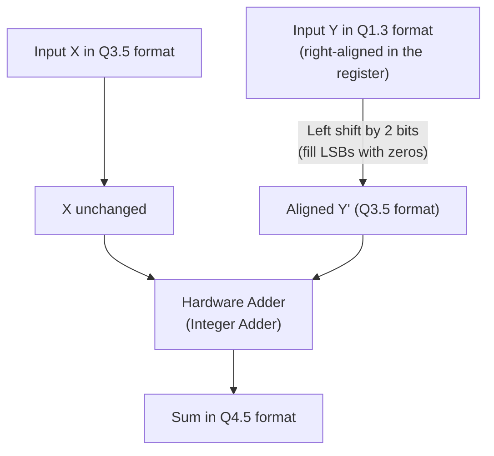

* **Final output format:**

To prevent overflow in the integer part caused by addition, and also to preserve the full precision of the fractional part, the output format is designed as follows:

$$Q_{\max(m1, m2)+1 . \max(n1, n2)}$$

* **Output fractional part ($\max(n1, n2)$):** To avoid losing precision, the largest number of fractional bits among the two numbers is preserved.
* **Output integer part ($\max(m1, m2)+1$):** The largest number of integer bits among the two inputs is selected, and one extra bit is added to provide enough room for the carry generated by addition and to prevent overflow.

---

##### Hardware Implementation: Hardwired vs. Dynamic

Depending on the type of system and processing requirements, the design of this hardware element for adding mixed-format numbers is performed in two general ways:

###### Method One: Hardwired Hardware Implementation

In special-purpose applications, such as FIR digital filters in audio or communication signal processing, the input formats are completely known and fixed at design time.

* **Feature:** The shift amount ($d$) is a constant mathematical value. In hardware, shifting by a constant amount has practically no hardware cost, no logic gates or propagation delay, because it is implemented simply through rewiring.
* **Practical example:** Adding the input signal of an ADC in $Q_{1.15}$ format to fixed filter coefficients in $Q_{1.7}$ format. Here, the second input is always connected to the adder with a fixed hardwired left shift of 8 bits.

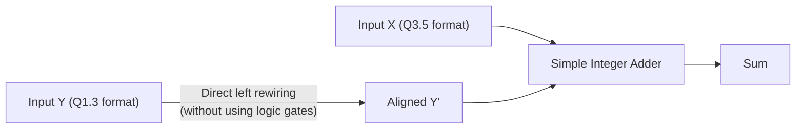

###### Method Two: Dynamic / Configurable Hardware Implementation

In general-purpose processors, general DSPs, and especially **AI accelerators (NPUs)** that use mixed-precision quantization techniques, the number formats may change from layer to layer.

* **Feature:** The hardware must be able to apply different shift amounts at runtime. For this purpose, a hardware block called a **Barrel Shifter**, built from parallel multiplexers, is placed before the adder. The shift amount ($d$) is sent to this block as a dynamic control signal.
* **Practical example:** An accelerator that adds $Q_{1.7}$ numbers, 8-bit precision, in one neural-network layer, and in another layer performs computations with $Q_{1.3}$ precision, 4-bit precision, to increase speed.

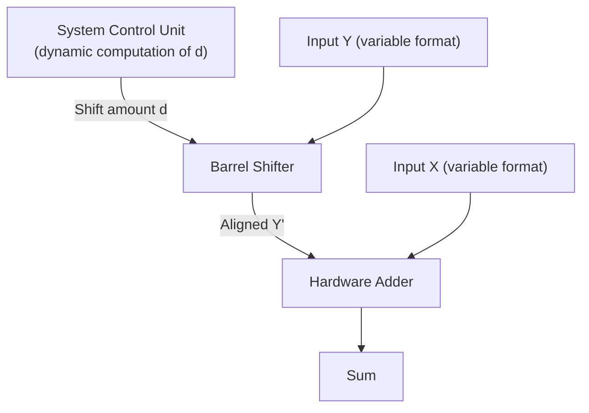

### 2. Multiplication

In fixed-point multiplication, unlike addition, no initial binary-point alignment is required.

#### Case One: Identical Formats

If two numbers $X$ and $Y$ in the same $Q_{m.n}$ format, with total length $U = m + n + 1$ bits, are multiplied:

$$X_{stored} \times Y_{stored} = (X \times 2^n) \times (Y \times 2^n) = (X \times Y) \times 2^{2n}$$

* **Binary-point position:** The resulting product will have $2n$ fractional bits.
* **Output word length:** The exact product is a $2U$-bit number in the $Q_{(2m+1).2n}$ format.
* **Rescaling:** To return the result to the original $Q_{m.n}$ format, the product must be shifted right by $n$ bits:

$$Z_{stored} = (X_{stored} \times Y_{stored}) \gg n$$

---

##### The Right-Shift Challenge and the Fate of the Integer Part ($2m+1$ Bits)

When the right shift by $n$ bits is applied to the exact $2U$-bit product so that it can be stored again in a single-width $U$-bit register with $Q_{m.n}$ format, the product register is squeezed from both sides:

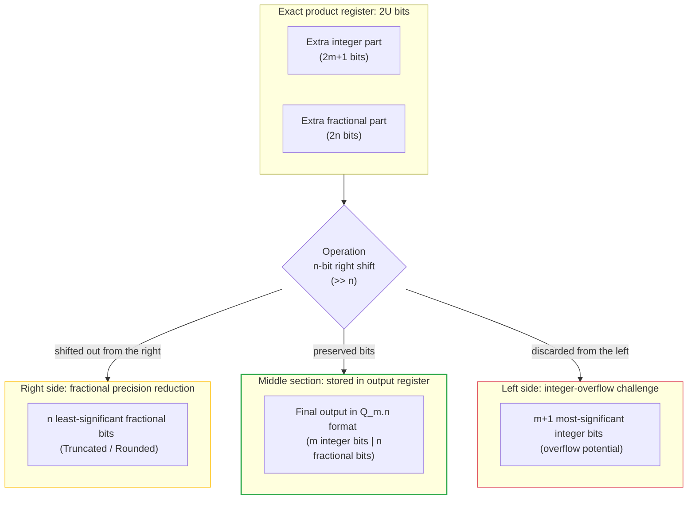

1. **On the right side, the fractional part:** $n$ least-significant fractional bits are shifted out of the register and discarded so that the result again has $n$ fractional bits.
2. **On the left side, the integer part:** The product has the potential to grow up to $2m+1$ bits. However, the output register has only $m$ bits for the integer part. By shifting right, we are forced to discard $m+1$ most-significant bits on the left, which creates the risk of **overflow**.

---

#### Rollover Phenomenon and the Need for a Saturation Circuit

In two's-complement hardware computations, if the most-significant bits on the left are discarded without protection, the **Rollover** phenomenon occurs. In this situation, due to overflow, the number suddenly changes sign or takes on an unrelated value, for example multiplying two large positive numbers produces a negative result.

To prevent this failure and preserve system stability, a **saturation circuit** is used. The saturation circuit checks whether the discarded left-side bits contained meaningful information or not. If overflow has occurred, the output is clamped to the largest, or smallest, representable number:

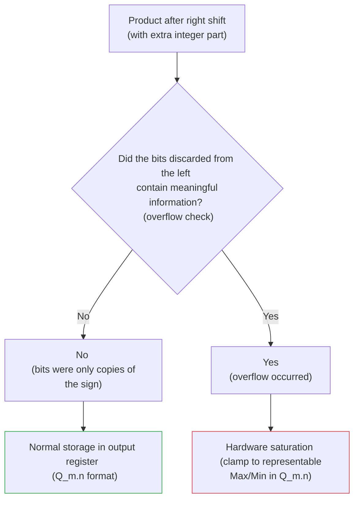

* **Does this make the computation problematic?**

  Yes, exact mathematical precision is lost at the moment of overflow, but the error is very small compared to rollover. For example, instead of the output suddenly becoming $-8$ because of rollover, it saturates at $+7$, which is the closest possible answer to the real value, and prevents unstable hardware behavior.

#### Case Two: Mixed and Different Formats

If two numbers with different formats, $X \in Q_{m1.n1}$ and $Y \in Q_{m2.n2}$, are multiplied, the product is produced without any shift in the following format:

$$\text{Format of } (X \times Y) = Q_{(m1 + m2 + 1).(n1 + n2)}$$

To transfer the final product into a desired destination format such as $Q_{m3.n3}$, the required shift amount ($S$) is computed and applied as follows:

$$S = (n1 + n2) - n3$$

* If $S > 0$: the product is shifted **right** by $S$ bits, along with rounding or truncation.
* If $S < 0$: the product is shifted **left** by $|S|$ bits.

$$Z_{stored} = \text{Shift}(X_{stored} \times Y_{stored}, \, S)$$

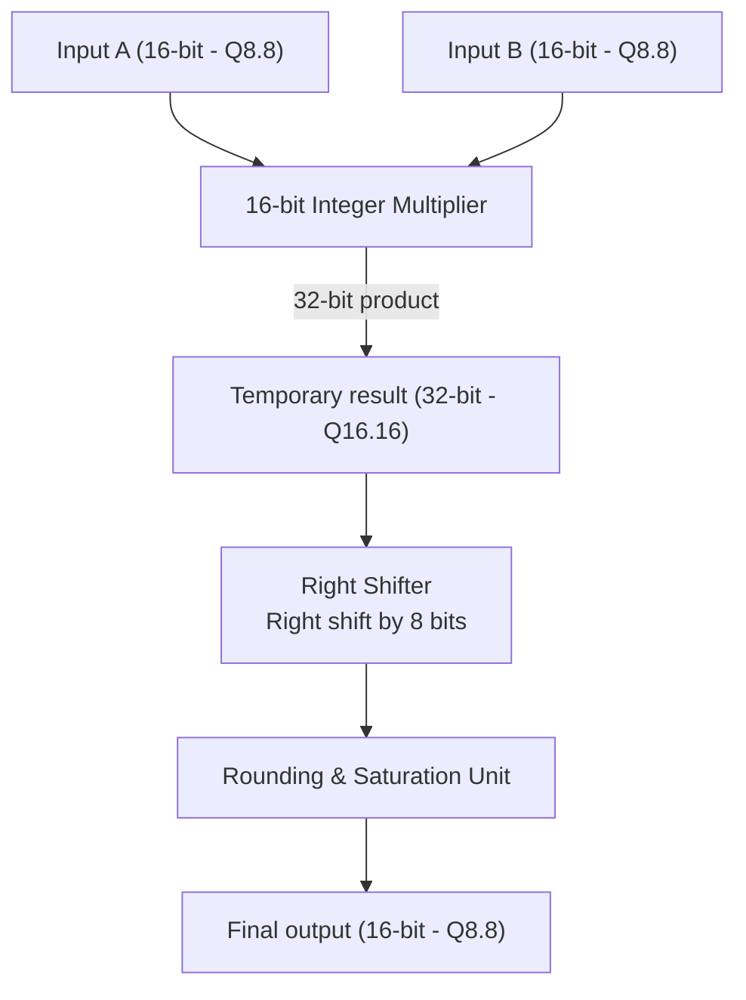

---

### 3. Division

Division in fixed-point arithmetic is challenging, because simple division of two integers causes the fractional part to be completely lost.

#### Case One: Identical Formats

If two numbers in $Q_{m.n}$ format are divided directly:

$$\frac{X_{stored}}{Y_{stored}} = \frac{X \times 2^n}{Y \times 2^n} = \frac{X}{Y}$$

It can be seen that the scaling factor $2^n$ cancels out and disappears, and the result becomes an ordinary integer.

* **Hardware solution:** The dividend ($X_{stored}$) must be shifted **left** by $n$ bits before division:

$$X'_{stored} = X_{stored} \ll n = X \times 2^{2n}$$

* Now integer division is performed so that the scale is balanced again:

$$Z_{stored} = \frac{X'_{stored}}{Y_{stored}} = \frac{X \times 2^{2n}}{Y \times 2^n} = \left(\frac{X}{Y}\right) \times 2^n$$

* **Final result:** The output is exactly in the target $Q_{m.n}$ format.

#### Case Two: Mixed and Different Formats

If we want to divide $X \in Q_{m1.n1}$ by $Y \in Q_{m2.n2}$ and store the final output in the destination format $Q_{m3.n3}$:

1. To preserve the exact balance of scaling factors in the output, the initial left-shift amount of the dividend is:

$$\text{Shift Left Amount} = n3 + n2 - n1$$

2. Hardware implementation of the formula:

$$X'_{stored} = X_{stored} \ll (n3 + n2 - n1)$$

$$Z_{stored} = \text{Integer\_Divide}(X'_{stored}, \, Y_{stored})$$

#### Case Two: Mixed and Different Formats

If we want to divide $X \in Q_{m1.n1}$ by $Y \in Q_{m2.n2}$ and store the final output in an arbitrary destination format $Q_{m3.n3}$:

1. To preserve the exact balance of scaling factors in the output, the initial left-shift amount of the dividend is:

$$\text{Shift Left Amount} = n3 + n2 - n1$$

2. Hardware implementation of the formula:

$$X'_{stored} = X_{stored} \ll (n3 + n2 - n1)$$

$$Z_{stored} = \text{Integer\_Divide}(X'_{stored}, \, Y_{stored})$$

We have three numbers whose real values are $X$, $Y$, and $Z$. Their stored values in hardware registers are defined as follows:

* **Dividend, first input:** $X_{stored} = X \times 2^{n1}$
* **Divisor, second input:** $Y_{stored} = Y \times 2^{n2}$
* **Final output, target:** $Z_{stored} = Z \times 2^{n3}$

The final goal is to compute the quotient as $Z = \frac{X}{Y}$ and store it with the correct scale, meaning $Z_{stored}$. Therefore, we seek to obtain the following result at the output:

$$Z_{stored} = \left(\frac{X}{Y}\right) \times 2^{n3}$$

Now, if the stored dividend ($X_{stored}$) is shifted left by $S$ bits before division, meaning it is multiplied by $2^S$, and then division is performed, we have:

$$\frac{X_{stored} \times 2^S}{Y_{stored}} = \frac{X \times 2^{n1} \times 2^S}{Y \times 2^{n2}} = \left(\frac{X}{Y}\right) \times 2^{n1 + S - n2}$$

For this result to be equal to the target format, namely $\left(\frac{X}{Y}\right) \times 2^{n3}$, the powers of 2 must be equal:

$$n1 + S - n2 = n3$$

By solving this equation for $S$, which is the left-shift amount, the key formula for division is obtained:

$$S = n3 + n2 - n1$$

Suppose we want to perform the following division:

* **Dividend ($X$):** the number $3.5$ in $Q_{2.2}$ format, meaning $n1 = 2$.

  Stored value: $X_{stored} = 3.5 \times 2^2 = 14$

* **Divisor ($Y$):** the number $0.5$ in $Q_{1.3}$ format, meaning $n2 = 3$.

  Stored value: $Y_{stored} = 0.5 \times 2^3 = 4$

* **Final destination format ($Q_{m3.n3}$):** we want to store the output in $Q_{3.4}$ format, meaning $n3 = 4$.

**Mathematical goal:**

The real quotient is $\frac{3.5}{0.5} = 7.0$. In the destination format ($Q_{3.4}$), this number must be stored as:

$$Z_{stored} = 7.0 \times 2^4 = 112$$

**Applying the formula:**

1. Compute the initial left-shift amount of the dividend ($S$):

$$S = n3 + n2 - n1 = 4 + 3 - 2 = 5$$

The dividend must be shifted left by $5$ bits.

2. Left shift the dividend:

$$X'_{stored} = X_{stored} \ll 5 = 14 \times 2^5 = 448$$

3. Perform integer division in hardware:

$$Z_{stored} = \frac{448}{4} = 112$$

It can be seen that the result is exactly **112**, which is equivalent to the number **7.0** in the destination $Q_{3.4}$ format.

---

#### Hardware Implementation of Mixed-Format Division

In hardware, this process flows according to the following flowchart:

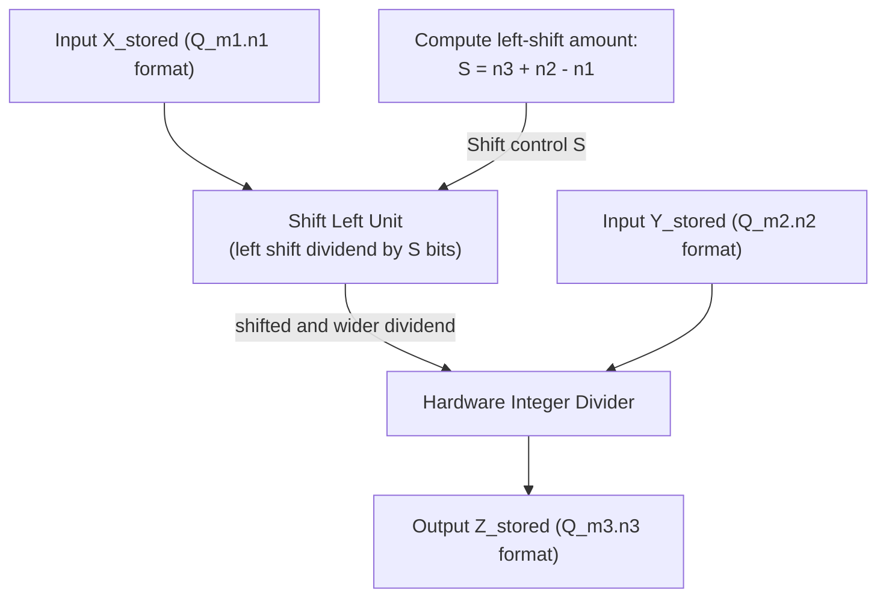

#### A Very Important Hardware Design Warning

When $X_{stored}$ is shifted left before division ($X'_{stored} = X_{stored} \ll S$), the bit length of this number increases.

* The hardware designer must choose a temporary register that holds the result of this left shift to be sufficiently **wider** in order to prevent overflow.
* If this is not done, the left shift causes overflow and the most-significant bits of the dividend are lost before the division operation is performed.
* For this reason, a hardware divider usually provides a wider bit-width section for the dividend input, or numerator.

---

## Overflow and Rounding Concepts

Because word length is limited in fixed-point hardware, after computations such as addition and multiplication, the number of result bits can exceed the allocated bit width. This creates two challenges: **overflow in the most-significant bits (MSB)** and **precision loss in the least-significant bits (LSB)**.

---

### 1. Overflow Management

Overflow occurs when the result of an arithmetic operation falls outside the representable range of the $Q_{m.n}$ format. For a signed $U$-bit number in two's complement, where $U = 1 + m + n$, the valid numeric range is:

$$\text{Range} = \left[ -2^m, \, 2^m - 2^{-n} \right]$$

#### a) Wraparound Overflow

This is the default behavior of ordinary registers and integer ALUs. In this case, the overflow bit, or carry out, is ignored and the remaining bits are interpreted.

* **Mathematical behavior:** The result of the operation is computed modulo the register capacity:

$$Z_{\text{wrap}} = X \pmod{2^U}$$

* **Hardware drawback:** This phenomenon causes the number sign to change suddenly from positive to negative, or vice versa. In digital filters (DSP) or closed-loop control systems, this can lead to severe oscillations and system instability, known as limit cycles.

#### b) Saturation

In this method, the hardware is equipped with overflow-detection logic. If the value exceeds the valid range, the output is clamped to the upper bound or lower bound of the interval.

$$\text{If } Z > \text{MaxVal} \implies Z_{\text{sat}} = 2^m - 2^{-n}$$

$$\text{If } Z < \text{MinVal} \implies Z_{\text{sat}} = -2^m$$

#### Hardware Datapath of the Saturation Unit (Saturation Detection RTL)

In two's-complement representation, overflow in the addition of two numbers $A$ and $B$ occurs when two numbers with the same sign are added, but the sign of the sum ($S$) differs from them.

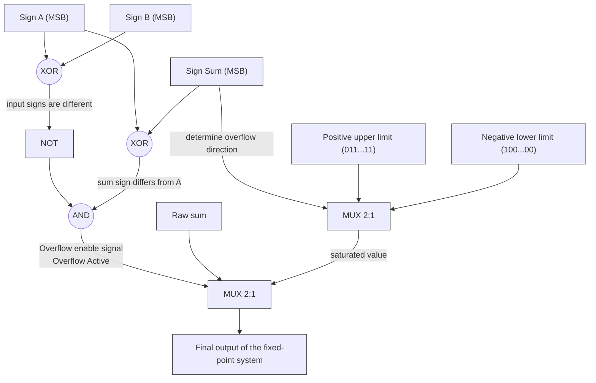

---

### 2. Truncation and Rounding Methods

When reducing word length, for example after multiplying two $Q8.8$ numbers where the result is $Q16.16$ and must be converted back to $Q8.8$, the extra least-significant bits ($LSB$) must be removed.

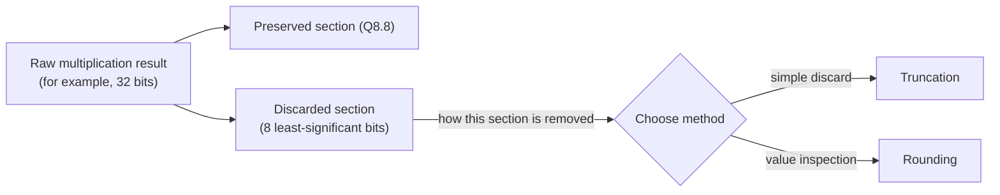

#### a) Truncation / Floor

This is the simplest method, in which the extra bits are discarded without any processing.

* **Mathematical error:** This method always has a continuous **negative bias**, where the error ranges from $0$ to $-1 \text{ LSB}$. The mean error is:

$$\mu_{\text{error}} = -0.5 \text{ LSB}$$

#### b) Round to Nearest / Half-Up

To reduce error bias, a half-step value ($0.5 \text{ LSB}$), meaning the value of the first discarded bit, is added to the original value before removing bits, and then truncation is performed.

* **Hardware formula:** If we want to remove $n$ fractional bits, the stored integer is added to $2^{n-1}$ and then shifted right by $n$ bits:

$$Z_{\text{rounded}} = (Z_{\text{raw}} + 2^{n-1}) \gg n$$

* **Mathematical error:** The mean error in this case becomes very close to zero ($\mu_{\text{error}} \approx 0$), which prevents error accumulation in iterative digital filters, such as IIR filters.

#### Hardware Datapath of the Rounding and Scaling Unit

The following hardware shows how a 32-bit product in $Q16.16$ format is rounded with high precision and converted to $Q8.8$ format, 16-bit:

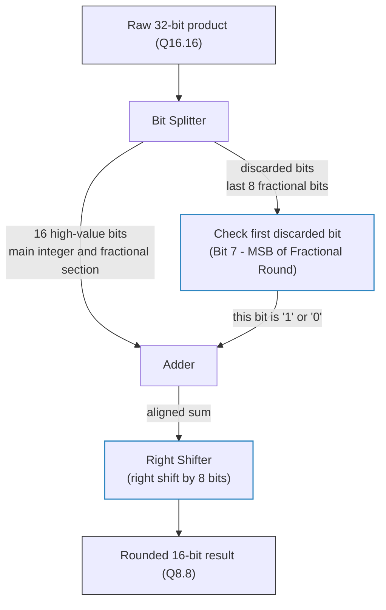

---

## Comprehensive Comparison of Fixed-Point (FXP) and Floating-Point (FLP)

| Comparison Metric | Fixed-Point | Floating-Point |
| :--- | :--- | :--- |
| **Required Hardware** | Very simple circuits, integer ALU | Extremely complex circuits, dedicated FPU |
| **Numeric Range** | Very small and limited | Extremely large |
| **Power Consumption** | Very low, suitable for batteries and mobile devices | High |
| **Processing Speed (Latency)** | Very fast, usually 1 clock cycle | Slower, requires several clock cycles |
| **Computational Precision** | Constant and uniform across the entire range | Very precise for small numbers, less precise for large numbers |
| **Software Complexity** | High, the programmer must worry about overflow and alignment | Very low, the programmer does not deal with bit structure |
| **Silicon Area (Chip)** | Very small | Large and costly |
| **Main Applications** | Digital filters, signal processing (DSP), microcontrollers, AI inference (INT8) | Scientific simulations, 3D graphics, neural-network training (FP32/BF16) |